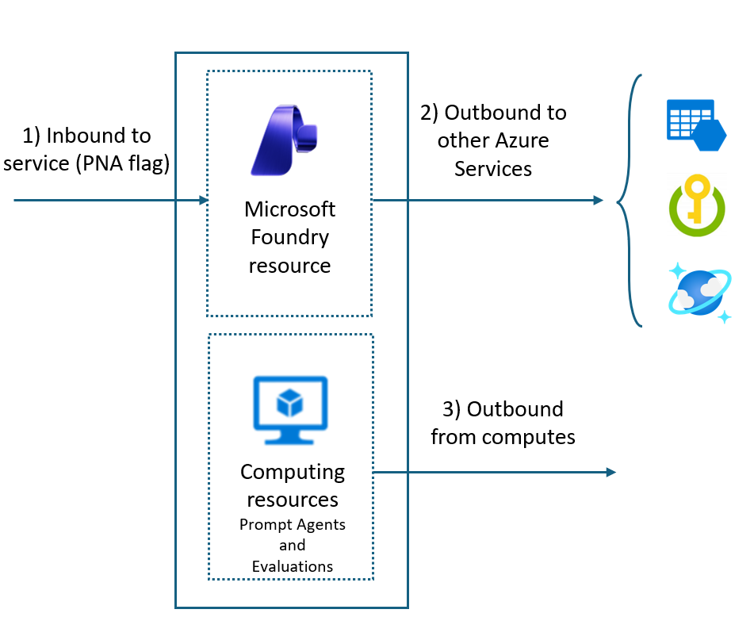
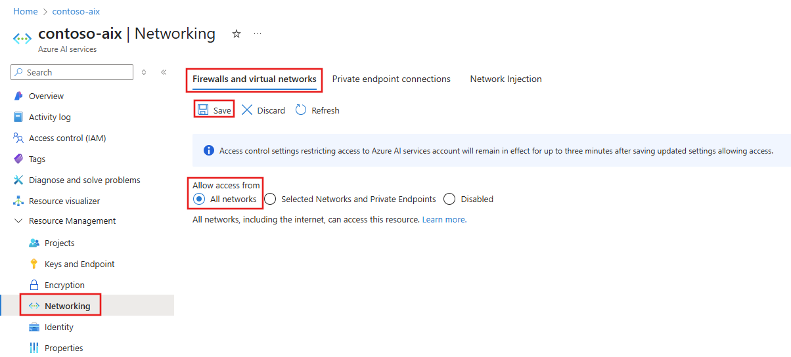
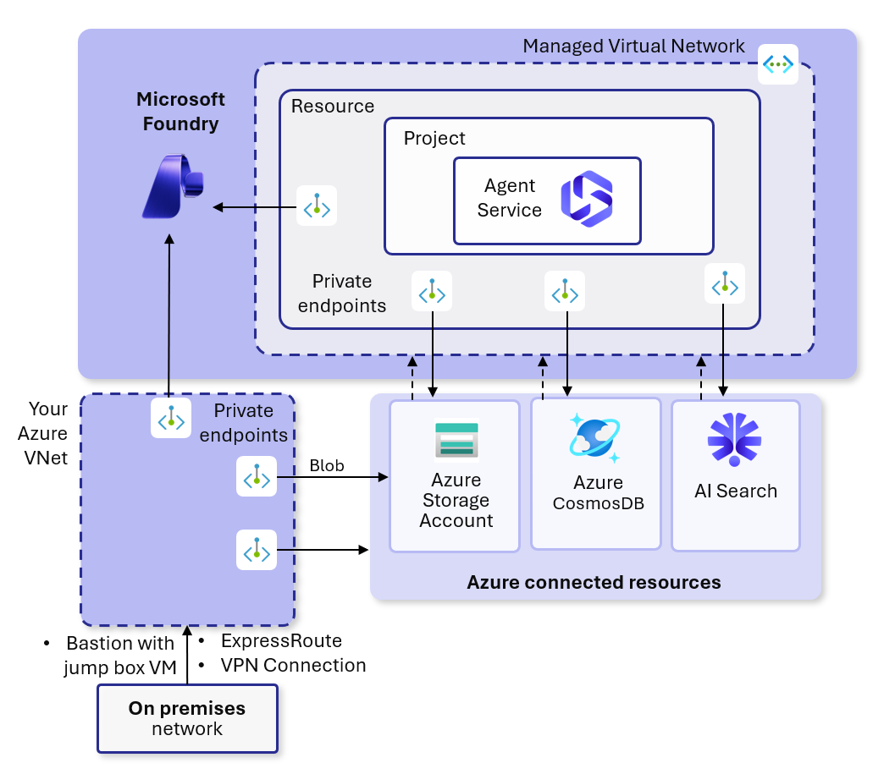
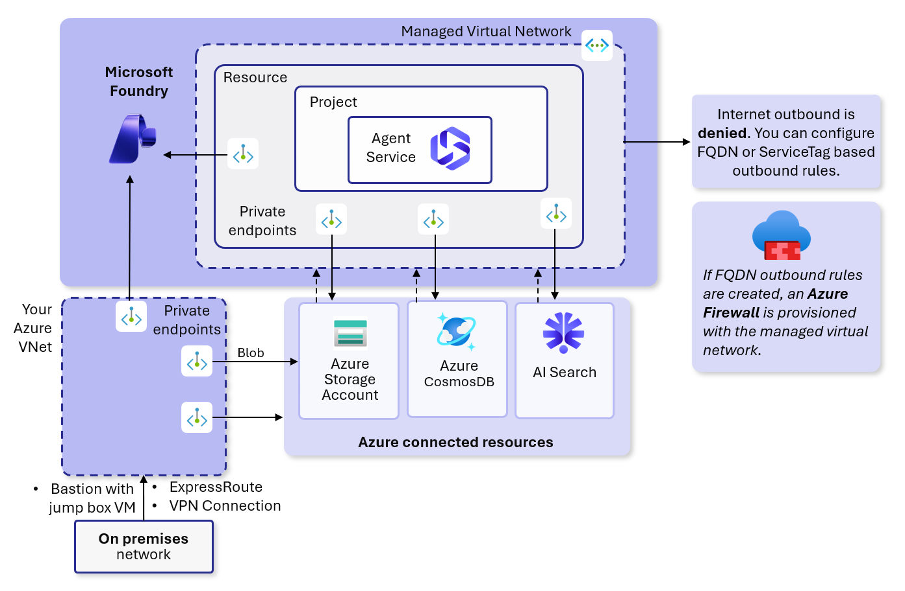
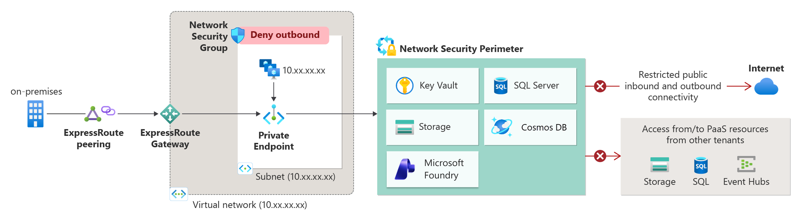
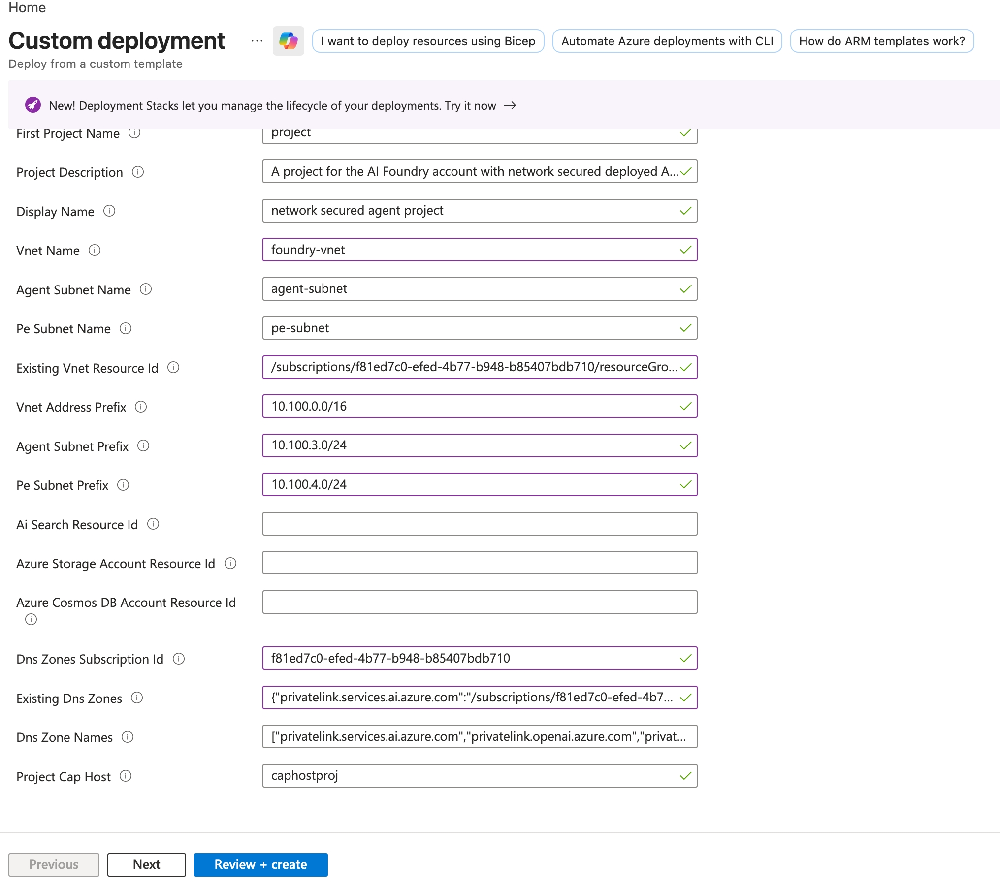

# Microsoft Foundry Networking — The Complete Guide

> **Updated March 2026** — Covers all networking options for Microsoft Foundry (formerly Azure AI Foundry), including Private Link, Managed VNet, BYO VNet injection, and Network Security Perimeter.

---

## Why Is This So Confusing?

If you've been reading Microsoft's docs and feeling lost — you're not alone. Microsoft has **5 separate documentation pages** about Foundry networking, and it's unclear how they relate to each other. Here's the problem: **Foundry is not one thing — it's made up of several components, and each component has its own networking story.**

This guide puts it all in one place.

---

## Part 1: The Components — What Needs Network Protection?

Before talking about network options, you need to understand that Microsoft Foundry has **four different components**, and each one has separate networking considerations:

```
┌─────────────────────────────────────────────────────────────────┐
│                    Microsoft Foundry                            │
│                                                                 │
│  ┌──────────────┐  ┌──────────────┐  ┌────────────────────────┐│
│  │ 1. Foundry   │  │ 2. Foundry   │  │ 3. Agent Service       ││
│  │    Portal    │  │    Resource  │  │    (compute that runs  ││
│  │    (UI)      │  │    (APIs)    │  │     your agents)       ││
│  └──────────────┘  └──────────────┘  └────────────────────────┘│
│                                                                 │
│  ┌─────────────────────────────────────────────────────────────┐│
│  │ 4. Dependent Azure Resources                               ││
│  │    (Storage, Cosmos DB, AI Search, Key Vault, OpenAI, etc.)││
│  └─────────────────────────────────────────────────────────────┘│
└─────────────────────────────────────────────────────────────────┘
```

| Component | What it is | Network question it raises |
|-----------|-----------|---------------------------|
| **Foundry Portal** | The web UI at ai.azure.com where you manage projects | How do your users access the portal? |
| **Foundry Resource** (Account + Project) | The Azure resource with APIs and settings | Can it be reached from the internet? Who can call its APIs? |
| **Agent Service compute** | The container that runs your AI agents, evaluations, prompt flows | Where does agent code execute? What can it reach? |
| **Dependent resources** | Azure Storage, Cosmos DB, AI Search, Azure OpenAI, Key Vault | Are these resources accessible from the internet or only privately? |

**Each of these components has its own network surface**, and you need to secure all of them. That's why there are so many docs — each one focuses on a different piece.

---

## Part 2: The Three Network Directions

Now that you know the components, there are **three directions** of network traffic to secure:



### Direction 1: Inbound — Who can reach your Foundry resource?

**This is about your users and client applications connecting to Foundry.**

By default, your Foundry resource is accessible from the public internet. Anyone with the right credentials can call the APIs or open the portal. For enterprise deployments, you want to restrict this.

**How you lock it down:** You set the **Public Network Access (PNA) flag** on your Foundry resource:

| PNA Setting | What it means |
|-------------|--------------|
| **All networks** | Anyone on the internet can connect (default — fine for testing) |
| **Selected IPs** | Only specific IP ranges can connect (e.g., your office IP) |
| **Disabled** | No public access at all — only reachable through a **private endpoint** in your VNet |

When you disable public access and add a private endpoint, your Foundry resource gets a private IP address inside your virtual network. Your team connects through VPN, ExpressRoute, or a Bastion jump box — never over the public internet.

> **This applies to ALL setup tiers** (Basic, Standard, Standard+VNet). You can always add a private endpoint, regardless of which agent tier you chose.

### Direction 2: Outbound from Foundry — How it reaches Azure services

**This is about how the Foundry resource talks to its dependent Azure services** (Storage, Key Vault, Azure OpenAI, etc.).

By default, these communications go over the Azure backbone network using public endpoints — encrypted, but technically "public." For maximum security, you create **private endpoints** for each dependent service, so all traffic stays fully private.

### Direction 3: Outbound from Agent compute — How your agents reach data

**This is the big one.** When your AI agents run, they need to reach data sources, APIs, and tools. This traffic comes from the **Agent Service compute** — the container that executes your agent code.

**This is where it gets complicated**, because Microsoft offers **three different options** for securing this traffic. That's the next section.

---

## Part 3: The Four Network Options (And When To Use Each)

Here's where people get confused. Microsoft offers **four different networking approaches**, and they're documented in four separate pages. Here's how they map:

```
                        ┌──────────────────────────────────────┐
                        │     INBOUND (to Foundry)             │
                        │                                      │
                        │  Option A: Private Link              │
                        │  Option D: Network Security          │
                        │            Perimeter (NSP)           │
                        └──────────────────────────────────────┘

                        ┌──────────────────────────────────────┐
                        │     OUTBOUND (from Agent compute)    │
                        │                                      │
                        │  Option B: BYO VNet Injection (GA)   │
                        │  Option C: Managed VNet (Preview)    │
                        └──────────────────────────────────────┘
```

### Quick Comparison

| | **Option A: Private Link** | **Option B: BYO VNet Injection** | **Option C: Managed VNet** | **Option D: NSP** |
|---|---|---|---|---|
| **What it secures** | Inbound access to Foundry | Outbound from Agent compute | Outbound from Agent compute | Inbound + Outbound (data-plane) |
| **Status** | GA | GA | **Preview** | **Preview** |
| **Complexity** | Low | Medium-High | Low-Medium | Medium |
| **Who manages the network** | You create PE in your VNet | You provide VNet + subnets | Microsoft manages the VNet | Microsoft manages the perimeter |
| **Agent runs in** | N/A (inbound only) | Your VNet subnet | Microsoft-managed VNet | N/A (policy layer) |
| **Can reach on-prem** | N/A | Yes (agents are in your VNet) | Via Application Gateway only | N/A |
| **Your own firewall** | N/A | Yes | No (Microsoft-managed FW) | N/A |
| **Use it when** | You need private access to the portal/APIs | Full network control, compliance, on-prem access | Simpler setup, no own VNet needed | You want a policy-based perimeter across multiple Azure services |
| **Docs** | [Private Link](https://learn.microsoft.com/en-us/azure/foundry/how-to/configure-private-link?view=foundry) | [VNet for Agents](https://learn.microsoft.com/en-us/azure/foundry/agents/how-to/virtual-networks) | [Managed VNet](https://learn.microsoft.com/en-us/azure/foundry/how-to/managed-virtual-network?view=foundry) | [NSP](https://learn.microsoft.com/en-us/azure/foundry/how-to/add-foundry-to-network-security-perimeter?view=foundry) |

> **Important:** These are NOT mutually exclusive. You typically **combine** Option A (Private Link for inbound) with either Option B or C (for outbound). Option D (NSP) is a complementary policy layer on top.

Now let's explain each one.

---

### Option A: Private Link (Inbound Isolation) — GA

**What it does:** Creates a private endpoint in your VNet that gives your Foundry resource a private IP address. Your team accesses the Foundry portal and APIs through this private IP instead of the public internet.

**Think of it like:** A private door into Foundry that only exists inside your building (VNet). The public door gets locked.

**How to set it up:**

1. In the [Azure portal](https://portal.azure.com/), go to your Foundry resource → **Networking**.
2. Set Public network access to **Disabled**.
3. Select **+ Private endpoint** → choose your VNet and subnet.
4. Azure creates a private IP and updates DNS automatically.

**DNS is the key:** When your team types `yourfoundry.cognitiveservices.azure.com`, the Private DNS Zone resolves it to the private IP (e.g., `10.0.1.5`) instead of a public IP. Same URL, private path. No code changes needed.

**Your team connects via:**

| Method | Best for |
|--------|----------|
| **[VPN Gateway](https://learn.microsoft.com/en-us/azure/vpn-gateway/vpn-gateway-about-vpngateways)** (Point-to-Site) | Individual developers on laptops |
| **[VPN Gateway](https://learn.microsoft.com/en-us/azure/vpn-gateway/vpn-gateway-about-vpngateways)** (Site-to-Site) | Connecting an entire office |
| **[ExpressRoute](https://learn.microsoft.com/en-us/azure/expressroute/)** | Dedicated private connection from data center |
| **[Azure Bastion](https://learn.microsoft.com/en-us/azure/bastion/bastion-overview)** | Quick access via a jump box VM in the browser |

**Trusted Azure services** can bypass the firewall if you enable it — they authenticate via managed identity:

| Service | Resource Provider |
|---------|------------------|
| Foundry Tools | `Microsoft.CognitiveServices` |
| Azure AI Search | `Microsoft.Search` |
| Azure Machine Learning | `Microsoft.MachineLearningServices` |



---

### Option B: BYO VNet Injection (Outbound Isolation) — GA

**What it does:** Places the Agent Service compute (the container running your agents) directly inside **your own virtual network**. You provide the VNet and subnets. Microsoft injects the agent container into your subnet.

**Think of it like:** Instead of your agents running on some Microsoft server you can't see, they run *inside your own network*. You control what they can reach.

**This is the full enterprise solution.** It's GA (production-ready) and gives you maximum control.


**What gets deployed in your VNet:**

| Subnet | What's in it | Size |
|--------|-------------|------|
| **Agent Subnet** | Your agents run here. Delegated to `Microsoft.App/environments`. Microsoft injects the agent container. | `/24` recommended (256 IPs), `/27` minimum |
| **Private Endpoint Subnet** | Private endpoints for Storage, Cosmos DB, AI Search, Foundry Account. Each gets a private IP. | Sized per number of endpoints |

**How traffic flows:**
- Agent code runs in the agent subnet → calls Azure Storage → goes through the private endpoint in the PE subnet → reaches Storage over private IP. Never touches the public internet.
- Agent calls Azure OpenAI → goes through the Foundry private endpoint → private IP. Same story.
- Agent calls an on-premises API → goes through your VPN/ExpressRoute → reaches your data center. Works natively because the agent is already in your VNet.

**Required Private DNS Zones** (so URLs resolve to private IPs):

| For | Private DNS Zone |
|-----|-----------------|
| Foundry Account | `privatelink.cognitiveservices.azure.com` |
| Foundry Account | `privatelink.openai.azure.com` |
| Foundry Account | `privatelink.services.ai.azure.com` |
| Azure AI Search | `privatelink.search.windows.net` |
| Azure Cosmos DB | `privatelink.documents.azure.com` |
| Azure Storage | `privatelink.blob.core.windows.net` |
| Azure Storage | `privatelink.file.core.windows.net` |

**Deployment:** Use the Bicep or Terraform templates — they create everything:
- **Bicep:** [15-private-network-standard-agent-setup](https://github.com/microsoft-foundry/foundry-samples/tree/main/infrastructure/infrastructure-setup-bicep/15-private-network-standard-agent-setup)
- **Terraform:** [15b-private-network-standard-agent-setup-byovnet](https://github.com/microsoft-foundry/foundry-samples/tree/main/infrastructure/infrastructure-setup-terraform/15b-private-network-standard-agent-setup-byovnet)
- **Hybrid/on-prem:** [19-hybrid-private-resources-agent-setup](https://github.com/microsoft-foundry/foundry-samples/tree/main/infrastructure/infrastructure-setup-bicep/19-hybrid-private-resources-agent-setup)

**Add a firewall** with hub-and-spoke if you need egress control:


---

### Option C: Managed VNet (Outbound Isolation) — Preview

**What it does:** Microsoft creates and manages a virtual network **for you**. Your agents run in this Microsoft-managed VNet. You don't provide a VNet or subnets — Microsoft handles it all.

**Think of it like:** Option B is "bring your own house, we'll move in." Option C is "we'll build the house for you, you just tell us the rules."

> ⚠️ **This is currently in Preview** — not recommended for production. If your enterprise doesn't allow preview features, use Option B instead.



**Two isolation modes for the managed VNet:**

**Allow Internet Outbound** — Agents can reach any internet destination. Useful for development where agents need to download packages or call external APIs. Azure still manages the VNet and can add private endpoints for Azure services.


**Allow Only Approved Outbound** — Agents can ONLY reach destinations you explicitly approve. Everything else is blocked. You define allowed targets using service tags, FQDNs, or private endpoints. Microsoft creates a managed Azure Firewall automatically.



**Managed VNet vs BYO VNet Injection — side by side:**

| | Managed VNet (Option C) | BYO VNet Injection (Option B) |
|---|---|---|
| Who creates the VNet | Microsoft | You |
| Your firewall | No — managed firewall auto-created | Yes — bring your own |
| On-premises access | Via Application Gateway only | Native (agents are in your VNet) |
| Evaluation compute security | Not supported | Supported |
| MCP tools with network isolation | Not supported (public MCP only) | Supported (private MCP) |
| Logging outbound traffic | Not supported | Supported (your firewall) |
| Status | **Preview** | **GA** |
| Deploy via | Bicep template only | Portal, Bicep, or Terraform |

**Managed VNet limitations:**
- Bicep-only deployment ([18-managed-virtual-network-preview](https://github.com/microsoft-foundry/foundry-samples/tree/main/infrastructure/infrastructure-setup-bicep/18-managed-virtual-network-preview))
- Can't bring your own firewall
- Can't switch back to no isolation once enabled
- FQDN rules only support ports 80 and 443
- Private endpoints to Cosmos DB and AI Search must be created manually via CLI
- Each Foundry account gets its own managed firewall (can't share)
- Preview regions only
- Requires feature flag registration: `az feature register --namespace Microsoft.CognitiveServices --name AI.ManagedVnetPreview`

---

### Option D: Network Security Perimeter (NSP) — Preview

**What it does:** NSP is a **policy-based security boundary** around multiple Azure PaaS resources. Instead of managing private endpoints one by one, you group resources into a perimeter and define inbound/outbound rules centrally.

**Think of it like:** Options A/B/C are about building walls and doors. Option D is about drawing a circle around a group of resources and saying "nothing crosses this circle unless it's on the list."

> ⚠️ **This is also in Preview.**



**How it works:**
1. Create a Network Security Perimeter in Azure
2. Associate your Foundry resource (and other Azure resources like Storage, AI Search) with the perimeter
3. Start in **Learning mode** — logs what would be blocked without actually blocking
4. Define **inbound rules** (who can reach your resources — by IP range or subscription)
5. Define **outbound rules** (what your resources can reach — by FQDN)
6. Switch to **Enforced mode** — now the rules are active

**Key concept:** Resources inside the same NSP **trust each other automatically** (when using managed identity). You only need rules for traffic crossing the perimeter boundary.

**NSP vs Private Link:**

| | Private Link (Option A) | NSP (Option D) |
|---|---|---|
| Approach | Network-level (private endpoints, private IPs) | Policy-level (rules, allow-lists) |
| Controls | Inbound only | Inbound + Outbound (data-plane) |
| Scope | One resource at a time | Multiple resources grouped together |
| Private IPs | Yes — resources get private IPs in your VNet | No — works at the policy layer |
| Status | **GA** | **Preview** |

**NSP doesn't replace Private Link** — it's complementary. You might use Private Link for the network-level isolation and NSP for the policy-level governance on top.

---

## Part 4: How It All Fits Together — Decision Guide

Here's the practical guide: **which options do you combine for your scenario?**

### Scenario 1a: "Just getting started, minimal security"
- **Agent tier:** Basic
- **Inbound:** Public access (default)
- **Outbound:** N/A (Microsoft-managed compute)
- **Options used:** None — just create an account and project
- **Template:** [40-basic-agent-setup](https://github.com/microsoft-foundry/foundry-samples/tree/main/infrastructure/infrastructure-setup-bicep/40-basic-agent-setup)

### Scenario 1b: "Basic agents, but private portal access"
- **Agent tier:** Basic
- **Inbound:** Option A (Private Link) — disable public access, add private endpoint
- **Outbound:** N/A (Microsoft-managed compute, Azure backbone)
- **Options used:** A
- **Template:** [10-private-network-basic](https://github.com/microsoft-foundry/foundry-samples/tree/main/infrastructure/infrastructure-setup-bicep/10-private-network-basic)

> ℹ️ **Basic ≠ public only.** You can add a private endpoint to a Basic setup. The "Basic" label refers to data storage (Microsoft-managed multitenant) — not the network access level. What you CAN'T do with Basic is BYO resources, VNet injection, or CMK.

### Scenario 2: "Production, data in my tenant, but no VNet needed"
- **Agent tier:** Standard (BYO Storage, Cosmos DB, AI Search)
- **Inbound:** Option A (Private Link) — disable public access, add private endpoint
- **Outbound:** Default (Azure backbone)
- **Options used:** A
- **Template:** [41-standard-agent-setup](https://github.com/microsoft-foundry/foundry-samples/tree/main/infrastructure/infrastructure-setup-bicep/41-standard-agent-setup) + manually add PE, or [10-private-network-basic](https://github.com/microsoft-foundry/foundry-samples/tree/main/infrastructure/infrastructure-setup-bicep/10-private-network-basic)

> ⚠️ **What's NOT private here:** The Foundry portal/API gets a private IP (your users connect privately), but the **Agent Service compute still runs on Microsoft's infrastructure**. It talks to your BYO resources (Storage, Cosmos DB, AI Search) over the **Azure backbone using their public endpoints** — encrypted, but not over private IPs. Your BYO resources still have public endpoints unless you manually lock them down. If you need the agent compute itself to be in your VNet with private IPs to all resources, go to **Scenario 3**.

### Scenario 3: "Full enterprise lockdown"
- **Agent tier:** Standard + BYO VNet
- **Inbound:** Option A (Private Link) — disable public access
- **Outbound:** Option B (BYO VNet Injection) — agents in your VNet, all private endpoints, all resources have public access disabled
- **Firewall:** Hub-and-spoke with Azure Firewall for egress control
- **Options used:** A + B
- **Template:** [15-private-network-standard-agent-setup](https://github.com/microsoft-foundry/foundry-samples/tree/main/infrastructure/infrastructure-setup-bicep/15-private-network-standard-agent-setup)

> ✅ **Everything is private here:** Foundry portal (private endpoint), Agent compute (injected into your VNet subnet), and ALL BYO resources (private endpoints, public access disabled). This is the only scenario where the agent compute itself has a private IP in your network.

### Scenario 4: "Enterprise lockdown, but don't want to manage a VNet"
- **Agent tier:** Standard
- **Inbound:** Option A (Private Link)
- **Outbound:** Option C (Managed VNet) — Microsoft manages the VNet
- **Options used:** A + C *(Preview)*
- **Template:** [18-managed-virtual-network-preview](https://github.com/microsoft-foundry/foundry-samples/tree/main/infrastructure/infrastructure-setup-bicep/18-managed-virtual-network-preview)

> ⚠️ **Preview.** Agent compute runs in a Microsoft-managed VNet (not your VNet). You don't see or manage the network — Microsoft handles it. Some limitations: no private MCP, no evaluation compute isolation, no custom firewall.

### Scenario 5: "Full lockdown + private MCP servers or on-prem data"
- **Agent tier:** Standard + BYO VNet
- **Inbound:** Option A (Private Link)
- **Outbound:** Option B (BYO VNet Injection) + MCP subnet
- **Options used:** A + B
- **Template:** [19-hybrid-private-resources-agent-setup](https://github.com/microsoft-foundry/foundry-samples/tree/main/infrastructure/infrastructure-setup-bicep/19-hybrid-private-resources-agent-setup)

> Uses 3 subnets: agent subnet, PE subnet, and an MCP subnet for hosting private MCP servers accessible by the agent.

---

## Part 5: Agent Setup Tiers — When Do You Provide Resources?

This is a critical question: **when do YOU need to create and manage Azure resources for the Agent Service, and when does Microsoft handle it?**

| | Basic | Standard | Standard + BYO VNet |
|---|---|---|---|
| **Cosmos DB** | ❌ Microsoft manages it | ✅ **You provide it** | ✅ **You provide it** |
| **Azure Storage** | ❌ Microsoft manages it | ✅ **You provide it** | ✅ **You provide it** |
| **Azure AI Search** | ❌ Microsoft manages it | ✅ **You provide it** | ✅ **You provide it** |
| **Virtual Network** | ❌ Not needed | ❌ Not needed | ✅ **You provide it** |
| **Where is agent data stored?** | Microsoft's multitenant storage (you can't see it) | In YOUR Azure resources (your tenant) | In YOUR Azure resources (your tenant) |
| **Who pays for data resources?** | Included | You pay for Cosmos DB, Storage, AI Search | You pay for Cosmos DB, Storage, AI Search |

**In plain terms:**
- **Basic** = You bring NOTHING. Microsoft stores your agent conversations, files, and search indexes in their own infrastructure. Fast to start, but you don't control where data lives.
- **Standard** = You bring **3 resources**: Azure Storage + Azure Cosmos DB + Azure AI Search. All agent data is stored in YOUR Azure subscription. You control it, you see it, you pay for it.
- **Standard + BYO VNet** = Same as Standard, PLUS you also bring a **Virtual Network** with subnets. The agent compute runs inside your network.

### Quick Reference

| Capability | Basic | Standard | Standard + BYO VNet |
|-----------|-------|----------|---------------------|
| Quick start, no resource management | ✅ | | |
| Data in your own Azure resources | | ✅ | ✅ |
| Customer Managed Keys (CMK) | | ✅ | ✅ |
| Full network isolation (agents in your VNet) | | | ✅ |

**Standard setup BYO resources:**

| Your Resource | What it stores | Minimum requirements |
|---------------|---------------|---------------------|
| Azure Storage | Files uploaded by users/devs | Standard account |
| Azure AI Search | Vector stores (embeddings) | Any tier |
| Azure Cosmos DB for NoSQL | Conversations, agent metadata | 3000 RU/s minimum (1000 × 3 containers) |

**Cosmos DB containers created automatically:**

| Container | Data |
|-----------|------|
| `thread-message-store` | User conversations |
| `system-thread-message-store` | Internal system messages |
| `agent-entity-store` | Agent metadata (instructions, tools, name) |

For N projects under one account, you need N × 3000 RU/s.

### Behind the Scenes: What is a Capability Host?

If you dig into the Azure portal or use the REST API, you will encounter an object called a **[Capability Host](https://learn.microsoft.com/en-us/azure/foundry/agents/concepts/capability-hosts?view=foundry-classic)**. 

* **What is it?** The Capability Host is the underlying infrastructure engine that actually runs your AI agents. It acts as the bridge that binds your agent code to your BYO data resources (Cosmos DB, Storage, AI Search) and the LLM models. 
* **Why it matters for networking:** When you use **Option B (BYO VNet Injection)**, the Capability Host is the actual physical resource component that gets injected into your delegated `Agent Subnet`.

> **💡 Pro Tip: Stuck Deletions & Cleanups** 
> Capability hosts are **immutable**. If you change your network setup, you must delete the capability host and recreate it. Occasionally, a capability host can get "stuck" in a deleting or failed state, making it impossible to delete from the UI (which can prevent you from dropping or changing your subnets). 
> 
> If you get stuck with a locked capability host, there is a manual cleanup procedure. You can use the `deleteCaphost.sh` script or direct Azure CLI REST API calls to force-delete the "zombie" capability host object so you can start fresh. (Check the official GitHub/Microsoft troubleshooting guides for the exact cleanup script).

---

## Part 6: Agent Tools — Network Support Matrix

Not all agent tools work behind a VNet. Here's the current status:

| Tool | Works in VNet? | Traffic path |
|------|---------------|-------------|
| MCP Tool (Private MCP) | ✅ Yes | Through your VNet subnet |
| Azure AI Search | ✅ Yes | Through private endpoint |
| Code Interpreter | ✅ Yes | Microsoft backbone (no config needed) |
| Function Calling | ✅ Yes | Microsoft backbone (no config needed) |
| Bing Grounding | ✅ Yes | Public internet* |
| Websearch | ✅ Yes | Public internet* |
| SharePoint Grounding | ✅ Yes | Public internet* |
| Foundry IQ (preview) | ✅ Yes | Via MCP |
| Fabric Data Agent | ❌ No | — |
| Logic Apps | ❌ No | — |
| File Search | ❌ No | Under development |
| OpenAPI tool | ❌ No | Under development |
| Azure Functions | ❌ No | Under investigation |
| Browser Automation | ❌ No | Under investigation |
| Computer Use | ❌ No | Under investigation |
| Image Generation | ❌ No | Under investigation |
| Agent-to-Agent (A2A) | ❌ No | Under development |

*Bing, Websearch, and SharePoint use the public internet even in VNet-isolated setups. Block via Azure Policy if needed.

---

## Part 7: Feature Limitations with Network Isolation

| Feature | Status | Notes |
|---------|--------|-------|
| Hosted Agents | ❌ Not supported | No VNet support |
| Publish to Teams/M365 | ❌ Not supported | Requires public endpoints |
| Synthetic Data for Evaluations | ❌ Not supported | Bring your own data |
| Traces | ❌ Not supported | No private Application Insights support |
| Workflow Agents | ⚠️ Partial | Inbound works. Outbound VNet injection not supported |
| AI Gateway | ⚠️ Partial | Auto-public. Needs its own network isolation |
| MCP tools + Managed VNet | ❌ Not supported | Use BYO VNet (Option B) for private MCP |
| Evaluation compute + Managed VNet | ❌ Not supported | Use BYO VNet (Option B) |

---

## Part 8: Known Limitations

- **RFC1918 only:** Subnets must use `10.0.0.0/8`, `172.16.0.0/12`, or `192.168.0.0/16`
- **Avoid 172.17.0.0/16:** Reserved by Docker
- **One agent subnet per Foundry resource** — can't share subnets
- **Subnet size:** Minimum `/27` (32 IPs), recommended `/24` (256 IPs)
- **Same subscription:** Private endpoints must match the VNet subscription
- **Capability hosts are immutable:** Can't update after creation — delete and recreate
- **Managed VNet is one-way:** Once enabled, can't disable or switch modes
- **File Search + Blob Storage:** Not supported behind VNet

---

## Part 9: RBAC Roles Required

| Who | Needs this role | Scope |
|-----|----------------|-------|
| Admin creating the account | Azure AI Account Owner | Subscription |
| Admin assigning BYO resource permissions | Role Based Access Administrator | Resource group |
| Developers creating/editing agents | Azure AI User | Project |

### Project managed identity roles (Standard setup)

| Resource | Role |
|----------|------|
| Cosmos DB account | Cosmos DB Operator |
| Storage account | Storage Account Contributor |
| Azure AI Search | Search Index Data Contributor + Search Service Contributor |
| Blob container `<workspaceId>-azureml-blobstore` | Storage Blob Data Contributor |
| Blob container `<workspaceId>-agents-blobstore` | Storage Blob Data Owner |
| Cosmos DB database `enterprise_memory` | Cosmos DB Built-in Data Contributor |

### Custom RBAC for Cosmos DB Data Plan (Private Networks)

When your Cosmos DB operates within a private network setup, built-in roles might lack exact data-plane query access. You may need to create and assign a strictly-scoped **Custom Role** to your project's managed identity so it can read/query items over the private network. 

Run this PowerShell script (replace the variables with your own environments data):

```powershell
$resourceGroupName = "<your-resource-group>"
$accountName = "<your-cosmos-db-account-name>"

# 1. Create a custom Data-Plane Role
New-AzCosmosDBSqlRoleDefinition -AccountName $accountName `
  -ResourceGroupName $resourceGroupName `
  -Type CustomRole `
  -RoleName CosmosDBDataPlanRole `
  -DataAction @( `
    'Microsoft.DocumentDB/databaseAccounts/readMetadata', `
    'Microsoft.DocumentDB/databaseAccounts/sqlDatabases/containers/items/read', `
    'Microsoft.DocumentDB/databaseAccounts/sqlDatabases/containers/executeQuery', `
    'Microsoft.DocumentDB/databaseAccounts/sqlDatabases/containers/readChangeFeed' `
  ) `
  -AssignableScope "/"

# 2. Get the new Role's ID (You can pull the ID from the output of the command above)
$customRoleDefinitionId = "/subscriptions/<your-subscription-id>/resourceGroups/$resourceGroupName/providers/Microsoft.DocumentDB/databaseAccounts/$accountName/sqlRoleDefinitions/<new-role-guid>"

# 3. Assign the new role to the Foundry Project Managed Identity 
# (You can find the Principal ID under Identity in your AI Project)
$principalId = "<your-ai-project-managed-identity-object-id>"

New-AzCosmosDBSqlRoleAssignment -AccountName $accountName `
   -ResourceGroupName $resourceGroupName `
   -RoleDefinitionId $customRoleDefinitionId `
   -Scope "/" `
   -PrincipalId $principalId
```

---

## Part 10: Resource Provider Registrations

```bash
az provider register --namespace 'Microsoft.KeyVault'
az provider register --namespace 'Microsoft.CognitiveServices'
az provider register --namespace 'Microsoft.Storage'
az provider register --namespace 'Microsoft.MachineLearningServices'
az provider register --namespace 'Microsoft.Search'
az provider register --namespace 'Microsoft.Network'
az provider register --namespace 'Microsoft.App'
az provider register --namespace 'Microsoft.ContainerService'
# Only if using Bing Search tool:
az provider register --namespace 'Microsoft.Bing'
```

For Managed VNet (Preview), also register the feature flag:
```bash
az feature register --namespace Microsoft.CognitiveServices --name AI.ManagedVnetPreview
```

---

## Part 11: Troubleshooting

### Deployment Errors

| Error | Cause | Fix |
|-------|-------|-----|
| `CapabilityHost supports a single, non empty value for storageConnections...` | Missing BYO resource | Provide all three: Storage, Cosmos DB, AI Search |
| `Provided subnet must be of the proper address space` | Wrong IP range | Use RFC1918 only |
| `Subscription is not registered with required resource providers` | Missing registrations | Run `az provider register` commands above |
| `Failed async operation` / `Capability host operation failed` | Various | Create support ticket. Check capability host |
| `Subnet requires delegation to Microsoft.App/environments` | Stale resource | Purge via portal or run `deleteCaphost.sh` |
| `Timeout of 60000ms` on Agent pages | Can't reach Cosmos DB | Check private endpoint + DNS for Cosmos DB |

### DNS Issues

| Symptom | Fix |
|---------|-----|
| `nslookup` returns public IP | Link private DNS zone to your VNet |
| Custom DNS can't resolve | Forward `privatelink.*` to Azure DNS (`168.63.129.16`) |
| Intermittent resolution failures | Check DNS server reachability from all subnets |

### Connectivity Issues

| Symptom | Fix |
|---------|-----|
| Timeout on port 443 | Check NSG allows traffic to PE IP on 443 |
| Can't reach from on-prem | Check VPN/ER is up + route tables include VNet range |
| 403 Forbidden | Usually RBAC, not networking. Check role assignments |

### Agent Issues

| Symptom | Fix |
|---------|-----|
| Agent won't start | Use Standard setup (not Basic). Check subnet IPs available |
| Agent can't access MCP tools | Check private endpoints + managed identity RBAC |
| Evaluation fails with network errors | Check all DNS zones configured |
| Agent timeout on external calls | Firewall may block HTTPS. Allow destination or add NAT gateway |

---

## Part 12: Which Bicep Template Should I Use?

Microsoft provides **many** Bicep templates in [foundry-samples](https://github.com/microsoft-foundry/foundry-samples/tree/main/infrastructure/infrastructure-setup-bicep) and it's hard to know which one fits your scenario. Here's the complete guide:

### Template Decision Flowchart

```
Do you need network isolation?
│
├── No ──► Do you need your own data resources?
│          │
│          ├── No  ──► 40-basic-agent-setup
│          │           (Fastest start. Microsoft-managed storage.)
│          │
│          └── Yes ──► 41-standard-agent-setup
│                      (BYO Cosmos DB, Storage, AI Search. No VNet.)
│
└── Yes ──► Do you need ONLY inbound isolation (private portal access)?
           │
           ├── Yes ──► 10-private-network-basic
           │           (Private endpoint for Foundry. No agent VNet.)
           │
           └── No ──► You need full outbound isolation too.
                      │
                      ├── Want Microsoft to manage the VNet?
                      │   └── 18-managed-virtual-network-preview ⚠️ PREVIEW
                      │
                      ├── Want to manage your own VNet?
                      │   │
                      │   ├── System Managed Identity (default)
                      │   │   └── 15-private-network-standard-agent-setup ✅ MOST COMMON
                      │   │
                      │   ├── User Assigned Identity
                      │   │   └── 17-private-network-standard-user-assigned-identity-agent-setup
                      │   │
                      │   ├── Need API Management integration?
                      │   │   └── 16-private-network-standard-agent-apim-setup-preview ⚠️ PREVIEW
                      │   │
                      │   └── Need MCP servers or on-prem data in the VNet?
                      │       └── 19-hybrid-private-resources-agent-setup
                      │
                      └── (See also 30/31/32 templates if you need Customer Managed Keys)
```

### All Templates — Side by Side

| # | Template | Agent Tier | Identity | Network | Special Feature | Status |
|---|----------|-----------|----------|---------|----------------|--------|
| **40** | [basic-agent-setup](https://github.com/microsoft-foundry/foundry-samples/tree/main/infrastructure/infrastructure-setup-bicep/40-basic-agent-setup) | Basic | SMI | Public | Fastest start | GA |
| **42** | [basic-agent-setup-with-customization](https://github.com/microsoft-foundry/foundry-samples/tree/main/infrastructure/infrastructure-setup-bicep/42-basic-agent-setup-with-customization) | Basic | SMI | Public | BYO OpenAI + App Insights | GA |
| **45** | [basic-agent-bing](https://github.com/microsoft-foundry/foundry-samples/tree/main/infrastructure/infrastructure-setup-bicep/45-basic-agent-bing) | Basic | SMI | Public | Bing grounding pre-configured | GA |
| **41** | [standard-agent-setup](https://github.com/microsoft-foundry/foundry-samples/tree/main/infrastructure/infrastructure-setup-bicep/41-standard-agent-setup) | Standard | SMI | Public | BYO resources (Cosmos, Storage, Search) | GA |
| **43** | [standard-agent-setup-with-customization](https://github.com/microsoft-foundry/foundry-samples/tree/main/infrastructure/infrastructure-setup-bicep/43-standard-agent-setup-with-customization) | Standard | SMI | Public | BYO resources + BYO OpenAI | GA |
| **10** | [private-network-basic](https://github.com/microsoft-foundry/foundry-samples/tree/main/infrastructure/infrastructure-setup-bicep/10-private-network-basic) | — | SMI | **Private inbound** | PE for Foundry only (no agent VNet) | GA |
| **15** | [private-network-standard-agent-setup](https://github.com/microsoft-foundry/foundry-samples/tree/main/infrastructure/infrastructure-setup-bicep/15-private-network-standard-agent-setup) | Standard | SMI | **Full E2E** | BYO VNet + all private endpoints | **GA** |
| **16** | [private-network-standard-agent-apim-setup](https://github.com/microsoft-foundry/foundry-samples/tree/main/infrastructure/infrastructure-setup-bicep/16-private-network-standard-agent-apim-setup-preview) | Standard | SMI | **Full E2E** | + Azure API Management integration | **Preview** |
| **17** | [private-network-standard-UAI-agent-setup](https://github.com/microsoft-foundry/foundry-samples/tree/main/infrastructure/infrastructure-setup-bicep/17-private-network-standard-user-assigned-identity-agent-setup) | Standard | **UAI** | **Full E2E** | User Assigned Identity instead of SMI | GA |
| **18** | [managed-virtual-network-preview](https://github.com/microsoft-foundry/foundry-samples/tree/main/infrastructure/infrastructure-setup-bicep/18-managed-virtual-network-preview) | Standard | SMI | **Managed VNet** | Microsoft manages the VNet for you | **Preview** |
| **19** | [hybrid-private-resources-agent-setup](https://github.com/microsoft-foundry/foundry-samples/tree/main/infrastructure/infrastructure-setup-bicep/19-hybrid-private-resources-agent-setup) | Standard | SMI | **Full E2E** | + MCP servers + on-prem data + 3 subnets | GA |
| **30** | [customer-managed-keys](https://github.com/microsoft-foundry/foundry-samples/tree/main/infrastructure/infrastructure-setup-bicep/30-customer-managed-keys) | — | SMI | — | CMK encryption | GA |
| **31** | [CMK-standard-agent](https://github.com/microsoft-foundry/foundry-samples/tree/main/infrastructure/infrastructure-setup-bicep/31-customer-managed-keys-standard-agent) | Standard | SMI | — | CMK + Standard agent | GA |
| **32** | [CMK-UAI](https://github.com/microsoft-foundry/foundry-samples/tree/main/infrastructure/infrastructure-setup-bicep/32-customer-managed-keys-user-assigned-identity) | — | UAI | — | CMK + User Assigned Identity | GA |

**Legend:** SMI = System Managed Identity, UAI = User Assigned Identity, PE = Private Endpoint, E2E = End-to-end network isolation

### What's the Difference Between 15, 16, 17, and 19?

These four templates are all "full E2E network isolation" but with different extras:

| Template | Base | + What's Added |
|----------|------|---------------|
| **15** | Standard + BYO VNet + all PEs | **The baseline.** Start here if you just need full network isolation. |
| **16** | Same as 15 | + **Azure API Management** private endpoint. Use when agents need to call APIs through APIM. Preview. |
| **17** | Same as 15 | + **User Assigned Identity** instead of System Managed Identity. Use when you need to pre-create and share the identity across resources, or when your org requires UAI. |
| **19** | Same as 15 | + **Third subnet for MCP servers** + on-prem data access. Use when agents need to reach private MCP tools or hybrid data sources. Also supports toggling public/private access. |

### My Recommendation

For most enterprise deployments:

1. **Starting out?** Use **40** (basic) or **41** (standard) — no networking complexity
2. **Need private portal access only?** Use **10** — adds a private endpoint, nothing else
3. **Full enterprise lockdown?** Use **15** — this is the "production standard" template
4. **Need private MCP or on-prem data?** Use **19** — extends 15 with hybrid connectivity
5. **Don't want to manage a VNet?** Use **18** — but it's Preview, with limitations

---

## References — The Microsoft Docs Map

Here's where each doc fits (so you don't get lost again):

| Doc | Covers | Options |
|-----|--------|---------|
| [Configure Private Link](https://learn.microsoft.com/en-us/azure/foundry/how-to/configure-private-link?view=foundry) | **Inbound** access + overall network planning | Option A |
| [Virtual Networks for Agents](https://learn.microsoft.com/en-us/azure/foundry/agents/how-to/virtual-networks) | **Outbound** — BYO VNet injection for Agent Service | Option B |
| [Managed Virtual Network](https://learn.microsoft.com/en-us/azure/foundry/how-to/managed-virtual-network?view=foundry) | **Outbound** — Microsoft-managed VNet (Preview) | Option C |
| [Network Security Perimeter](https://learn.microsoft.com/en-us/azure/foundry/how-to/add-foundry-to-network-security-perimeter?view=foundry) | **Policy-based** inbound + outbound (Preview) | Option D |
| [Environment Setup](https://learn.microsoft.com/en-us/azure/foundry/agents/environment-setup) | Agent setup tiers (Basic / Standard / Standard+VNet) | Tier choice |
| [Standard Agent Setup](https://learn.microsoft.com/en-us/azure/foundry/agents/concepts/standard-agent-setup) | BYO resources (Cosmos DB, Storage, AI Search) details | Standard tier |
| [Capability Hosts](https://learn.microsoft.com/en-us/azure/foundry/agents/concepts/capability-hosts?view=foundry-classic) | The underlying compute infrastructure that runs your AI Agent | Architecture |
| [Foundry Samples](https://github.com/microsoft-foundry/foundry-samples) | Bicep + Terraform templates for all scenarios | All |

---

## Part 8: Hands-On — Deploying Template 15 in a Hub-Spoke Network

This section walks through a real deployment of **Template 15** (private network standard agent setup) into an existing hub-spoke topology with Azure Firewall.

### The Scenario

We have an existing hub-spoke network and want to deploy a fully private AI Foundry agent:

- **Hub VNet** (`10.0.0.0/16`) — Azure Firewall at `10.0.0.4`, DNS proxy enabled
- **Spoke VNet** (`foundry-vnet`, `10.100.0.0/16`) — peered to hub, with UDR routing `0.0.0.0/0` → Firewall
- **Azure Bastion** + test VM for private access
- **Goal**: Deploy AI Foundry Agent Service with all PaaS endpoints private, integrated with existing network

### Architecture Diagram


```
┌─────────────────────┐      VNet Peering      ┌────────────────────────────────────────┐
│  Hub VNet           │◄──────────────────────►│  Spoke VNet (foundry-vnet)              │
│  10.0.0.0/16        │                        │  10.100.0.0/16                          │
│                     │                        │                                          │
│  ┌───────────────┐  │                        │  ┌────────────┐  ┌───────────────────┐  │
│  │ Azure Firewall│  │                        │  │ Bastion    │  │ test-vm subnet    │  │
│  │ 10.0.0.4      │  │                        │  │ .1.0/26    │  │ .2.0/24           │  │
│  └───────────────┘  │                        │  └────────────┘  └───────────────────┘  │
│                     │                        │                                          │
│  UDR: 0/0 → FW     │                        │  ┌────────────────────────────────────┐  │
└─────────────────────┘                        │  │ agent-subnet  .3.0/24             │  │
         │                                     │  │ delegated: Microsoft.App/envs      │  │
         ▼                                     │  │ (AI Agent Service compute)         │  │
    ┌─────────┐                                │  └────────────────────────────────────┘  │
    │ Internet│                                │                                          │
    └─────────┘                                │  ┌────────────────────────────────────┐  │
                                               │  │ pe-subnet  .4.0/24                │  │
                                               │  │ PEs: Foundry, Search, Storage,    │  │
                                               │  │      Cosmos DB, Blob, File        │  │
                                               │  └────────────────────────────────────┘  │
                                               └────────────────────────────────────────┘
```

### Step 1: Create Private DNS Zones

Before deploying, create all 7 private DNS zones and link them to the spoke VNet:

```bash
RG="foundry-private"
SUB="<your-subscription-id>"
VNET_ID="/subscriptions/$SUB/resourceGroups/$RG/providers/Microsoft.Network/virtualNetworks/foundry-vnet"

ZONES=(
  "privatelink.cognitiveservices.azure.com"
  "privatelink.openai.azure.com"
  "privatelink.services.ai.azure.com"
  "privatelink.search.windows.net"
  "privatelink.documents.azure.com"
  "privatelink.blob.core.windows.net"
  "privatelink.file.core.windows.net"
)

for zone in "${ZONES[@]}"; do
  az network private-dns zone create -g $RG -n "$zone"
  az network private-dns link vnet create -g $RG -n "${zone}-link" \
    --zone-name "$zone" --virtual-network "$VNET_ID" --registration-enabled false
done
```

### Step 2: Register Resource Providers

The agent subnet delegation requires `Microsoft.App` and `Microsoft.ContainerService`:

```bash
az provider register --namespace Microsoft.App
az provider register --namespace Microsoft.ContainerService
```

Wait for both to show `Registered`:

```bash
az provider show -n Microsoft.App --query registrationState -o tsv
az provider show -n Microsoft.ContainerService --query registrationState -o tsv
```

### Step 3: Deploy via Azure Portal

Click **"Deploy to Azure"** from the [Template 15 README](https://github.com/microsoft-foundry/foundry-samples/tree/main/infrastructure/infrastructure-setup-bicep/15-private-network-standard-agent-setup).

Fill in the parameters — here's what the form looks like with BYO VNet values:



Key parameters for BYO VNet:

| Parameter | Value |
|-----------|-------|
| **Vnet Name** | `foundry-vnet` |
| **Agent Subnet Name / Prefix** | `agent-subnet` / `10.100.3.0/24` |
| **Pe Subnet Name / Prefix** | `pe-subnet` / `10.100.4.0/24` |
| **Existing Vnet Resource Id** | Full resource ID of your spoke VNet |
| **Vnet Address Prefix** | `10.100.0.0/16` |
| **Dns Zones Subscription Id** | Your subscription ID |
| **Existing Dns Zones** | JSON mapping zone names → **resource group name** (not full resource ID!) |
| **Ai Search / Storage / Cosmos** | Leave empty (template creates new ones) |

> **Important:** The `existingDnsZones` parameter expects the **resource group name** where each DNS zone lives, NOT the full resource ID. For example:
> ```json
> {
>   "privatelink.services.ai.azure.com": "foundry-private",
>   "privatelink.openai.azure.com": "foundry-private",
>   "privatelink.cognitiveservices.azure.com": "foundry-private",
>   "privatelink.search.windows.net": "foundry-private",
>   "privatelink.documents.azure.com": "foundry-private",
>   "privatelink.blob.core.windows.net": "foundry-private",
>   "privatelink.file.core.windows.net": "foundry-private"
> }
> ```
> Leave a zone value empty (`""`) to let the template create a new zone for that service.

### Step 4: Troubleshooting

**"Subscription not registered with Microsoft.App"** — Register the providers (Step 2 above).

**"AccountIsNotSucceeded — Current state: Failed"** — A previous failed deployment left the AI Services account in a broken state. Delete and purge it:

```bash
az cognitiveservices account delete --name <account-name> -g foundry-private
az cognitiveservices account purge --name <account-name> -g foundry-private --location swedencentral
```

Then redeploy — ARM is incremental, so it will skip already-created resources and only recreate what failed.

### Step 5: Attach UDR to New Subnets

After deployment, attach your existing UDR to the new subnets so traffic routes through Azure Firewall:

```bash
az network vnet subnet update -g foundry-private --vnet-name foundry-vnet \
  --name agent-subnet --route-table udr-foundry-private

az network vnet subnet update -g foundry-private --vnet-name foundry-vnet \
  --name pe-subnet --route-table udr-foundry-private
```

### Step 6: Verify from Test VM

Connect to `foundry-vm` via Bastion and verify DNS resolves to private IPs:

```bash
nslookup <ai-services-name>.cognitiveservices.azure.com
# Should resolve to 10.100.4.x (pe-subnet)

nslookup <storage-name>.blob.core.windows.net
# Should resolve to 10.100.4.x

nslookup <cosmos-name>.documents.azure.com
# Should resolve to 10.100.4.x
```

### Step 7: Configure RBAC for Knowledge Source (Blob → AI Search → AI Foundry)

Template 15 creates the resources with managed identities, but it does **not** assign all the cross-service RBAC roles needed for knowledge source scenarios (e.g., connecting Azure Blob Storage as a knowledge source in AI Foundry). You must configure these manually.

#### 7.1 Identify Managed Identity Principal IDs

Each resource deployed by Template 15 has a **system-assigned managed identity**. You need the Principal ID (Object ID) of each to assign RBAC roles.

<details>
<summary><b>Option A: Find via Azure Portal</b></summary>

For each resource (**AI Services**, **AI Search**, **Storage Account**):

1. Go to the resource in the Azure Portal
2. Left menu → **Identity** → **System assigned** tab
3. Verify **Status** is **On**
4. Copy the **Object (principal) ID**

For the **Foundry Project** managed identity:
1. Go to your AI Services resource
2. Left menu → **Resource Management** → **Properties**
3. Look for the project under connected resources, or:
4. Go to **Microsoft Entra ID** → **Enterprise applications** → search for your project name → copy the **Object ID**

</details>

<details>
<summary><b>Option B: Find via CLI</b></summary>

```bash
RG="foundry-private"

# AI Services (hub account) managed identity
AI_MI=$(az cognitiveservices account show --name <ai-services-name> -g $RG \
  --query identity.principalId -o tsv)

# Foundry Project managed identity
PROJ_MI=$(az cognitiveservices account show --name <ai-services-name> -g $RG \
  --query "properties.capabilities[?name=='projectPrincipalId'].value" -o tsv 2>/dev/null)
# If the above doesn't work, get it from the portal or resource JSON:
# PROJ_MI=$(az resource show --ids "<ai-services-id>/projects/<project-name>" --query identity.principalId -o tsv)

# AI Search managed identity
SEARCH_MI=$(az search service show --name <search-name> -g $RG \
  --query identity.principalId -o tsv)

echo "AI Services MI: $AI_MI"
echo "Project MI:     $PROJ_MI"
echo "AI Search MI:   $SEARCH_MI"
```

</details>

#### 7.2 Assign RBAC Roles

The following roles enable AI Foundry's project to index blob data via AI Search and serve it as a knowledge source.

<details>
<summary><b>Option A: Assign via Azure Portal</b></summary>

For each role assignment in the table below, repeat these steps:

1. Go to the **Target Resource** in the Azure Portal (e.g., your Storage Account)
2. Left menu → **Access control (IAM)**
3. Click **+ Add** → **Add role assignment**
4. **Role** tab → search for the role name (e.g., "Storage Blob Data Contributor") → select it → **Next**
5. **Members** tab → **Assign access to**: select **Managed identity**
6. Click **+ Select members**
7. **Managed identity** dropdown → choose the resource type (e.g., "Cognitive Services" for AI Services, "Search service" for AI Search)
8. Select the correct identity from the list → **Select**
9. **Review + assign** → **Review + assign**

Repeat for all 8 role assignments listed in the RBAC Summary table below.

</details>

<details>
<summary><b>Option B: Assign via CLI</b></summary>

```bash
RG="foundry-private"
STORAGE_ID=$(az storage account show --name <storage-name> -g $RG --query id -o tsv)
SEARCH_ID=$(az search service show --name <search-name> -g $RG --query id -o tsv)
AI_ID=$(az cognitiveservices account show --name <ai-services-name> -g $RG --query id -o tsv)

# --- AI Services → Storage ---
az role assignment create --assignee-object-id "$AI_MI" \
  --assignee-principal-type ServicePrincipal \
  --role "Storage Blob Data Contributor" --scope "$STORAGE_ID"

# --- Project → Storage ---
az role assignment create --assignee-object-id "$PROJ_MI" \
  --assignee-principal-type ServicePrincipal \
  --role "Storage Blob Data Contributor" --scope "$STORAGE_ID"

# --- AI Services → AI Search ---
az role assignment create --assignee-object-id "$AI_MI" \
  --assignee-principal-type ServicePrincipal \
  --role "Search Index Data Contributor" --scope "$SEARCH_ID"

az role assignment create --assignee-object-id "$AI_MI" \
  --assignee-principal-type ServicePrincipal \
  --role "Search Service Contributor" --scope "$SEARCH_ID"

# --- Project → AI Search ---
az role assignment create --assignee-object-id "$PROJ_MI" \
  --assignee-principal-type ServicePrincipal \
  --role "Search Index Data Contributor" --scope "$SEARCH_ID"

az role assignment create --assignee-object-id "$PROJ_MI" \
  --assignee-principal-type ServicePrincipal \
  --role "Search Service Contributor" --scope "$SEARCH_ID"

# --- AI Search → Storage (indexer reads blobs) ---
az role assignment create --assignee-object-id "$SEARCH_MI" \
  --assignee-principal-type ServicePrincipal \
  --role "Storage Blob Data Reader" --scope "$STORAGE_ID"

# --- AI Search → AI Services (vectorization / embeddings) ---
az role assignment create --assignee-object-id "$SEARCH_MI" \
  --assignee-principal-type ServicePrincipal \
  --role "Cognitive Services OpenAI Contributor" --scope "$AI_ID"
```

</details>

#### RBAC Summary

| # | Assignee (Managed Identity) | Target Resource | Role | Purpose |
|---|---------------------------|-----------------|------|---------|
| 1 | AI Services | Storage Account | Storage Blob Data Contributor | Read/write blob data |
| 2 | Foundry Project | Storage Account | Storage Blob Data Contributor | Read/write blob data |
| 3 | AI Services | AI Search | Search Index Data Contributor | Create/manage indexes |
| 4 | AI Services | AI Search | Search Service Contributor | Manage search service |
| 5 | Foundry Project | AI Search | Search Index Data Contributor | Create/manage indexes |
| 6 | Foundry Project | AI Search | Search Service Contributor | Manage search service |
| 7 | AI Search | Storage Account | Storage Blob Data Reader | Index blob content |
| 8 | AI Search | AI Services | Cognitive Services OpenAI Contributor | Generate embeddings for vectorization |

#### 7.3 Create Shared Private Link (AI Search → Storage)

In a fully private setup, AI Search cannot reach the storage account over the public internet. You must create a **Shared Private Link** so AI Search can connect to blob storage through a managed private endpoint.

<details>
<summary><b>Option A: Create via Azure Portal</b></summary>

**Create the Shared Private Link:**
1. Go to your **AI Search** service
2. Left menu → **Settings** → **Networking**
3. Click the **Shared private access** tab
4. Click **+ Add Shared Private Access**
5. Fill in:
   - **Name**: `spl-blob-storage`
   - **Resource type**: `Microsoft.Storage/storageAccounts`
   - **Resource**: select your storage account
   - **Target sub-resource**: `blob`
   - **Request message**: "AI Search indexer access to blob storage"
6. Click **OK** — status will show **Pending**

**Approve the connection on the Storage Account:**
1. Go to your **Storage Account**
2. Left menu → **Security + networking** → **Networking**
3. Click the **Private endpoint connections** tab
4. Find the connection with status **Pending** (from AI Search)
5. Select it → click **Approve**
6. Add description: "Approved for AI Search indexer" → **Yes**

</details>

<details>
<summary><b>Option B: Create via CLI</b></summary>

```bash
STORAGE_ID=$(az storage account show --name <storage-name> -g $RG --query id -o tsv)

az search shared-private-link-resource create \
  --name "spl-blob-storage" \
  --service-name <search-name> \
  --resource-group $RG \
  --group-id "blob" \
  --resource-id "$STORAGE_ID" \
  --request-message "AI Search indexer access to blob storage"
```

After creation, **approve** the pending private endpoint connection on the storage account:

```bash
# Find the pending connection
PE_CONN=$(az storage account show --name <storage-name> -g $RG \
  --query "privateEndpointConnections[?properties.privateLinkServiceConnectionState.status=='Pending'].name" -o tsv)

# Approve it
az storage account private-endpoint-connection approve \
  --account-name <storage-name> -g $RG \
  --name "$PE_CONN" --description "Approved for AI Search indexer"
```

</details>

> **Without the Shared Private Link**, creating a knowledge source in the Foundry portal will fail with:
> *"Failed to create knowledge source. An error occurred while processing your request."*

#### 7.4 Enable Semantic Search on AI Search

Template 15 deploys AI Search with **Semantic Search disabled** by default. The knowledge base retrieval requires the semantic ranker — without it, queries will fail with:

> *"SemanticQueriesNotAvailable: Semantic Search is not enabled for this service."*

**Enable via CLI:**

```bash
az rest --method patch \
  --url "https://management.azure.com/subscriptions/$SUB_ID/resourceGroups/$RG/providers/Microsoft.Search/searchServices/<search-name>?api-version=2024-06-01-preview" \
  --body '{"properties":{"semanticSearch":"free"}}'
```

**Enable via Portal:**
1. Go to your AI Search service
2. **Settings** → **Semantic ranker**
3. Select **Free** (or **Standard** for production)
4. Click **Save**

### What Template 15 Creates

| Resource | Purpose | Public Access |
|----------|---------|---------------|
| AI Foundry (Cognitive Services) | Orchestration + model hosting (GPT-4.1) | **Disabled** |
| Azure AI Search | Vector store for agent knowledge | **Disabled** |
| Azure Storage (Blob + Files) | File storage for agent configs/uploads | **Disabled** |
| Azure Cosmos DB (NoSQL) | Thread/conversation storage | **Disabled** |
| Private Endpoints (6) | Secure connectivity to all PaaS services | N/A |
| Subnet delegation | `agent-subnet` delegated to `Microsoft.App/environments` | N/A |

---

## License

This project is licensed under the terms specified in the LICENSE file.
