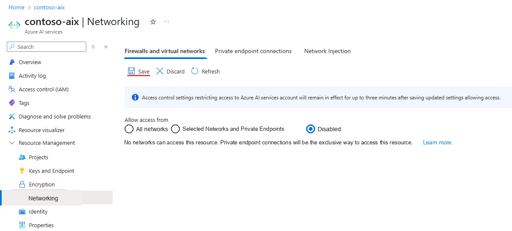
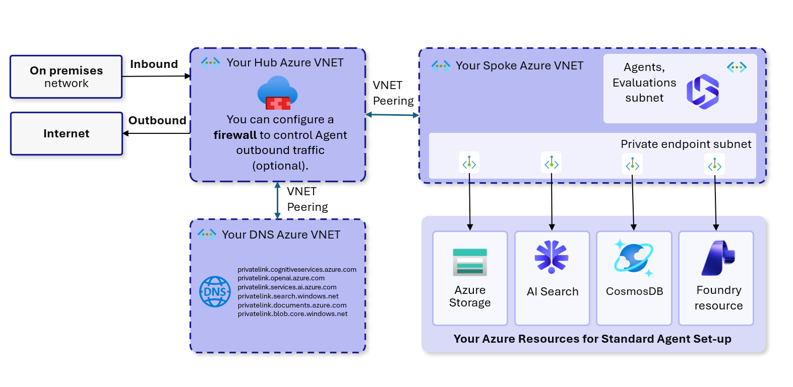
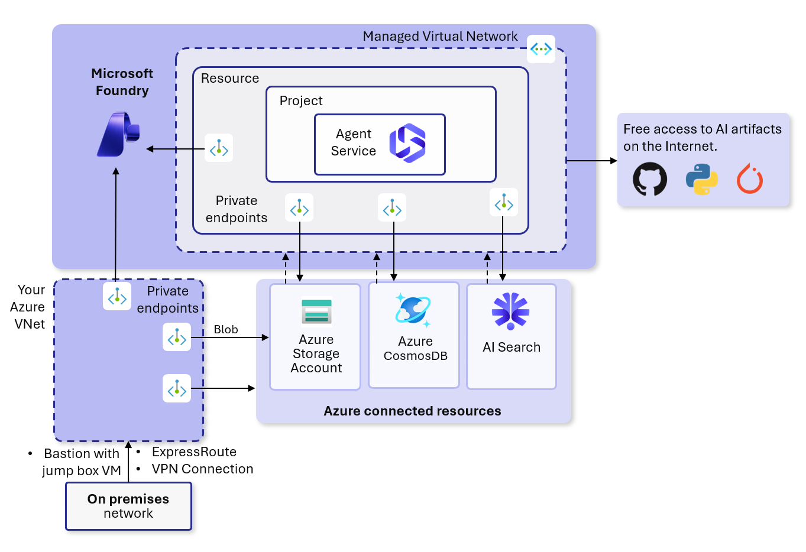
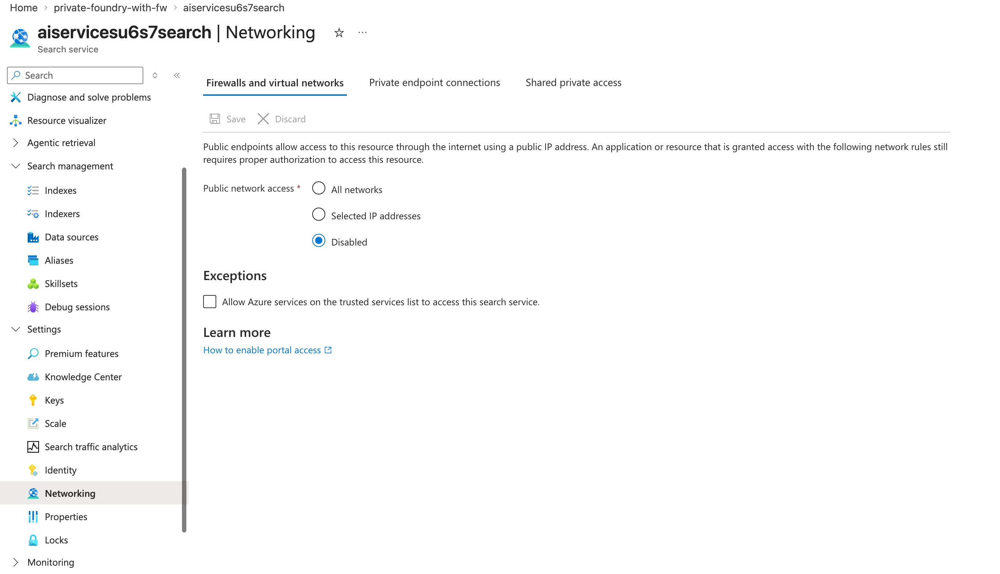
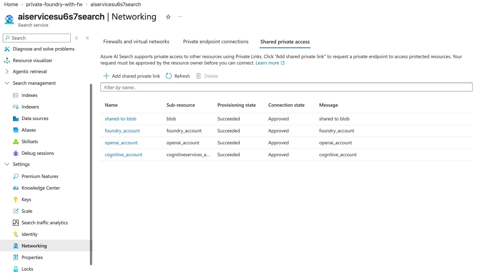
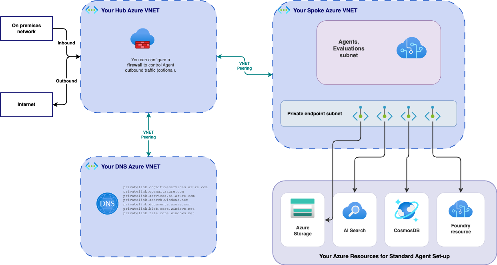
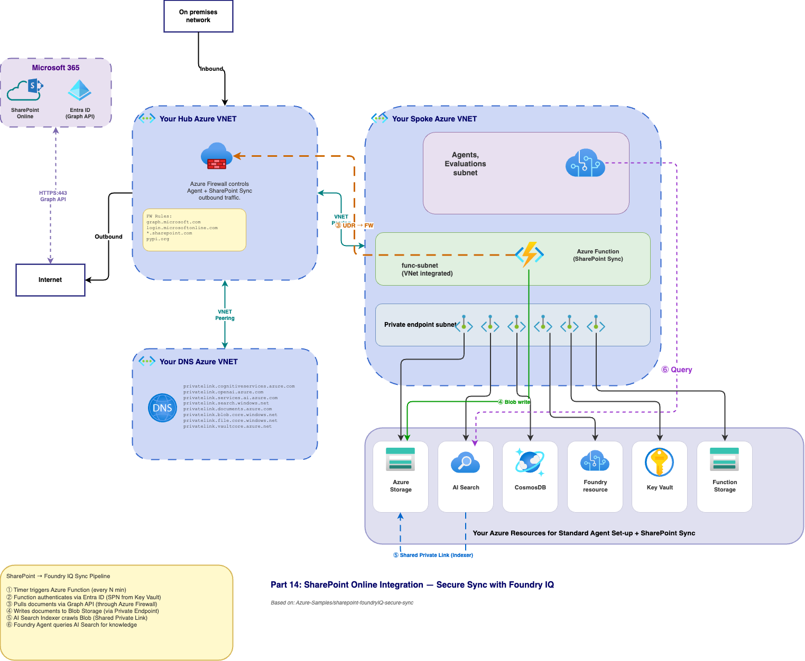

# Microsoft Foundry Networking — The Complete Guide

> **Updated April 2026** — Covers all networking options for Microsoft Foundry (formerly Azure AI Foundry), including Private Link, Managed VNet, BYO VNet injection, and Network Security Perimeter.

[](https://portal.azure.com/#create/Microsoft.Template/uri/https%3A%2F%2Fraw.githubusercontent.com%2Froie9876%2FAzure-AI-Foundry-Networking%2Frefs%2Fheads%2Fmain%2Fbicep%2Fazuredeploy.json)

> **Modified Template 15** — This repo includes a copy of the [official Microsoft Foundry Template 15](https://github.com/microsoft-foundry/foundry-samples/tree/main/infrastructure/infrastructure-setup-bicep/15-private-network-standard-agent-setup) with added support for **UDR (route all traffic through Azure Firewall)** and **private subnets** (`defaultOutboundAccess: false`). Set the `firewallPrivateIp` parameter to your firewall's private IP to enable deny-all egress control.

---

## Table of Contents

- [Why Is This So Confusing?](#why-is-this-so-confusing)
- [Part 1: The Components — What Needs Network Protection?](#part-1-the-components--what-needs-network-protection)
- [Part 2: The Three Network Directions](#part-2-the-three-network-directions)
  - [Direction 1: Inbound](#direction-1-inbound--who-can-reach-your-foundry-resource)
  - [Direction 2: Outbound from Foundry](#direction-2-outbound-from-foundry--how-it-reaches-azure-services)
  - [Direction 3: Outbound from Agent compute](#direction-3-outbound-from-agent-compute--how-your-agents-reach-data)
- [Part 3: The Four Network Options](#part-3-the-four-network-options-and-when-to-use-each)
  - [Option A: Private Link (Inbound)](#option-a-private-link-inbound-isolation--ga)
  - [Option B: BYO VNet Injection (Outbound)](#option-b-byo-vnet-injection-outbound-isolation--ga)
  - [Option C: Managed VNet (Outbound)](#option-c-managed-vnet-outbound-isolation--preview)
  - [Option D: Network Security Perimeter](#option-d-network-security-perimeter-nsp--preview)
- [Part 4: Decision Guide](#part-4-how-it-all-fits-together--decision-guide)
- [Part 5: Agent Setup Tiers](#part-5-agent-setup-tiers--when-do-you-provide-resources)
- [Part 5b: How Dependent Resources Connect — AI Search Networking Deep Dive](#part-5b-how-dependent-resources-connect--ai-search-networking-deep-dive)
  - [Mechanism 1: Trusted Services Exception (Inbound to AI Search)](#mechanism-1-trusted-services-exception-inbound-to-ai-search)
  - [Mechanism 2: Shared Private Access (Outbound from AI Search)](#mechanism-2-shared-private-access-outbound-from-ai-search)
  - [Comparison: Trusted Services vs Shared Private Access](#comparison-trusted-services-vs-shared-private-access)
  - [What Your Private Deployment Should Use](#what-your-private-deployment-should-use)
  - [Does Foundry Have SPLs Too?](#does-foundry-have-spls-too)
- [Part 6: Agent Tools — Network Support Matrix](#part-6-agent-tools--network-support-matrix)
- [Part 7: Feature Limitations with Network Isolation](#part-7-feature-limitations-with-network-isolation)
- [Part 8: Known Limitations](#part-8-known-limitations)
- [Part 9: RBAC Roles Required](#part-9-rbac-roles-required)
- [Part 10: Resource Provider Registrations](#part-10-resource-provider-registrations)
- [Part 11: Troubleshooting](#part-11-troubleshooting)
- [Part 12: Which Bicep Template Should I Use?](#part-12-which-bicep-template-should-i-use)
- [References — The Microsoft Docs Map](#references--the-microsoft-docs-map)
- [Part 13: Hands-On — Deploying Template 15 in a Hub-Spoke Network](#part-13-hands-on--deploying-template-15-in-a-hub-spoke-network)
  - [Firewall Rules Reference](#firewall-rules-reference)
- [Part 14: SharePoint Online Integration — Secure Sync with Foundry IQ](#part-14-sharepoint-online-integration--secure-sync-with-foundry-iq)
  - [14.1 What Problem Does This Solve?](#141-what-problem-does-this-solve)
  - [14.2 End-to-End Architecture](#142-end-to-end-architecture-zoomed-in)
  - [14.3 Ingest Flow — How Create / Update / Delete Propagate](#143-ingest-flow--how-create--update--delete-propagate)
  - [14.3.1 Permission Flow Deep-Dive — How User/Group IDs Travel from SharePoint to the Index](#1431-permission-flow-deep-dive--how-usergroup-ids-travel-from-sharepoint-to-the-index)
  - [14.4 What Ends Up in the Index — Schema & ACL Model](#144-what-ends-up-in-the-index--schema--acl-model)
  - [14.5 How the Foundry Agent "Knows" About Permissions](#145-how-the-foundry-agent-knows-about-permissions--spoiler-it-doesnt-not-by-itself)
  - [14.6 Verifying That ACLs Landed Correctly](#146-verifying-that-acls-landed-correctly)
  - [14.7 `azure_ai_search` Tool vs. Knowledge Source](#147-azure_ai_search-tool-vs-knowledge-source--why-we-picked-the-tool)
  - [14.8 Prerequisites](#148-prerequisites)
  - [14.9 Deploy the SharePoint Sync Layer](#149-deploy-the-sharepoint-sync-layer)
  - [14.9.1 `sharepoint-sync.env` — Parameter Reference](#1491-sharepoint-syncenv--parameter-reference)
  - [14.10 Customer-Environment Configuration](#1410-customer-environment-configuration-optional-overrides)
  - [14.11 What It Deploys](#1411-what-it-deploys)
  - [14.12 How Secrets Are Handled](#1412-how-secrets-are-handled)
  - [14.13 Post-Deployment Steps](#1413-post-deployment-steps)
  - [14.14 Troubleshooting](#1414-troubleshooting)

---

## Why Is This So Confusing?

If you've been reading Microsoft's docs and feeling lost — you're not alone. Microsoft has **5 separate documentation pages** about Foundry networking, and it's unclear how they relate to each other. Here's the problem: **Foundry is not one thing — it's made up of several components, and each component has its own networking story.**

This guide puts it all in one place.

---

## Part 1: The Components — What Needs Network Protection?

Before talking about network options, you need to understand that Microsoft Foundry has **four different components**, and each one has separate networking considerations:

```
┌─────────────────────────────────────────────────────────────────┐
│                    Microsoft Foundry                            │
│                                                                 │
│  ┌──────────────┐  ┌──────────────┐  ┌────────────────────────┐│
│  │ 1. Foundry   │  │ 2. Foundry   │  │ 3. Agent Service       ││
│  │    Portal    │  │    Resource  │  │    (compute that runs  ││
│  │    (UI)      │  │    (APIs)    │  │     your agents)       ││
│  └──────────────┘  └──────────────┘  └────────────────────────┘│
│                                                                 │
│  ┌─────────────────────────────────────────────────────────────┐│
│  │ 4. Dependent Azure Resources                               ││
│  │    (Storage, Cosmos DB, AI Search, Key Vault, OpenAI, etc.)││
│  └─────────────────────────────────────────────────────────────┘│
└─────────────────────────────────────────────────────────────────┘
```

| Component | What it is | Network question it raises |
|-----------|-----------|---------------------------|
| **Foundry Portal** | The web UI at ai.azure.com where you manage projects | How do your users access the portal? |
| **Foundry Resource** (Account + Project) | The Azure resource with APIs and settings | Can it be reached from the internet? Who can call its APIs? |
| **Agent Service compute** | The container that runs your AI agents, evaluations, prompt flows | Where does agent code execute? What can it reach? |
| **Dependent resources** | Azure Storage, Cosmos DB, AI Search, Azure OpenAI, Key Vault | Are these resources accessible from the internet or only privately? |

**Each of these components has its own network surface**, and you need to secure all of them. That's why there are so many docs — each one focuses on a different piece.

---

## Part 2: The Three Network Directions

Now that you know the components, there are **three directions** of network traffic to secure:


### Direction 1: Inbound — Who can reach your Foundry resource?

**This is about your users and client applications connecting to Foundry.**

By default, your Foundry resource is accessible from the public internet. Anyone with the right credentials can call the APIs or open the portal. For enterprise deployments, you want to restrict this.

**How you lock it down:** You set the **Public Network Access (PNA) flag** on your Foundry resource:

| PNA Setting | What it means |
|-------------|--------------|
| **All networks** | Anyone on the internet can connect (default — fine for testing) |
| **Selected IPs** | Only specific IP ranges can connect (e.g., your office IP) |
| **Disabled** | No public access at all — only reachable through a **private endpoint** in your VNet |

When you disable public access and add a private endpoint, your Foundry resource gets a private IP address inside your virtual network. Your team connects through VPN, ExpressRoute, or a Bastion jump box — never over the public internet.

> **This applies to ALL setup tiers** (Basic, Standard, Standard+VNet). You can always add a private endpoint, regardless of which agent tier you chose.

### Direction 2: Outbound from Foundry — How it reaches Azure services

**This is about how the Foundry resource talks to its dependent Azure services** (Storage, Key Vault, Azure OpenAI, etc.).

By default, these communications go over the Azure backbone network using public endpoints — encrypted, but technically "public." For maximum security, you create **private endpoints** for each dependent service, so all traffic stays fully private.

### Direction 3: Outbound from Agent compute — How your agents reach data

**This is the big one.** When your AI agents run, they need to reach data sources, APIs, and tools. This traffic comes from the **Agent Service compute** — the container that executes your agent code.

**This is where it gets complicated**, because Microsoft offers **three different options** for securing this traffic. That's the next section.

---

## Part 3: The Four Network Options (And When To Use Each)

Here's where people get confused. Microsoft offers **four different networking approaches**, and they're documented in four separate pages. Here's how they map:

```
                        ┌──────────────────────────────────────┐
                        │     INBOUND (to Foundry)             │
                        │                                      │
                        │  Option A: Private Link              │
                        │  Option D: Network Security          │
                        │            Perimeter (NSP)           │
                        └──────────────────────────────────────┘

                        ┌──────────────────────────────────────┐
                        │     OUTBOUND (from Agent compute)    │
                        │                                      │
                        │  Option B: BYO VNet Injection (GA)   │
                        │  Option C: Managed VNet (Preview)    │
                        └──────────────────────────────────────┘
```

### Quick Comparison

| | **Option A: Private Link** | **Option B: BYO VNet Injection** | **Option C: Managed VNet** | **Option D: NSP** |
|---|---|---|---|---|
| **What it secures** | Inbound access to Foundry | Outbound from Agent compute | Outbound from Agent compute | Inbound + Outbound (data-plane) |
| **Status** | GA | GA | **Preview** | **Preview** |
| **Complexity** | Low | Medium-High | Low-Medium | Medium |
| **Who manages the network** | You create PE in your VNet | You provide VNet + subnets | Microsoft manages the VNet | Microsoft manages the perimeter |
| **Agent runs in** | N/A (inbound only) | Your VNet subnet | Microsoft-managed VNet | N/A (policy layer) |
| **Can reach on-prem** | N/A | Yes (agents are in your VNet) | Via Application Gateway only | N/A |
| **Your own firewall** | N/A | Yes | No (Microsoft-managed FW) | N/A |
| **Use it when** | You need private access to the portal/APIs | Full network control, compliance, on-prem access | Simpler setup, no own VNet needed | You want a policy-based perimeter across multiple Azure services |
| **Docs** | [Private Link](https://learn.microsoft.com/en-us/azure/foundry/how-to/configure-private-link?view=foundry) | [VNet for Agents](https://learn.microsoft.com/en-us/azure/foundry/agents/how-to/virtual-networks) | [Managed VNet](https://learn.microsoft.com/en-us/azure/foundry/how-to/managed-virtual-network?view=foundry) | [NSP](https://learn.microsoft.com/en-us/azure/foundry/how-to/add-foundry-to-network-security-perimeter?view=foundry) |

> **Important:** These are NOT mutually exclusive. You typically **combine** Option A (Private Link for inbound) with either Option B or C (for outbound). Option D (NSP) is a complementary policy layer on top.

Now let's explain each one.

---

### Option A: Private Link (Inbound Isolation) — GA

**What it does:** Creates a private endpoint in your VNet that gives your Foundry resource a private IP address. Your team accesses the Foundry portal and APIs through this private IP instead of the public internet.

**Think of it like:** A private door into Foundry that only exists inside your building (VNet). The public door gets locked.

**How to set it up:**

1. In the [Azure portal](https://portal.azure.com/), go to your Foundry resource → **Networking**.
2. Set Public network access to **Disabled**.
3. Select **+ Private endpoint** → choose your VNet and subnet.
4. Azure creates a private IP and updates DNS automatically.

**DNS is the key:** When your team types `yourfoundry.cognitiveservices.azure.com`, the Private DNS Zone resolves it to the private IP (e.g., `10.0.1.5`) instead of a public IP. Same URL, private path. No code changes needed.

**Your team connects via:**

| Method | Best for |
|--------|----------|
| **[VPN Gateway](https://learn.microsoft.com/en-us/azure/vpn-gateway/vpn-gateway-about-vpngateways)** (Point-to-Site) | Individual developers on laptops |
| **[VPN Gateway](https://learn.microsoft.com/en-us/azure/vpn-gateway/vpn-gateway-about-vpngateways)** (Site-to-Site) | Connecting an entire office |
| **[ExpressRoute](https://learn.microsoft.com/en-us/azure/expressroute/)** | Dedicated private connection from data center |
| **[Azure Bastion](https://learn.microsoft.com/en-us/azure/bastion/bastion-overview)** | Quick access via a jump box VM in the browser |

**Trusted Azure services** can bypass the firewall if you enable it — they authenticate via managed identity:

| Service | Resource Provider |
|---------|------------------|
| Foundry Tools | `Microsoft.CognitiveServices` |
| Azure AI Search | `Microsoft.Search` |
| Azure Machine Learning | `Microsoft.MachineLearningServices` |



---

### Option B: BYO VNet Injection (Outbound Isolation) — GA

**What it does:** Places the Agent Service compute (the container running your agents) directly inside **your own virtual network**. You provide the VNet and subnets. Microsoft injects the agent container into your subnet.

**Think of it like:** Instead of your agents running on some Microsoft server you can't see, they run *inside your own network*. You control what they can reach.

**This is the full enterprise solution.** It's GA (production-ready) and gives you maximum control.


**What gets deployed in your VNet:**

| Subnet | What's in it | Size |
|--------|-------------|------|
| **Agent Subnet** | Your agents run here. Delegated to `Microsoft.App/environments`. Microsoft injects the agent container. | `/24` recommended (256 IPs), `/27` minimum |
| **Private Endpoint Subnet** | Private endpoints for Storage, Cosmos DB, AI Search, Foundry Account. Each gets a private IP. | Sized per number of endpoints |

**How traffic flows:**
- Agent code runs in the agent subnet → calls Azure Storage → goes through the private endpoint in the PE subnet → reaches Storage over private IP. Never touches the public internet.
- Agent calls Azure OpenAI → goes through the Foundry private endpoint → private IP. Same story.
- Agent calls an on-premises API → goes through your VPN/ExpressRoute → reaches your data center. Works natively because the agent is already in your VNet.

**Required Private DNS Zones** (so URLs resolve to private IPs):

| For | Private DNS Zone |
|-----|-----------------|
| Foundry Account | `privatelink.cognitiveservices.azure.com` |
| Foundry Account | `privatelink.openai.azure.com` |
| Foundry Account | `privatelink.services.ai.azure.com` |
| Azure AI Search | `privatelink.search.windows.net` |
| Azure Cosmos DB | `privatelink.documents.azure.com` |
| Azure Storage | `privatelink.blob.core.windows.net` |
| Azure Storage | `privatelink.file.core.windows.net` |

**Deployment:** Use the Bicep or Terraform templates — they create everything:
- **Bicep:** [15-private-network-standard-agent-setup](https://github.com/microsoft-foundry/foundry-samples/tree/main/infrastructure/infrastructure-setup-bicep/15-private-network-standard-agent-setup)
- **Terraform:** [15b-private-network-standard-agent-setup-byovnet](https://github.com/microsoft-foundry/foundry-samples/tree/main/infrastructure/infrastructure-setup-terraform/15b-private-network-standard-agent-setup-byovnet)
- **Hybrid/on-prem:** [19-hybrid-private-resources-agent-setup](https://github.com/microsoft-foundry/foundry-samples/tree/main/infrastructure/infrastructure-setup-bicep/19-hybrid-private-resources-agent-setup)

**Add a firewall** with hub-and-spoke if you need egress control:



---

### Option C: Managed VNet (Outbound Isolation) — Preview

**What it does:** Microsoft creates and manages a virtual network **for you**. Your agents run in this Microsoft-managed VNet. You don't provide a VNet or subnets — Microsoft handles it all.

**Think of it like:** Option B is "bring your own house, we'll move in." Option C is "we'll build the house for you, you just tell us the rules."

> ⚠️ **This is currently in Preview** — not recommended for production. If your enterprise doesn't allow preview features, use Option B instead.


**Two isolation modes for the managed VNet:**

**Allow Internet Outbound** — Agents can reach any internet destination. Useful for development where agents need to download packages or call external APIs. Azure still manages the VNet and can add private endpoints for Azure services.



**Allow Only Approved Outbound** — Agents can ONLY reach destinations you explicitly approve. Everything else is blocked. You define allowed targets using service tags, FQDNs, or private endpoints. Microsoft creates a managed Azure Firewall automatically.


**Managed VNet vs BYO VNet Injection — side by side:**

| | Managed VNet (Option C) | BYO VNet Injection (Option B) |
|---|---|---|
| Who creates the VNet | Microsoft | You |
| Your firewall | No — managed firewall auto-created | Yes — bring your own |
| On-premises access | Via Application Gateway only | Native (agents are in your VNet) |
| Evaluation compute security | Not supported | Supported |
| MCP tools with network isolation | Not supported (public MCP only) | Supported (private MCP) |
| Logging outbound traffic | Not supported | Supported (your firewall) |
| Status | **Preview** | **GA** |
| Deploy via | Bicep template only | Portal, Bicep, or Terraform |

**Managed VNet limitations:**
- Bicep-only deployment ([18-managed-virtual-network-preview](https://github.com/microsoft-foundry/foundry-samples/tree/main/infrastructure/infrastructure-setup-bicep/18-managed-virtual-network-preview))
- Can't bring your own firewall
- Can't switch back to no isolation once enabled
- FQDN rules only support ports 80 and 443
- Private endpoints to Cosmos DB and AI Search must be created manually via CLI
- Each Foundry account gets its own managed firewall (can't share)
- Preview regions only
- Requires feature flag registration: `az feature register --namespace Microsoft.CognitiveServices --name AI.ManagedVnetPreview`

---

### Option D: Network Security Perimeter (NSP) — Preview

**What it does:** NSP is a **policy-based security boundary** around multiple Azure PaaS resources. Instead of managing private endpoints one by one, you group resources into a perimeter and define inbound/outbound rules centrally.

**Think of it like:** Options A/B/C are about building walls and doors. Option D is about drawing a circle around a group of resources and saying "nothing crosses this circle unless it's on the list."

> ⚠️ **This is also in Preview.**


**How it works:**
1. Create a Network Security Perimeter in Azure
2. Associate your Foundry resource (and other Azure resources like Storage, AI Search) with the perimeter
3. Start in **Learning mode** — logs what would be blocked without actually blocking
4. Define **inbound rules** (who can reach your resources — by IP range or subscription)
5. Define **outbound rules** (what your resources can reach — by FQDN)
6. Switch to **Enforced mode** — now the rules are active

**Key concept:** Resources inside the same NSP **trust each other automatically** (when using managed identity). You only need rules for traffic crossing the perimeter boundary.

**NSP vs Private Link:**

| | Private Link (Option A) | NSP (Option D) |
|---|---|---|
| Approach | Network-level (private endpoints, private IPs) | Policy-level (rules, allow-lists) |
| Controls | Inbound only | Inbound + Outbound (data-plane) |
| Scope | One resource at a time | Multiple resources grouped together |
| Private IPs | Yes — resources get private IPs in your VNet | No — works at the policy layer |
| Status | **GA** | **Preview** |

**NSP doesn't replace Private Link** — it's complementary. You might use Private Link for the network-level isolation and NSP for the policy-level governance on top.

---

## Part 4: How It All Fits Together — Decision Guide

Here's the practical guide: **which options do you combine for your scenario?**

### Scenario 1a: "Just getting started, minimal security"
- **Agent tier:** Basic
- **Inbound:** Public access (default)
- **Outbound:** N/A (Microsoft-managed compute)
- **Options used:** None — just create an account and project
- **Template:** [40-basic-agent-setup](https://github.com/microsoft-foundry/foundry-samples/tree/main/infrastructure/infrastructure-setup-bicep/40-basic-agent-setup)

### Scenario 1b: "Basic agents, but private portal access"
- **Agent tier:** Basic
- **Inbound:** Option A (Private Link) — disable public access, add private endpoint
- **Outbound:** N/A (Microsoft-managed compute, Azure backbone)
- **Options used:** A
- **Template:** [10-private-network-basic](https://github.com/microsoft-foundry/foundry-samples/tree/main/infrastructure/infrastructure-setup-bicep/10-private-network-basic)

> ℹ️ **Basic ≠ public only.** You can add a private endpoint to a Basic setup. The "Basic" label refers to data storage (Microsoft-managed multitenant) — not the network access level. What you CAN'T do with Basic is BYO resources, VNet injection, or CMK.

### Scenario 2: "Production, data in my tenant, but no VNet needed"
- **Agent tier:** Standard (BYO Storage, Cosmos DB, AI Search)
- **Inbound:** Option A (Private Link) — disable public access, add private endpoint
- **Outbound:** Default (Azure backbone)
- **Options used:** A
- **Template:** [41-standard-agent-setup](https://github.com/microsoft-foundry/foundry-samples/tree/main/infrastructure/infrastructure-setup-bicep/41-standard-agent-setup) + manually add PE, or [10-private-network-basic](https://github.com/microsoft-foundry/foundry-samples/tree/main/infrastructure/infrastructure-setup-bicep/10-private-network-basic)

> ⚠️ **What's NOT private here:** The Foundry portal/API gets a private IP (your users connect privately), but the **Agent Service compute still runs on Microsoft's infrastructure**. It talks to your BYO resources (Storage, Cosmos DB, AI Search) over the **Azure backbone using their public endpoints** — encrypted, but not over private IPs. Your BYO resources still have public endpoints unless you manually lock them down. If you need the agent compute itself to be in your VNet with private IPs to all resources, go to **Scenario 3**.

### Scenario 3: "Full enterprise lockdown"
- **Agent tier:** Standard + BYO VNet
- **Inbound:** Option A (Private Link) — disable public access
- **Outbound:** Option B (BYO VNet Injection) — agents in your VNet, all private endpoints, all resources have public access disabled
- **Firewall:** Hub-and-spoke with Azure Firewall for egress control
- **Options used:** A + B
- **Template:** [15-private-network-standard-agent-setup](https://github.com/microsoft-foundry/foundry-samples/tree/main/infrastructure/infrastructure-setup-bicep/15-private-network-standard-agent-setup)

> ✅ **Everything is private here:** Foundry portal (private endpoint), Agent compute (injected into your VNet subnet), and ALL BYO resources (private endpoints, public access disabled). This is the only scenario where the agent compute itself has a private IP in your network.

### Scenario 4: "Enterprise lockdown, but don't want to manage a VNet"
- **Agent tier:** Standard
- **Inbound:** Option A (Private Link)
- **Outbound:** Option C (Managed VNet) — Microsoft manages the VNet
- **Options used:** A + C *(Preview)*
- **Template:** [18-managed-virtual-network-preview](https://github.com/microsoft-foundry/foundry-samples/tree/main/infrastructure/infrastructure-setup-bicep/18-managed-virtual-network-preview)

> ⚠️ **Preview.** Agent compute runs in a Microsoft-managed VNet (not your VNet). You don't see or manage the network — Microsoft handles it. Some limitations: no private MCP, no evaluation compute isolation, no custom firewall.

### Scenario 5: "Full lockdown + private MCP servers or on-prem data"
- **Agent tier:** Standard + BYO VNet
- **Inbound:** Option A (Private Link)
- **Outbound:** Option B (BYO VNet Injection) + MCP subnet
- **Options used:** A + B
- **Template:** [19-hybrid-private-resources-agent-setup](https://github.com/microsoft-foundry/foundry-samples/tree/main/infrastructure/infrastructure-setup-bicep/19-hybrid-private-resources-agent-setup)

> Uses 3 subnets: agent subnet, PE subnet, and an MCP subnet for hosting private MCP servers accessible by the agent.

---

## Part 5: Agent Setup Tiers — When Do You Provide Resources?

This is a critical question: **when do YOU need to create and manage Azure resources for the Agent Service, and when does Microsoft handle it?**

| | Basic | Standard | Standard + BYO VNet |
|---|---|---|---|
| **Cosmos DB** | ❌ Microsoft manages it | ✅ **You provide it** | ✅ **You provide it** |
| **Azure Storage** | ❌ Microsoft manages it | ✅ **You provide it** | ✅ **You provide it** |
| **Azure AI Search** | ❌ Microsoft manages it | ✅ **You provide it** | ✅ **You provide it** |
| **Virtual Network** | ❌ Not needed | ❌ Not needed | ✅ **You provide it** |
| **Where is agent data stored?** | Microsoft's multitenant storage (you can't see it) | In YOUR Azure resources (your tenant) | In YOUR Azure resources (your tenant) |
| **Who pays for data resources?** | Included | You pay for Cosmos DB, Storage, AI Search | You pay for Cosmos DB, Storage, AI Search |

**In plain terms:**
- **Basic** = You bring NOTHING. Microsoft stores your agent conversations, files, and search indexes in their own infrastructure. Fast to start, but you don't control where data lives.
- **Standard** = You bring **3 resources**: Azure Storage + Azure Cosmos DB + Azure AI Search. All agent data is stored in YOUR Azure subscription. You control it, you see it, you pay for it.
- **Standard + BYO VNet** = Same as Standard, PLUS you also bring a **Virtual Network** with subnets. The agent compute runs inside your network.

### Quick Reference

| Capability | Basic | Standard | Standard + BYO VNet |
|-----------|-------|----------|---------------------|
| Quick start, no resource management | ✅ | | |
| Data in your own Azure resources | | ✅ | ✅ |
| Customer Managed Keys (CMK) | | ✅ | ✅ |
| Full network isolation (agents in your VNet) | | | ✅ |

**Standard setup BYO resources:**

| Your Resource | What it stores | Minimum requirements |
|---------------|---------------|---------------------|
| Azure Storage | Files uploaded by users/devs | Standard account |
| Azure AI Search | Vector stores (embeddings) | Any tier |
| Azure Cosmos DB for NoSQL | Conversations, agent metadata | 3000 RU/s minimum (1000 × 3 containers) |

**Cosmos DB containers created automatically:**

| Container | Data |
|-----------|------|
| `thread-message-store` | User conversations |
| `system-thread-message-store` | Internal system messages |
| `agent-entity-store` | Agent metadata (instructions, tools, name) |

For N projects under one account, you need N × 3000 RU/s.

### Behind the Scenes: What is a Capability Host?

If you dig into the Azure portal or use the REST API, you will encounter an object called a **[Capability Host](https://learn.microsoft.com/en-us/azure/foundry/agents/concepts/capability-hosts?view=foundry-classic)**. 

* **What is it?** The Capability Host is the underlying infrastructure engine that actually runs your AI agents. It acts as the bridge that binds your agent code to your BYO data resources (Cosmos DB, Storage, AI Search) and the LLM models. 
* **Why it matters for networking:** When you use **Option B (BYO VNet Injection)**, the Capability Host is the actual physical resource component that gets injected into your delegated `Agent Subnet`.

> **💡 Pro Tip: Stuck Deletions & Cleanups** 
> Capability hosts are **immutable**. If you change your network setup, you must delete the capability host and recreate it. Occasionally, a capability host can get "stuck" in a deleting or failed state, making it impossible to delete from the UI (which can prevent you from dropping or changing your subnets). 
> 
> If you get stuck with a locked capability host, there is a manual cleanup procedure. You can use the `deleteCaphost.sh` script or direct Azure CLI REST API calls to force-delete the "zombie" capability host object so you can start fresh. (Check the official GitHub/Microsoft troubleshooting guides for the exact cleanup script).

---

## Part 5b: How Dependent Resources Connect — AI Search Networking Deep Dive

When you deploy a fully private Foundry setup (Scenario 3 / Template 15), all your BYO resources — AI Search, Storage, Cosmos DB, AI Services — have **public access disabled**. But these resources need to talk to *each other*, not just to Foundry and your agents.

This section explains the two networking mechanisms that control **how Azure AI Search connects to and from other services** in a private deployment. These are often confused because they appear on the same Networking page in the portal — but they solve completely different problems.

```
                          ┌──────────────────────┐
      Foundry/OpenAI ───► │   Azure AI Search    │ ───► Azure Storage
       (INBOUND)          │   (your resource)    │       (OUTBOUND)
                          └──────────────────────┘
                          
      Controlled by:          Controlled by:
      "Trusted Services"      "Shared Private Access"
      checkbox                (shared private links)
```

### Mechanism 1: Trusted Services Exception (Inbound to AI Search)

**Direction: INBOUND** — Other Azure services reaching *into* AI Search.

On the AI Search Networking page → **Firewalls and virtual networks** tab, there is a checkbox under **Exceptions**:

> ☑ Allow Azure services on the trusted services list to access this search service.



**What this does:** When public access is **Disabled**, nobody can reach AI Search — not even other Azure services. Checking this box creates an exception for specific Azure services that Microsoft considers "trusted." These services can bypass the IP firewall using their **managed identity** instead of a network path.

**The trusted services list for AI Search includes:**

| Trusted Service | Resource Provider | Why it needs access |
|---|---|---|
| **Microsoft Foundry / Azure OpenAI** | `Microsoft.CognitiveServices` | RAG patterns — Foundry queries AI Search to retrieve relevant documents for "Azure OpenAI On Your Data" |
| **Azure Machine Learning** | `Microsoft.MachineLearningServices` | ML pipelines that query search indexes |

**How it works under the hood:**
1. The trusted service (e.g., Foundry) has a **system-assigned managed identity**
2. That identity has a **role assignment** on the AI Search service (e.g., `Search Index Data Reader` or `Search Index Data Contributor`)
3. The service authenticates via Microsoft Entra ID — no API keys, no public IP needed
4. AI Search validates the Entra token and checks the caller is on the trusted list
5. The request is allowed through even though public access is disabled

**Key characteristics:**
- **Free** — no additional cost
- **Identity-based** — relies on Entra ID + RBAC, not network paths
- **Limited scope** — only the services on Microsoft's trusted list can use this; you can't add arbitrary services
- Works even when public network access is **Disabled** (that's the whole point)

> **Ref:** [Configure network access and firewall rules for Azure AI Search](https://learn.microsoft.com/en-us/azure/search/service-configure-firewall#grant-access-to-trusted-azure-services)

### Mechanism 2: Shared Private Access (Outbound from AI Search)

**Direction: OUTBOUND** — AI Search reaching *out* to other Azure resources.

On the AI Search Networking page → **Shared private access** tab, you can create **Shared Private Links (SPLs)** that let AI Search connect to other resources through managed private endpoints.



#### What is a Shared Private Link (SPL)?

A Shared Private Link is a **private endpoint that a PaaS service creates inside Microsoft's own managed infrastructure** — not in your VNet. It solves a specific problem: how does a fully managed service (like AI Search) reach another locked-down resource when it doesn't live in your virtual network?

**The key difference from a regular Private Endpoint:**

| | Private Endpoint (PE) | Shared Private Link (SPL) |
|---|---|---|
| **Created by** | You, in your VNet | The Azure service (e.g., AI Search), in Microsoft's infrastructure |
| **Lives in** | Your subnet (`pe-subnet`) | Microsoft-managed network — invisible to you |
| **Shows up in your VNet?** | Yes — you see the NIC, the IP | No — it's entirely hidden |
| **Traffic path** | Your VNet → PE → target resource | Azure service → Azure backbone → target resource |
| **Visible in your firewall logs?** | Yes (if routed through firewall) | No — never touches your VNet |
| **You manage it?** | Fully | You create/delete the link; Microsoft manages the endpoint |
| **Approval required?** | You approve on the target resource | Same — target resource owner must approve |
| **Use case** | Your apps/VMs/agents reaching a resource | An Azure PaaS service reaching another resource on your behalf |

**Think of it this way:** You have Private Endpoints in your VNet so *your* agents can reach AI Search, Storage, etc. But AI Search itself also needs to reach Storage and AI Services — and AI Search doesn't live in your VNet. SPLs give AI Search its *own* private connection to those resources, running entirely on the Azure backbone.

```
YOUR VNET                                    MICROSOFT-MANAGED
┌─────────────────────┐                      ┌─────────────────────┐
│ pe-subnet           │                      │ (invisible to you)  │
│  PE ─────────────────────► AI Search ─────── SPL ──► Storage     │
│  PE ─────────────────────► Storage         │ SPL ──► AI Services │
│  PE ─────────────────────► AI Services     │ SPL ──► AI Services │
│  PE ─────────────────────► CosmosDB        │ SPL ──► AI Services │
└─────────────────────┘                      └─────────────────────┘
  You created these                           AI Search created these
  They live in YOUR subnet                    They live in MICROSOFT's infra
```

> **Note:** SPLs are not unique to AI Search. Other Azure PaaS services also support them — see [Does Foundry Have SPLs Too?](#does-foundry-have-spls-too) below.

#### What this does

AI Search indexers and vectorizers need to read data from Storage, call embedding models on AI Services, write to knowledge stores, etc. When those target resources have public access disabled, AI Search can't reach them — unless it has a private connection. Shared Private Access creates a **private endpoint managed by Microsoft** (inside Microsoft's infrastructure, not your VNet) that connects AI Search to a specific target resource.

**In a typical private Foundry deployment, you need these SPLs:**

| # | Name | Target Resource | Sub-resource | Purpose |
|---|------|----------------|-------------|---------|
| 1 | `shared-to-blob` | Azure Storage | `blob` | Indexer reads blob data; enrichment cache; debug sessions; knowledge store |
| 2 | `foundry_account` | AI Services | `foundry_account` | Billing and skills processing |
| 3 | `openai_account` | AI Services | `openai_account` | Calls embedding model (e.g., `text-embedding-3-small`) during indexing for integrated vectorization |
| 4 | `cognitive_account` | AI Services | `cognitiveservices_account` | Built-in cognitive skills (OCR, entity recognition, etc.) |

**How it works under the hood:**
1. You create the shared private link on AI Search (portal → Shared private access → Add)
2. Microsoft deploys a private endpoint inside its managed infrastructure — AI Search gets a private IP for talking to the target resource
3. The target resource owner must **approve** the connection (it shows as "Pending" until approved)
4. Once approved, AI Search always uses this private path for that resource — it's enforced, not optional
5. **Indexers must run in the private execution environment** — set `"executionEnvironment": "Private"` on each indexer (see [Section 7.4](#74-set-indexer-execution-environment-to-private))

**Key characteristics:**
- **Billed** — based on [Azure Private Link pricing](https://azure.microsoft.com/pricing/details/private-link/)
- **Network-based** — creates an actual private endpoint with a private IP
- **Requires approval** — the target resource owner must approve each connection
- **Forces private execution** — indexers using SPLs cannot run in the multitenant environment
- **Per-resource** — one SPL per resource + sub-resource combination

> **Important:** Once an SPL is created for a resource, AI Search **always** uses it for connections to that resource. You can't bypass the private connection for a public one. This is enforced internally.

> **Ref:** [Make outbound connections through a shared private link](https://learn.microsoft.com/en-us/azure/search/search-indexer-howto-access-private)

### Comparison: Trusted Services vs Shared Private Access

| | Trusted Services Exception | Shared Private Access (SPLs) |
|---|---|---|
| **Traffic direction** | **Inbound** to AI Search | **Outbound** from AI Search |
| **What it controls** | Who can call/query AI Search | What AI Search indexers/vectorizers can reach |
| **Mechanism** | Firewall bypass via managed identity + RBAC | Private endpoint created by AI Search in Microsoft-managed infrastructure |
| **Cost** | **Free** | **Billed** (Azure Private Link pricing) |
| **Setup complexity** | Low — checkbox + role assignments | Medium — create link, approve on target, configure indexer execution |
| **Security model** | Identity-based (Entra ID + RBAC) | Network-based (private endpoint, no public internet) |
| **Alternative** | Private endpoint from your VNet to AI Search (which Template 15 already creates) | IP firewall rules on target resource (weaker, doesn't work for same-region storage) |
| **One or the other?** | No — **they can coexist.** One is inbound, the other is outbound. | |

### What Your Private Deployment Should Use

In a full enterprise lockdown (Template 15 / hub-spoke), here's the recommendation:

| Feature | Recommendation | Reason |
|---|---|---|
| **Trusted services checkbox** | **Leave unchecked** (most restrictive) | You already have a private endpoint for AI Search in your `pe-subnet`. Foundry reaches AI Search through that PE. The checkbox is redundant and slightly widens the attack surface. |
| **Shared private access** | **Required — create 2-4 SPLs** | Without these, AI Search indexers can't reach your locked-down Storage and AI Services. Knowledge source creation will fail. |

**If you enable the trusted services checkbox anyway:**
- It's a **belt-and-suspenders** approach — Foundry can reach AI Search via PE *or* via the trusted exception
- There's no conflict, but it's less restrictive than PE-only
- Some organizations enable it during troubleshooting and forget to disable it — not ideal for zero-trust posture

**If you skip the shared private access:**
- AI Search indexers **will fail** with `transientFailure` errors
- Knowledge source creation in the Foundry portal will fail with: *"Failed to create knowledge source"*
- The indexer literally cannot reach the blob storage or embedding model endpoint

> **Note:** Azure AI Search is *also* on the trusted services list of **other** Azure resources. For example, you can use the trusted service exception to let [AI Search connect to Azure Storage as a trusted service](https://learn.microsoft.com/en-us/azure/search/search-indexer-howto-access-trusted-service-exception). However, this only works for **blob and ADLS Gen2** on Azure Storage, and only with a **system-assigned managed identity**. In a fully private deployment with SPLs, you don't need this — the SPL already provides the private connection.

### Does Foundry Have SPLs Too?

**Yes — but only when using Managed VNet (Option C), and they're called "outbound rules" or "managed private endpoints" instead of SPLs.**

The concept is identical: Foundry (like AI Search) is a managed PaaS service that needs to reach your locked-down resources. Depending on which networking option you chose, the mechanism differs:

| Networking Option | How Foundry reaches your resources | SPL-like mechanism? |
|---|---|---|
| **Option B: BYO VNet Injection** | Agents run **in your subnet** — they use your VNet's Private Endpoints directly | **No SPLs needed.** Agents are already in your network. |
| **Option C: Managed VNet** | Agents run in a **Microsoft-managed VNet** — Foundry creates managed private endpoints to reach your resources | **Yes — these are Foundry's equivalent of SPLs.** You configure them as "outbound rules" on the Managed VNet. |

**In a BYO VNet deployment (Option B / Template 15):**
- Your agents run in the `agent-subnet` of your spoke VNet
- They reach Storage, AI Search, CosmosDB, AI Services via the Private Endpoints in your `pe-subnet`
- No SPLs needed on Foundry — the agents *are* in your network

**In a Managed VNet deployment (Option C):**
- Your agents run in a Microsoft-managed VNet (invisible to you)
- Foundry creates **managed private endpoints** (outbound rules) from its managed VNet to your resources
- These are functionally the same as AI Search's SPLs — a private endpoint inside Microsoft's infrastructure, approved by the target resource owner
- You configure them in Portal → Foundry account → Networking → Managed VNet → Outbound rules

**Summary:** SPL is a general Azure pattern — any PaaS service that runs in Microsoft-managed infrastructure and needs to reach your locked-down resources will use some form of managed private endpoint. AI Search calls them "Shared Private Links." Foundry's Managed VNet calls them "outbound rules." The mechanism is the same.

---

## Part 6: Agent Tools — Network Support Matrix

Not all agent tools work behind a VNet. Here's the current status:

| Tool | Works in VNet? | Traffic path |
|------|---------------|-------------|
| MCP Tool (Private MCP) | ✅ Yes | Through your VNet subnet |
| Azure AI Search | ✅ Yes | Through private endpoint |
| Code Interpreter | ✅ Yes | Microsoft backbone (no config needed) |
| Function Calling | ✅ Yes | Microsoft backbone (no config needed) |
| Bing Grounding | ✅ Yes | Public internet* |
| Websearch | ✅ Yes | Public internet* |
| SharePoint Grounding | ✅ Yes | Public internet* |
| Foundry IQ (preview) | ✅ Yes | Via MCP |
| Fabric Data Agent | ❌ No | — |
| Logic Apps | ❌ No | — |
| File Search | ❌ No | Under development |
| OpenAPI tool | ❌ No | Under development |
| Azure Functions | ❌ No | Under investigation |
| Browser Automation | ❌ No | Under investigation |
| Computer Use | ❌ No | Under investigation |
| Image Generation | ❌ No | Under investigation |
| Agent-to-Agent (A2A) | ❌ No | Under development |

*Bing, Websearch, and SharePoint use the public internet even in VNet-isolated setups. Block via Azure Policy if needed.

> **SharePoint & AI Search connectivity in hub-spoke:** If you use an AI Search **SharePoint Online indexer**, the traffic from AI Search to SharePoint goes via the **Microsoft Graph API on the Microsoft backbone network**. It does **not** flow through your VNet, UDR, or Azure Firewall. This means SharePoint indexers work regardless of your network topology — no firewall rules, no private endpoints, no SPL needed for SharePoint.

---

## Part 7: Feature Limitations with Network Isolation

| Feature | Status | Notes |
|---------|--------|-------|
| Hosted Agents | ❌ Not supported | No VNet support |
| Publish to Teams/M365 | ❌ Not supported | Requires public endpoints |
| Synthetic Data for Evaluations | ❌ Not supported | Bring your own data |
| Traces | ❌ Not supported | No private Application Insights support |
| Workflow Agents | ⚠️ Partial | Inbound works. Outbound VNet injection not supported |
| AI Gateway | ⚠️ Partial | Auto-public. Needs its own network isolation |
| MCP tools + Managed VNet | ❌ Not supported | Use BYO VNet (Option B) for private MCP |
| Evaluation compute + Managed VNet | ❌ Not supported | Use BYO VNet (Option B) |

---

## Part 8: Known Limitations

- **RFC1918 only:** Subnets must use `10.0.0.0/8`, `172.16.0.0/12`, or `192.168.0.0/16`
- **Avoid 172.17.0.0/16:** Reserved by Docker
- **One agent subnet per Foundry resource** — can't share subnets
- **Subnet size:** Minimum `/27` (32 IPs), recommended `/24` (256 IPs)
- **Same subscription:** Private endpoints must match the VNet subscription
- **Capability hosts are immutable:** Can't update after creation — delete and recreate
- **Managed VNet is one-way:** Once enabled, can't disable or switch modes
- **File Search + Blob Storage:** Not supported behind VNet

---

## Part 9: RBAC Roles Required

| Who | Needs this role | Scope |
|-----|----------------|-------|
| Admin creating the account | Azure AI Account Owner | Subscription |
| Admin assigning BYO resource permissions | Role Based Access Administrator | Resource group |
| Developers creating/editing agents | Azure AI User | Project |

### Project managed identity roles (Standard setup)

| Resource | Role |
|----------|------|
| Cosmos DB account | Cosmos DB Operator |
| Storage account | Storage Account Contributor |
| Azure AI Search | Search Index Data Contributor + Search Service Contributor |
| Blob container `<workspaceId>-azureml-blobstore` | Storage Blob Data Contributor |
| Blob container `<workspaceId>-agents-blobstore` | Storage Blob Data Owner |
| Cosmos DB database `enterprise_memory` | Cosmos DB Built-in Data Contributor |

### Custom RBAC for Cosmos DB Data Plan (Private Networks)

When your Cosmos DB operates within a private network setup, built-in roles might lack exact data-plane query access. You may need to create and assign a strictly-scoped **Custom Role** to your project's managed identity so it can read/query items over the private network. 

Run this PowerShell script (replace the variables with your own environments data):

```powershell
$resourceGroupName = "<your-resource-group>"
$accountName = "<your-cosmos-db-account-name>"

# 1. Create a custom Data-Plane Role
New-AzCosmosDBSqlRoleDefinition -AccountName $accountName `
  -ResourceGroupName $resourceGroupName `
  -Type CustomRole `
  -RoleName CosmosDBDataPlanRole `
  -DataAction @( `
    'Microsoft.DocumentDB/databaseAccounts/readMetadata', `
    'Microsoft.DocumentDB/databaseAccounts/sqlDatabases/containers/items/read', `
    'Microsoft.DocumentDB/databaseAccounts/sqlDatabases/containers/executeQuery', `
    'Microsoft.DocumentDB/databaseAccounts/sqlDatabases/containers/readChangeFeed' `
  ) `
  -AssignableScope "/"

# 2. Get the new Role's ID (You can pull the ID from the output of the command above)
$customRoleDefinitionId = "/subscriptions/<your-subscription-id>/resourceGroups/$resourceGroupName/providers/Microsoft.DocumentDB/databaseAccounts/$accountName/sqlRoleDefinitions/<new-role-guid>"

# 3. Assign the new role to the Foundry Project Managed Identity 
# (You can find the Principal ID under Identity in your AI Project)
$principalId = "<your-ai-project-managed-identity-object-id>"

New-AzCosmosDBSqlRoleAssignment -AccountName $accountName `
   -ResourceGroupName $resourceGroupName `
   -RoleDefinitionId $customRoleDefinitionId `
   -Scope "/" `
   -PrincipalId $principalId
```

---

## Part 10: Resource Provider Registrations

```bash
az provider register --namespace 'Microsoft.KeyVault'
az provider register --namespace 'Microsoft.CognitiveServices'
az provider register --namespace 'Microsoft.Storage'
az provider register --namespace 'Microsoft.MachineLearningServices'
az provider register --namespace 'Microsoft.Search'
az provider register --namespace 'Microsoft.Network'
az provider register --namespace 'Microsoft.App'
az provider register --namespace 'Microsoft.ContainerService'
# Only if using Bing Search tool:
az provider register --namespace 'Microsoft.Bing'
```

For Managed VNet (Preview), also register the feature flag:
```bash
az feature register --namespace Microsoft.CognitiveServices --name AI.ManagedVnetPreview
```

---

## Part 11: Troubleshooting

### Deployment Errors

| Error | Cause | Fix |
|-------|-------|-----|
| `CapabilityHost supports a single, non empty value for storageConnections...` | Missing BYO resource | Provide all three: Storage, Cosmos DB, AI Search |
| `Provided subnet must be of the proper address space` | Wrong IP range | Use RFC1918 only |
| `Subscription is not registered with required resource providers` | Missing registrations | Run `az provider register` commands above |
| `Failed async operation` / `Capability host operation failed` | Various | Create support ticket. Check capability host |
| `Subnet requires delegation to Microsoft.App/environments` | Stale resource | Purge via portal or run `deleteCaphost.sh` |
| `Timeout of 60000ms` on Agent pages | Can't reach Cosmos DB | Check private endpoint + DNS for Cosmos DB |
| `Failed to create knowledge source` | Multiple possible causes | See Knowledge Source section below |

### Knowledge Source Creation Failures

Creating a knowledge source (blob → AI Search → Foundry) in the portal is the most error-prone step in a private deployment. Here's a systematic checklist:

| # | Check | How to verify | Fix |
|---|-------|--------------|-----|
| 1 | **API key auth enabled on AI Services** | `az cognitiveservices account show --name <name> -g <rg> --query properties.disableLocalAuth` → should be `false` | See Part 13 Step 4.5 |
| 2 | **AI Services has RBAC on Storage** | Check AI Services MI has `Storage Blob Data Contributor` on storage account | See Part 13 Step 4.2 |
| 3 | **AI Services has RBAC on AI Search** | Check AI Services MI has `Search Index Data Contributor` + `Search Service Contributor` on AI Search | See Part 13 Step 4.2 |
| 4 | **SPL: AI Search → Blob Storage** | `az search shared-private-link-resource list` — should show `blob` with `Approved` status | See Part 13 Step 4.3 |
| 5 | **SPL: AI Search → Foundry Account** | Same command — should show `foundry_account` with `Approved` status | See Part 13 Step 4.3 |
| 6 | **SPL: AI Search → OpenAI Account** | Same command — should show `openai_account` with `Approved` status | See Part 13 Step 4.3 |
| 7 | **SPL: AI Search → Cognitive Account** | Same command — should show `cognitiveservices_account` with `Approved` status | See Part 13 Step 4.3 |
| 8 | **Indexer execution environment** | Check indexer JSON has `"executionEnvironment": "Private"` | See Part 13 Step 4.4 |
| 9 | **Semantic search enabled** | `az search service show --query properties.semanticSearch` — should be `free` or `standard` | See Part 13 Step 4.6 |
| 8 | **AI Search bypass** | `az search service show --query networkRuleSet.bypass` — consider `"AzurePortal"` for portal operations | Set bypass via REST API |

> **Tip:** Check the Azure Activity Log for the actual error details — the portal's generic "Failed to create knowledge source" message hides the real cause:
> ```bash
> az monitor activity-log list --resource-group <rg> \
>   --start-time $(date -u -v-30M '+%Y-%m-%dT%H:%M:%SZ') \
>   --status Failed \
>   --query "[].{time:eventTimestamp, operation:operationName.localizedValue, message:properties.statusMessage}" \
>   -o json
> ```

### DNS Issues

| Symptom | Fix |
|---------|-----|
| `nslookup` returns public IP | Link private DNS zone to your VNet |
| Custom DNS can't resolve | Forward `privatelink.*` to Azure DNS (`168.63.129.16`) |
| Intermittent resolution failures | Check DNS server reachability from all subnets |

### Connectivity Issues

| Symptom | Fix |
|---------|-----|
| Timeout on port 443 | Check NSG allows traffic to PE IP on 443 |
| Can't reach from on-prem | Check VPN/ER is up + route tables include VNet range |
| 403 Forbidden | Usually RBAC, not networking. Check role assignments |

### Agent Issues

| Symptom | Fix |
|---------|-----|
| Agent won't start | Use Standard setup (not Basic). Check subnet IPs available |
| Agent can't access MCP tools | Check private endpoints + managed identity RBAC |
| Evaluation fails with network errors | Check all DNS zones configured |
| Agent timeout on external calls | Firewall may block HTTPS. Allow destination or add NAT gateway |

---

## Part 12: Which Bicep Template Should I Use?

Microsoft provides **many** Bicep templates in [foundry-samples](https://github.com/microsoft-foundry/foundry-samples/tree/main/infrastructure/infrastructure-setup-bicep) and it's hard to know which one fits your scenario. Here's the complete guide:

### Template Decision Flowchart

```
Do you need network isolation?
│
├── No ──► Do you need your own data resources?
│          │
│          ├── No  ──► 40-basic-agent-setup
│          │           (Fastest start. Microsoft-managed storage.)
│          │
│          └── Yes ──► 41-standard-agent-setup
│                      (BYO Cosmos DB, Storage, AI Search. No VNet.)
│
└── Yes ──► Do you need ONLY inbound isolation (private portal access)?
           │
           ├── Yes ──► 10-private-network-basic
           │           (Private endpoint for Foundry. No agent VNet.)
           │
           └── No ──► You need full outbound isolation too.
                      │
                      ├── Want Microsoft to manage the VNet?
                      │   └── 18-managed-virtual-network-preview ⚠️ PREVIEW
                      │
                      ├── Want to manage your own VNet?
                      │   │
                      │   ├── System Managed Identity (default)
                      │   │   └── 15-private-network-standard-agent-setup ✅ MOST COMMON
                      │   │
                      │   ├── User Assigned Identity
                      │   │   └── 17-private-network-standard-user-assigned-identity-agent-setup
                      │   │
                      │   ├── Need API Management integration?
                      │   │   └── 16-private-network-standard-agent-apim-setup-preview ⚠️ PREVIEW
                      │   │
                      │   └── Need MCP servers or on-prem data in the VNet?
                      │       └── 19-hybrid-private-resources-agent-setup
                      │
                      └── (See also 30/31/32 templates if you need Customer Managed Keys)
```

### All Templates — Side by Side

| # | Template | Agent Tier | Identity | Network | Special Feature | Status |
|---|----------|-----------|----------|---------|----------------|--------|
| **40** | [basic-agent-setup](https://github.com/microsoft-foundry/foundry-samples/tree/main/infrastructure/infrastructure-setup-bicep/40-basic-agent-setup) | Basic | SMI | Public | Fastest start | GA |
| **42** | [basic-agent-setup-with-customization](https://github.com/microsoft-foundry/foundry-samples/tree/main/infrastructure/infrastructure-setup-bicep/42-basic-agent-setup-with-customization) | Basic | SMI | Public | BYO OpenAI + App Insights | GA |
| **45** | [basic-agent-bing](https://github.com/microsoft-foundry/foundry-samples/tree/main/infrastructure/infrastructure-setup-bicep/45-basic-agent-bing) | Basic | SMI | Public | Bing grounding pre-configured | GA |
| **41** | [standard-agent-setup](https://github.com/microsoft-foundry/foundry-samples/tree/main/infrastructure/infrastructure-setup-bicep/41-standard-agent-setup) | Standard | SMI | Public | BYO resources (Cosmos, Storage, Search) | GA |
| **43** | [standard-agent-setup-with-customization](https://github.com/microsoft-foundry/foundry-samples/tree/main/infrastructure/infrastructure-setup-bicep/43-standard-agent-setup-with-customization) | Standard | SMI | Public | BYO resources + BYO OpenAI | GA |
| **10** | [private-network-basic](https://github.com/microsoft-foundry/foundry-samples/tree/main/infrastructure/infrastructure-setup-bicep/10-private-network-basic) | — | SMI | **Private inbound** | PE for Foundry only (no agent VNet) | GA |
| **15** | [private-network-standard-agent-setup](https://github.com/microsoft-foundry/foundry-samples/tree/main/infrastructure/infrastructure-setup-bicep/15-private-network-standard-agent-setup) | Standard | SMI | **Full E2E** | BYO VNet + all private endpoints | **GA** |
| **16** | [private-network-standard-agent-apim-setup](https://github.com/microsoft-foundry/foundry-samples/tree/main/infrastructure/infrastructure-setup-bicep/16-private-network-standard-agent-apim-setup-preview) | Standard | SMI | **Full E2E** | + Azure API Management integration | **Preview** |
| **17** | [private-network-standard-UAI-agent-setup](https://github.com/microsoft-foundry/foundry-samples/tree/main/infrastructure/infrastructure-setup-bicep/17-private-network-standard-user-assigned-identity-agent-setup) | Standard | **UAI** | **Full E2E** | User Assigned Identity instead of SMI | GA |
| **18** | [managed-virtual-network-preview](https://github.com/microsoft-foundry/foundry-samples/tree/main/infrastructure/infrastructure-setup-bicep/18-managed-virtual-network-preview) | Standard | SMI | **Managed VNet** | Microsoft manages the VNet for you | **Preview** |
| **19** | [hybrid-private-resources-agent-setup](https://github.com/microsoft-foundry/foundry-samples/tree/main/infrastructure/infrastructure-setup-bicep/19-hybrid-private-resources-agent-setup) | Standard | SMI | **Full E2E** | + MCP servers + on-prem data + 3 subnets | GA |
| **30** | [customer-managed-keys](https://github.com/microsoft-foundry/foundry-samples/tree/main/infrastructure/infrastructure-setup-bicep/30-customer-managed-keys) | — | SMI | — | CMK encryption | GA |
| **31** | [CMK-standard-agent](https://github.com/microsoft-foundry/foundry-samples/tree/main/infrastructure/infrastructure-setup-bicep/31-customer-managed-keys-standard-agent) | Standard | SMI | — | CMK + Standard agent | GA |
| **32** | [CMK-UAI](https://github.com/microsoft-foundry/foundry-samples/tree/main/infrastructure/infrastructure-setup-bicep/32-customer-managed-keys-user-assigned-identity) | — | UAI | — | CMK + User Assigned Identity | GA |

**Legend:** SMI = System Managed Identity, UAI = User Assigned Identity, PE = Private Endpoint, E2E = End-to-end network isolation

### What's the Difference Between 15, 16, 17, and 19?

These four templates are all "full E2E network isolation" but with different extras:

| Template | Base | + What's Added |
|----------|------|---------------|
| **15** | Standard + BYO VNet + all PEs | **The baseline.** Start here if you just need full network isolation. |
| **16** | Same as 15 | + **Azure API Management** private endpoint. Use when agents need to call APIs through APIM. Preview. |
| **17** | Same as 15 | + **User Assigned Identity** instead of System Managed Identity. Use when you need to pre-create and share the identity across resources, or when your org requires UAI. |
| **19** | Same as 15 | + **Third subnet for MCP servers** + on-prem data access. Use when agents need to reach private MCP tools or hybrid data sources. Also supports toggling public/private access. |

### My Recommendation

For most enterprise deployments:

1. **Starting out?** Use **40** (basic) or **41** (standard) — no networking complexity
2. **Need private portal access only?** Use **10** — adds a private endpoint, nothing else
3. **Full enterprise lockdown?** Use **15** — this is the "production standard" template
4. **Need private MCP or on-prem data?** Use **19** — extends 15 with hybrid connectivity
5. **Don't want to manage a VNet?** Use **18** — but it's Preview, with limitations

---

## References — The Microsoft Docs Map

Here's where each doc fits (so you don't get lost again):

| Doc | Covers | Options |
|-----|--------|---------|
| [Configure Private Link](https://learn.microsoft.com/en-us/azure/foundry/how-to/configure-private-link?view=foundry) | **Inbound** access + overall network planning | Option A |
| [Virtual Networks for Agents](https://learn.microsoft.com/en-us/azure/foundry/agents/how-to/virtual-networks) | **Outbound** — BYO VNet injection for Agent Service | Option B |
| [Managed Virtual Network](https://learn.microsoft.com/en-us/azure/foundry/how-to/managed-virtual-network?view=foundry) | **Outbound** — Microsoft-managed VNet (Preview) | Option C |
| [Network Security Perimeter](https://learn.microsoft.com/en-us/azure/foundry/how-to/add-foundry-to-network-security-perimeter?view=foundry) | **Policy-based** inbound + outbound (Preview) | Option D |
| [Environment Setup](https://learn.microsoft.com/en-us/azure/foundry/agents/environment-setup) | Agent setup tiers (Basic / Standard / Standard+VNet) | Tier choice |
| [Standard Agent Setup](https://learn.microsoft.com/en-us/azure/foundry/agents/concepts/standard-agent-setup) | BYO resources (Cosmos DB, Storage, AI Search) details | Standard tier |
| [Capability Hosts](https://learn.microsoft.com/en-us/azure/foundry/agents/concepts/capability-hosts?view=foundry-classic) | The underlying compute infrastructure that runs your AI Agent | Architecture |
| [Foundry Samples](https://github.com/microsoft-foundry/foundry-samples) | Bicep + Terraform templates for all scenarios | All |

---

## Part 13: Hands-On — Deploying Template 15 in a Hub-Spoke Network

This section walks through a complete, production-ready deployment of **Template 15** (private network standard agent setup) into a hub-spoke topology with Azure Firewall. All egress traffic is forced through the firewall for inspection and control.

### Repository Structure

This repo is organized for a **modular, step-by-step deployment**:

```
deployment/
  1-deploy-hub.sh                 # Step 1: Hub infrastructure
  2-deploy-spoke.sh               # Step 2: Spoke networking
  3-deploy-sharepoint-sync.sh     # Step 4: SharePoint sync layer (Part 14)
  hub.env.example                 # Hub configuration template
  spoke.env.example               # Spoke configuration template
  sharepoint-sync.env.example     # SharePoint sync configuration template

bicep/                            # Step 3: Modified Template 15
  main.bicep                      #   Added: UDR support + private subnets
  main.bicepparam                 #   Parameter file
  azuredeploy.json                #   Compiled ARM template
  modules-network-secured/        #   Bicep modules
```

**Deployment order:**

```
1-deploy-hub.sh → 2-deploy-spoke.sh → Bicep (Template 15) → 3-deploy-sharepoint-sync.sh
     Hub              Spoke             Foundry               SharePoint (Part 14)
```

### The Scenario

You want a fully private AI Foundry agent deployment with enterprise-grade network controls:

- **Hub VNet** (`10.0.0.0/16`) — Azure Firewall, Private DNS Zones, Log Analytics
- **Spoke VNet** (`10.100.0.0/16`) — peered to hub, UDR routing `0.0.0.0/0` → Firewall
- **All PaaS endpoints private** — Foundry, AI Search, Storage, Cosmos DB behind private endpoints
- **Firewall controls all egress** — only whitelisted FQDNs allowed out
- (Optional) **SharePoint Online sync** — enterprise documents indexed for RAG via Foundry IQ

### Architecture Diagram



```
┌──────────────────────────┐     VNet Peering     ┌──────────────────────────────────────┐
│  Hub VNet (10.0.0.0/16)  │◄───────────────────►│  Spoke VNet (10.100.0.0/16)           │
│                          │                      │                                        │
│  ┌────────────────────┐  │                      │  ┌─────────────────────────────────┐  │
│  │ Azure Firewall     │  │                      │  │ agent-subnet    10.100.3.0/24   │  │
│  │ 10.0.1.4           │  │                      │  │ delegated: Microsoft.App/envs   │  │
│  │ DNS Proxy enabled  │  │                      │  │ (Foundry Agent compute)         │  │
│  └────────────────────┘  │                      │  └─────────────────────────────────┘  │
│                          │                      │                                        │
│  ┌────────────────────┐  │                      │  ┌─────────────────────────────────┐  │
│  │ Log Analytics      │  │                      │  │ pe-subnet       10.100.4.0/24   │  │
│  │ (firewall logs)    │  │                      │  │ PEs: Foundry, Search, Storage,  │  │
│  └────────────────────┘  │                      │  │      Cosmos DB, Blob, File      │  │
│                          │                      │  └─────────────────────────────────┘  │
│  Private DNS Zones:      │                      │                                        │
│  • cognitiveservices     │   UDR: 0/0 → FW     │  ┌─────────────────────────────────┐  │
│  • openai                │◄─────────────────────│  │ func-subnet     10.100.6.0/24   │  │
│  • search                │                      │  │ (SharePoint sync Function App)  │  │
│  • documents             │                      │  └─────────────────────────────────┘  │
│  • blob / file / vault   │                      │                                        │
└──────────────────────────┘                      │  ┌─────────────────────────────────┐  │
                                                  │  │ vm-subnet / Bastion (testing)   │  │
                                                  │  └─────────────────────────────────┘  │
                                                  └──────────────────────────────────────┘
```

### Step 1: Deploy Hub Infrastructure

The hub contains the shared network services: Azure Firewall, Private DNS Zones, and Log Analytics.

```bash
cd deployment
cp hub.env.example hub.env      # Edit: set SUBSCRIPTION_ID, LOCATION
./1-deploy-hub.sh
```

**What it creates:**

| Resource | Purpose |
|----------|---------|
| Hub VNet (`10.0.0.0/16`) | Central network hub |
| Azure Firewall + Policy | Egress control with Foundry-specific FQDN rules |
| Log Analytics Workspace | Firewall diagnostic logs |
| 8 Private DNS Zones | DNS resolution for all private endpoints |

### Step 2: Deploy Spoke Network

The spoke creates the VNet infrastructure that will host Foundry and its dependent services.

```bash
cp spoke.env.example spoke.env  # Edit: set SUBSCRIPTION_ID, SPOKE_RG, etc.
./2-deploy-spoke.sh
```

**What it creates:**

| Resource | Purpose |
|----------|---------|
| Spoke VNet (`10.100.0.0/16`) | Hosts all Foundry resources |
| `agent-subnet` (`10.100.3.0/24`) | Foundry Agent Service (delegated to `Microsoft.App/environments`) |
| `pe-subnet` (`10.100.4.0/24`) | Private endpoints for all PaaS services |
| `vm-subnet` + Bastion | Test VM for verifying DNS and connectivity |
| VNet Peering | Bidirectional hub ↔ spoke |
| UDR | `0.0.0.0/0` → Firewall (applied to all subnets) |
| DNS Zone Links | All 8 zones linked to spoke VNet |

### Step 3: Deploy Foundry (Modified Template 15)

This repo includes a **modified copy** of the [official Microsoft Template 15](https://github.com/microsoft-foundry/foundry-samples/tree/main/infrastructure/infrastructure-setup-bicep/15-private-network-standard-agent-setup) in the `bicep/` directory.

#### Why We Modified Template 15

The original Template 15 creates a VNet with subnets but doesn't address hub-spoke scenarios. Our modifications add:

1. **`firewallPrivateIp` parameter** — When set, creates a UDR that routes `0.0.0.0/0` to your firewall and attaches it to the agent subnet
2. **`defaultOutboundAccess: false`** on subnets — Ensures no implicit outbound internet access even without the UDR
3. **Existing VNet support** — Uses `existingVnetResourceId` to deploy into the spoke VNet created in Step 2

#### Deploy via Azure Portal (Recommended)

Click the button below to deploy directly:

[](https://portal.azure.com/#create/Microsoft.Template/uri/https%3A%2F%2Fraw.githubusercontent.com%2Froie9876%2FAzure-AI-Foundry-Networking%2Frefs%2Fheads%2Fmain%2Fbicep%2Fazuredeploy.json)

Fill in these key parameters:

| Parameter | Value |
|-----------|-------|
| **Location** | Same as your spoke (e.g., `swedencentral`) |
| **Vnet Name** | `spoke-vnet` |
| **Agent Subnet Name / Prefix** | `agent-subnet` / `10.100.3.0/24` |
| **Pe Subnet Name / Prefix** | `pe-subnet` / `10.100.4.0/24` |
| **Existing Vnet Resource Id** | Full resource ID of your spoke VNet |
| **Firewall Private Ip** | Your firewall's private IP (e.g., `10.0.1.4`) |
| **Dns Zones Subscription Id** | Your subscription ID |
| **Existing Dns Zones** | JSON mapping zone names → hub resource group name |

**`existingDnsZones` example:**
```json
{
  "privatelink.services.ai.azure.com": "foundry-hub-rg",
  "privatelink.openai.azure.com": "foundry-hub-rg",
  "privatelink.cognitiveservices.azure.com": "foundry-hub-rg",
  "privatelink.search.windows.net": "foundry-hub-rg",
  "privatelink.documents.azure.com": "foundry-hub-rg",
  "privatelink.blob.core.windows.net": "foundry-hub-rg",
  "privatelink.file.core.windows.net": "foundry-hub-rg"
}
```

#### Deploy via CLI (Alternative)

```bash
SPOKE_VNET_ID=$(az network vnet show -g foundry-spoke-rg -n spoke-vnet --query id -o tsv)

az deployment group create \
  --resource-group foundry-spoke-rg \
  --template-file ../bicep/main.bicep \
  --parameters ../bicep/main.bicepparam \
  --parameters \
    existingVnetResourceId="$SPOKE_VNET_ID" \
    firewallPrivateIp="10.0.1.4"
```

### Step 4: Post-Deployment Configuration

After Foundry deploys, complete these manual steps:

1. **Register resource providers** — `Microsoft.App`, `Microsoft.ContainerService` (see [Part 10](#part-10-resource-provider-registrations))

2. **Assign RBAC roles** (see [Part 9](#part-9-rbac-roles-required) for the full list)  
   Key assignments: AI Services MI + Project MI → `Storage Blob Data Contributor` on Storage, `Search Index Data Contributor` + `Search Service Contributor` on AI Search. AI Search MI → `Storage Blob Data Reader` on Storage, `Cognitive Services OpenAI Contributor` on AI Services.

3. **Create Shared Private Links** — AI Search needs 4 SPLs (see [Part 5](#part-5-shared-private-links-spls) for details):
   - `blob` → Storage Account (indexer reads blobs)
   - `foundry_account` → AI Services (Foundry control plane)
   - `openai_account` → AI Services (embedding models)
   - `cognitiveservices_account` → AI Services (cognitive skills)
   
   After creating, approve each pending PE connection on the target resource.

4. **Set indexer execution to Private** — required when using SPLs:
   ```bash
   SEARCH_KEY=$(az search admin-key show --service-name <name> -g <rg> --query primaryKey -o tsv)
   curl -X PUT "https://<name>.search.windows.net/indexers/<indexer>?api-version=2024-07-01" \
     -H "Content-Type: application/json" -H "api-key: $SEARCH_KEY" \
     -d '{"name":"<indexer>","dataSourceName":"<ds>","targetIndexName":"<idx>","parameters":{"configuration":{"executionEnvironment":"Private"}}}'
   ```

5. **Enable API key auth** on AI Services (portal limitation for knowledge source creation):
   ```bash
   az rest --method PATCH \
     --url "https://management.azure.com/<ai-services-resource-id>?api-version=2024-10-01" \
     --body '{"properties":{"disableLocalAuth":false}}'
   ```

6. **Enable semantic search** on AI Search:
   ```bash
   az rest --method PATCH \
     --url "https://management.azure.com/subscriptions/$SUB/resourceGroups/$RG/providers/Microsoft.Search/searchServices/<name>?api-version=2024-06-01-preview" \
     --body '{"properties":{"semanticSearch":"free"}}'
   ```

### Step 5: Verify from Test VM

Connect to the test VM via Bastion and verify DNS resolves to private IPs:

```bash
nslookup <ai-services-name>.cognitiveservices.azure.com
# Should resolve to 10.100.4.x (pe-subnet)

nslookup <storage-name>.blob.core.windows.net
# Should resolve to 10.100.4.x

nslookup <cosmos-name>.documents.azure.com
# Should resolve to 10.100.4.x
```

Verify traffic routes through the firewall:
```bash
curl -s ifconfig.me
# Should return the firewall's public IP
```

### Firewall Rules Reference

We tested Foundry behind a **deny-all** firewall and discovered the minimum FQDNs that must be allowed. These rules are split by purpose — start with the required ones and add optional rules as needed.

> **Official reference:** For the full Container Apps firewall requirements, see [Integrate Azure Container Apps with Azure Firewall — Application Rules](https://learn.microsoft.com/en-us/azure/container-apps/use-azure-firewall#application-rules)

#### Required: Agent Service Infrastructure

These FQDNs are the **minimum** needed for the Foundry Agent Service (Container Apps) to start and run:

| Protocol | FQDNs | Purpose |
|----------|-------|---------|
| UDP/53 | `*` | DNS resolution (required for all private endpoint lookups) |
| HTTPS/443 | `mcr.microsoft.com`, `*.data.mcr.microsoft.com` | Microsoft Container Registry — agent runtime image pulls |
| HTTPS/443 | `*.login.microsoft.com`, `login.microsoftonline.com`, `*.login.microsoftonline.com` | Entra ID authentication |
| HTTPS/443 | `*.identity.azure.net` | Managed identity token acquisition |

#### Required: Foundry Evaluation

Without these, Foundry evaluation jobs will fail:

| Protocol | FQDNs | Purpose |
|----------|-------|---------|
| HTTPS/443 | `*.azureml.ms` | Azure ML evaluation backend |
| HTTPS/443 | `*.blob.core.windows.net` | Evaluation data storage |
| HTTPS/443 | `raw.githubusercontent.com` | Evaluation prompt templates |

#### Optional: Application Insights

Only needed if you want Application Insights telemetry from your agents:

| Protocol | FQDNs | Purpose |
|----------|-------|---------|
| HTTPS/443 | `settings.sdk.monitor.azure.com` | App Insights SDK configuration |

#### Optional: Fine-Tuning Sample Datasets

When using the fine-tune wizard in the Foundry Portal with a sample dataset, the `raw.githubusercontent.com` URL is passed as `content_url` to the AOAI files/import API. The AOAI backend fetches the file from GitHub. All 6 curated datasets (Supervised, DPO, Reinforcement) use this path.

| Protocol | FQDNs | Purpose |
|----------|-------|---------|
| HTTPS/443 | `raw.githubusercontent.com`, `github.com`, `objects.githubusercontent.com` | AOAI fine-tune wizard — sample dataset import via `content_url` |

#### Additional for SharePoint Sync (Part 14)

| Rule Collection | Rule Name | Protocol | FQDNs | Purpose |
|-----------------|-----------|----------|-------|---------|
| `AllowSharePointSync` | `GraphAPI` | HTTPS/443 | `graph.microsoft.com`, `login.microsoftonline.com`, `*.sharepoint.com`, `*.sharepointonline.com` | Graph API for file sync + SharePoint REST + Entra ID auth |
| `AllowPythonBuildDeps` | `PyPI` | HTTPS/443 | `pypi.org`, `files.pythonhosted.org`, `pythonhosted.org` | PyPI — Python package downloads for Function App remote build (Oryx) |

> **Tip:** If you see blocked traffic in the firewall logs, query Log Analytics:
> ```kql
> AZFWApplicationRule | where Action == "Deny" | project TimeGenerated, Fqdn, SourceIp
> AZFWNetworkRule | where Action == "Deny" | project TimeGenerated, DestinationIp, DestinationPort
> ```

### What Template 15 Creates

| Resource | Purpose | Public Access |
|----------|---------|---------------|
| AI Foundry (Cognitive Services) | Orchestration + model hosting (GPT-4.1) | **Disabled** |
| Azure AI Search | Vector store for agent knowledge | **Disabled** |
| Azure Storage (Blob + Files) | File storage for agent configs/uploads | **Disabled** |
| Azure Cosmos DB (NoSQL) | Thread/conversation storage | **Disabled** |
| Private Endpoints (6) | Secure connectivity to all PaaS services | N/A |
| Subnet delegation | `agent-subnet` delegated to `Microsoft.App/environments` | N/A |

### What You Get After Steps 1–5

At this point you have a **fully private Foundry agent** that can:
- Deploy and run agents (GPT-4.1) in a private VNet
- Use RAG on files uploaded to the private Blob storage
- All traffic inspected by Azure Firewall
- Zero public internet exposure on any PaaS service

---

## Part 14: SharePoint Online Integration — Secure Sync with Foundry IQ

> **Credit:** The SharePoint sync engine is based on [Azure-Samples/sharepoint-foundryIQ-secure-sync](https://github.com/Azure-Samples/sharepoint-foundryIQ-secure-sync) by **[Sidali Kadouche](https://github.com/sidkadouc)** ([@sidkadouc](https://github.com/sidkadouc)). This repo adapts it to run inside a locked-down hub-spoke VNet and automates every wiring step.



### 14.1 What Problem Does This Solve?

After Part 13, your Foundry agent can answer questions about files **you manually upload** to Blob Storage. In a real enterprise, the source of truth is **SharePoint Online** — and those files carry **per-document permissions** (users, groups, and optionally Purview/RMS sensitivity labels). You need two things that Foundry does not give you out of the box:

1. **Keep an AI-Search index in sync with SharePoint** — new files, edits, deletes, renames, and permission changes.
2. **Respect SharePoint permissions at query time** — Alice must never see results from a document she cannot open in SharePoint.

This section explains exactly how the pipeline achieves (1), what it stores in the index, and what you still have to build yourself to achieve (2).

### 14.2 End-to-End Architecture (Zoomed In)

```
                        ┌───────────────────────────────────────┐
                        │           SharePoint Online           │
                        │  (files, ACLs, sensitivity labels)    │
                        └───────────────┬───────────────────────┘
                                        │ 1. Graph API
                                        │    (HTTPS 443, via Azure FW)
                                        ▼
 ┌──────────────────────────── Spoke VNet ─────────────────────────────────┐
 │                                                                         │
 │   ┌─────────────────────┐         ┌──────────────────────────────┐      │
 │   │ Azure Function App  │  2.     │ Blob container                │      │
 │   │  (Python, Elastic   │ ───────▶│  sharepoint-sync              │      │
 │   │   Premium, VNet-    │  write  │  - one blob per SP file       │      │
 │   │   integrated)       │         │  - metadata:                   │      │
 │   │                     │         │     user_ids, group_ids        │      │
 │   │  Timer trigger      │         │     IsDeleted, purview_*       │      │
 │   │  every 1h           │         │     sharepoint_web_url         │      │
 │   └─────────────────────┘         └──────────────┬────────────────┘      │
 │                                                  │ 3. Shared Private     │
 │                                                  │    Link (pull)        │
 │                                                  ▼                       │
 │                                    ┌───────────────────────────────┐     │
 │                                    │  Azure AI Search              │     │
 │                                    │   - Indexer (hourly, private) │     │
 │                                    │   - Skillset: OCR → merge →   │     │
 │                                    │     chunk → Azure OpenAI      │     │
 │                                    │     embeddings                │     │
 │                                    │   - Index: sharepoint-index   │     │
 │                                    └──────────────┬────────────────┘     │
 │                                                   │ 4. query             │
 │                                                   ▼                      │
 │                                    ┌───────────────────────────────┐     │
 │                                    │  Foundry Agent                │     │
 │                                    │  (azure_ai_search tool)       │     │
 │                                    │  → url_citation back to       │     │
 │                                    │    the SharePoint page        │     │
 │                                    └───────────────────────────────┘     │
 └─────────────────────────────────────────────────────────────────────────┘
```

Four logical stages: **(1) pull from SharePoint**, **(2) stage in Blob**, **(3) index into AI Search**, **(4) query from Foundry**. Every hop is private except the first one — which is why it has to go through the Azure Firewall with explicit FQDN allow rules (`*.sharepoint.com`, `graph.microsoft.com`, `login.microsoftonline.com`).

### 14.3 Ingest Flow — How Create / Update / Delete Propagate

The sync runs on a **timer-triggered Azure Function** (default: every hour). Every run performs **two independent reconciliations**: Blob ↔ SharePoint, and Index ↔ Blob.

#### Stage 1 — SharePoint → Blob (the Function App)

The Function App supports two change-detection modes, chosen by the `PERMISSIONS_DELTA_MODE` env var:

| Mode | How it detects changes | Good for |
|------|------------------------|----------|
| `hash` *(default)* | Full-list every file in the SharePoint drive; compare `last_modified` + SHA256 of content/permissions against the corresponding blob's metadata. Write only what differs. | Small/medium libraries, simplest setup, no state to manage |
| `graph_delta` | Use Microsoft Graph **delta API** with a saved delta token; Graph only returns items added/modified/deleted since last run. Permission deltas use the `Prefer: deltashowsharingchanges` header. | Large libraries with frequent churn |

Regardless of mode, here is what each event does:

| SharePoint event | What the Function writes to Blob | Effect on the index (next indexer run) |
|---|---|---|
| **File created** | `PUT` new blob, metadata includes `user_ids`, `group_ids`, `sharepoint_web_url`, `purview_*` | Indexer sees a new blob → OCR → chunk → embed → add document(s) to index |
| **File content edited** | `PUT` overwrite blob (new ETag / `last_modified`) | Indexer's change tracker notices the new `last_modified` → re-chunks and replaces all chunks for that file |
| **File metadata only changed** (e.g. permissions changed in SharePoint) | `PUT` overwrite blob with new `user_ids` / `group_ids` metadata (content identical) | Indexer still re-processes because `last_modified` advanced → ACL fields refreshed in the index |
| **File renamed / moved** | Old blob gets `IsDeleted=true` metadata, new blob written at new path | Old chunks tombstoned + new chunks added (see soft-delete below) |
| **File deleted in SharePoint** | Existing blob patched with metadata `IsDeleted=true` (`hash` mode uses orphan detection; `graph_delta` mode reads the delete event) | Indexer's **soft-delete detection policy** removes all chunks for that blob |

> **Important nuance:** the pipeline does **not physically delete blobs** by default. It marks them with `IsDeleted=true` so AI Search can remove them from the index on the next pass. This gives you an audit trail and lets you replay the index. Set `DELETE_ORPHANED_BLOBS=true` on the Function App if you want physical deletion.

#### Stage 2 — Blob → AI Search Index (the indexer)

The indexer is configured in [3-deploy-sharepoint-sync.sh#L1005-L1019](deployment/3-deploy-sharepoint-sync.sh#L1005) with:

```jsonc
{
  "type": "azureblob",
  "dataDeletionDetectionPolicy": {
    "@odata.type": "#Microsoft.Azure.Search.SoftDeleteColumnDeletionDetectionPolicy",
    "softDeleteColumnName": "IsDeleted",     // blob metadata key
    "softDeleteMarkerValue": "true"
  }
}
```

Behaviour:

- **Change tracking** — Azure Blob indexers use `LastModified` by default; only blobs whose `LastModified` advanced since the last indexer high-water-mark are re-processed.
- **Soft-delete** — any blob carrying `IsDeleted=true` in its metadata causes **all index documents produced from that blob** (one per chunk) to be removed on the next indexer run.
- **Private execution** — the indexer runs in a **private execution environment** (`"executionEnvironment": "private"`) and reaches Blob through a **Shared Private Link**, so the Storage account can stay firewalled.

#### End-to-end timing

```
T+0:00  File updated in SharePoint
T+0..60 Function timer fires → writes/updates blob
T+0..60 Indexer schedule fires → re-chunks + re-embeds + refreshes index
T≈2h    Worst-case latency for a SharePoint edit to appear in agent answers
```

Both schedules are independent (both default to hourly). Tighten them, or trigger the Function manually from the portal for immediate sync.

### 14.3.1 Permission Flow Deep-Dive — How User/Group IDs Travel from SharePoint to the Index

This section traces a single ACL entry end-to-end. It complements §14.3 (which focuses on the **file** lifecycle) by focusing on the **permission** lifecycle and on the state file (`delta-token.json`) that makes the whole pipeline incremental.

> **Terminology note.** The field names `acl_user_ids` / `acl_group_ids` and the blob metadata keys `user_ids` / `group_ids` are **not POSIX uid/gid**. SharePoint has no Unix IDs. What we store are **Microsoft Entra ID (Azure AD) Object IDs** — GUIDs like `a1b2c3d4-5678-...`. The naming convention comes from the [upstream Azure AI Search ACL push-API guidance](https://learn.microsoft.com/azure/search/search-index-access-control-lists-and-rbac-push-api).

#### The full pipeline, layer by layer

```
┌──────────────────────────────────────────────────────────────────────────┐
│ 1. SharePoint Online                                                     │
│    Each file has a permission list: users + groups granted View/Edit.    │
│    Each principal has an Entra Object ID (GUID).                         │
└──────────────────┬───────────────────────────────────────────────────────┘
                   │  Microsoft Graph API (SPN auth):
                   │    /drives/{id}/items/{id}/permissions
                   │    (optionally wrapped in /root/delta with Prefer:
                   │     deltashowsharingchanges)
                   ▼
┌──────────────────────────────────────────────────────────────────────────┐
│ 2. Function App (permissions_sync.py)                                    │
│    - _extract_user_ids() / _extract_group_ids() pull raw GUIDs from      │
│      the Graph permission objects.                                       │
│    - merge_permissions_for_search() applies the Purview RMS overlay      │
│      when SYNC_PURVIEW_PROTECTION=true (intersection of SP + RMS).       │
│    - Result: effective_user_ids[], effective_group_ids[].                │
│    - Encoded as pipe-delimited strings (GUIDs can't contain '|').        │
└──────────────────┬───────────────────────────────────────────────────────┘
                   │  Blob Storage REST (managed identity):
                   │    PUT /<container>/<path> + set_blob_metadata()
                   ▼
┌──────────────────────────────────────────────────────────────────────────┐
│ 3. Blob custom metadata (written on each file blob)                      │
│    user_ids   = "<guid>|<guid>|<guid>"   (or placeholder 0000...0000)    │
│    group_ids  = "<guid>|<guid>"          (or placeholder 0000...0001)    │
│    sharepoint_permissions   = <raw JSON, for audit>                      │
│    permissions_hash         = <stable hash for delta detection>          │
│    permissions_synced_at    = <ISO timestamp>                            │
│    purview_label_name / purview_is_encrypted / purview_protection_status │
└──────────────────┬───────────────────────────────────────────────────────┘
                   │  Azure AI Search indexer — blob metadata becomes
                   │  /document/user_ids and /document/group_ids in the
                   │  skillset context (NO 'metadata_' prefix for custom
                   │  blob metadata — that prefix only applies to system
                   │  metadata like metadata_storage_name).
                   ▼
┌──────────────────────────────────────────────────────────────────────────┐
│ 4. Skillset indexProjections (3-deploy-sharepoint-sync.sh#L1252-L1253)   │
│    For each chunk produced by the SplitSkill, copy the parent blob's     │
│    ACL into the chunk's index document:                                  │
│      {"name":"acl_user_ids",  "source":"/document/user_ids"}             │
│      {"name":"acl_group_ids", "source":"/document/group_ids"}            │
└──────────────────┬───────────────────────────────────────────────────────┘
                   ▼
┌──────────────────────────────────────────────────────────────────────────┐
│ 5. Index fields (sharepoint-index)                                       │
│    acl_user_ids  : Edm.String, filterable, retrievable                   │
│    acl_group_ids : Edm.String, filterable, retrievable                   │
│    Values are the SAME pipe-delimited strings written in step 3.         │
│    Query with:  $filter=search.ismatch('<user-oid>','acl_user_ids')      │
└──────────────────────────────────────────────────────────────────────────┘
```

#### The delta state file: `.sync-state/delta-token.json`

The Function App never wants to re-enumerate the entire SharePoint drive on every hourly run. It persists a **Microsoft Graph delta cursor** in the same blob container as the data:

```
<storage-account>/<container>/.sync-state/delta-token.json
```

| Aspect | Value |
|---|---|
| Format | `{"delta_link": "<https-url-with-opaque-token>", "saved_at": "<ISO-timestamp>"}` |
| Written by | [`blob_client.py` `save_delta_token()`](deployment/sharepoint-sync-func/blob_client.py#L491) |
| Read by | [`blob_client.py` `load_delta_token()`](deployment/sharepoint-sync-func/blob_client.py#L465) |
| Auth | Function App managed identity (Storage Blob Data Contributor) |
| Lifetime | Survives cold starts, redeploys, scale-out — blob storage is the only persistent state plane for Flex Consumption |

How it's used on each run:

1. **First run** → no blob exists → call `GET /drives/{id}/root/delta` → Graph returns every item + an `@odata.deltaLink` URL → upload all files to blob → save the `deltaLink` to `delta-token.json`.
2. **Subsequent runs** → load the saved `deltaLink` → `GET {deltaLink}` → Graph returns **only** items changed since last run + a fresh `deltaLink` → write the diff to blob → overwrite `delta-token.json` with the new cursor.
3. **Permission-only changes** are included when the Function sends the Graph header `Prefer: deltashowsharingchanges`.

When to reset it:

| Situation | Action |
|---|---|
| You changed `SHAREPOINT_DRIVE_NAME` or `SHAREPOINT_FOLDER_PATH` | Delete `delta-token.json` — the saved cursor points to a different scope. |
| Graph returns `410 Gone` (cursor expired, typically >30 days inactive) | Handled automatically: code falls back to a full sync and saves a fresh cursor. |
| You want to force a full re-crawl | Set `FORCE_FULL_SYNC=true` on the Function App (one-shot) **or** delete the blob. |
| Full cleanup + redeploy | Empty the blob container — `delta-token.json` goes with it; next run is full. |

Reset manually:

```bash
az storage blob delete \
  --account-name "$AZURE_STORAGE_ACCOUNT_NAME" \
  -c "$AZURE_BLOB_CONTAINER_NAME" \
  -n .sync-state/delta-token.json \
  --auth-mode login
```

> **Not to be confused with:** the per-drive files under `.delta_tokens/delta_token_*.json` that appear when `PERMISSIONS_DELTA_MODE=graph_delta`. Those are a secondary cursor used only for the *permissions* delta API, and live on the Function's local disk (`DELTA_TOKEN_STORAGE_PATH`, default `.delta_tokens`). The primary file-level cursor is always `.sync-state/delta-token.json` in blob storage.

#### Placeholder GUIDs — why you see `00000000-0000-0000-0000-000000000000`

Azure AI Search's blob indexer **drops empty metadata values**. If a file is shared only with users (no groups) or only with groups (no users), we still need *some* value in the other field so the skillset's projection fires. The Function writes sentinel GUIDs that match nobody:

| Field | Placeholder when empty | Meaning |
|---|---|---|
| `user_ids`  | `00000000-0000-0000-0000-000000000000` | "No specific users — access is controlled by groups." |
| `group_ids` | `00000000-0000-0000-0000-000000000001` | "No specific groups — access is controlled by users." |

No real Entra Object ID will ever match these, so they're safe to ignore at query time. Your `$filter` will naturally return zero matches on these placeholders and non-zero on real GUIDs.

#### Known pitfalls (sized correctly, but worth knowing)

1. **8 KB metadata cap.** Azure Storage limits total custom blob metadata to ~8 KB. A file shared with hundreds of direct users can silently truncate. Mitigation: share via groups (1 GUID ≪ N user GUIDs) or fall back to pulling ACLs from a sidecar blob.
2. **Metadata updates don't bump `Last-Modified`.** If the Function only rewrites metadata (permission-only change on a file whose content is unchanged), the indexer's default change detector may skip the blob. The Function sidesteps this by re-uploading the (identical) content so `Last-Modified` advances. Confirm by watching `permissions_synced_at` in blob metadata after a permission-only edit in SharePoint.
3. **The indexer must have the skillset projection.** Hand-built indexers (e.g. created via the Foundry UI) often lack the `indexProjections` entry that copies `user_ids`/`group_ids` onto each chunk. See §14.6 for a quick verification query, and [§14.14](#1414-troubleshooting) for the ACL troubleshooting checklist.
4. **Agent doesn't enforce ACLs automatically.** The index holds the ACL; the application layer must inject the `$filter`. See §14.5 patterns A/B/C.

### 14.4 What Ends Up in the Index — Schema & ACL Model

The script provisions an index called `sharepoint-index` with the following shape (see [3-deploy-sharepoint-sync.sh#L949-L961](deployment/3-deploy-sharepoint-sync.sh#L949)):

| Field | Type | Role | Populated from |
|---|---|---|---|
| `chunk_id` | `Edm.String` (key) | Unique ID of the text chunk | Generated by the chunking skill |
| `chunk` | `Edm.String` | The actual text content fed to the LLM | `/document/pages/*` |
| `title` | `Edm.String` | File name (display + semantic ranking) | `metadata_storage_name` |
| `url` | `Edm.String` | **Citation target** — the SharePoint web URL of the source document | Blob metadata `sharepoint_web_url` |
| `acl_user_ids` | `Edm.String` (filterable) | Space-separated list of **Entra Object IDs** (users) with access | Blob metadata `user_ids` |
| `acl_group_ids` | `Edm.String` (filterable) | Space-separated list of **Entra Group Object IDs** with access | Blob metadata `group_ids` |
| `purview_label_name` | `Edm.String` (filterable) | Sensitivity label display name, e.g. `Confidential` | Blob metadata `purview_label_name` |
| `purview_is_encrypted` | `Edm.String` (filterable) | `"true"` if RMS-encrypted | Blob metadata `purview_is_encrypted` |
| `purview_protection_status` | `Edm.String` (filterable) | `unprotected` / `protected` / `label_only` / `unknown` | Blob metadata `purview_protection_status` |
| `text_vector` | `Collection(Edm.Single)` | Embedding of `chunk` (vector search) | Azure OpenAI embedding skill |

#### What `acl_user_ids` and `acl_group_ids` actually contain

These are **NOT** POSIX `uid` / `gid`. SharePoint itself does not expose Unix-style IDs. The Function App resolves each SharePoint permission principal to its **Entra ID (Azure AD) Object ID** — a GUID like `a1b2c3d4-5678-...` — and stores them as a **space-separated string** in the field so they can be matched by `search.ismatch()`.

Example of a single index document:

```json
{
  "chunk_id": "aHR0cHM6Ly9...=-chunk-3",
  "title": "Data-Retention-Policy.docx",
  "chunk": "Records must be retained for a minimum of 7 years...",
  "url": "https://contoso.sharepoint.com/sites/Legal/Shared%20Documents/Data-Retention-Policy.docx",
  "acl_user_ids":  "a1b2c3d4-5678-90ab-cdef-111111111111 99887766-5544-3322-1100-aabbccddeeff",
  "acl_group_ids": "55667788-9900-aabb-ccdd-eeff00112233",
  "purview_label_name": "Internal",
  "purview_is_encrypted": "false",
  "purview_protection_status": "label_only"
}
```

#### Optional Purview "dual layer" ACL

When `SYNC_PURVIEW_PROTECTION=true`, the effective ACL written to the blob is **`SharePoint permissions ∩ Purview RMS permissions`** — i.e. a user must be allowed **both** in SharePoint and in the RMS policy. The intersection is computed in the Function App and collapsed back into `user_ids` / `group_ids` metadata, so the index schema does not change. See the [upstream Purview guide](https://github.com/Azure-Samples/sharepoint-foundryIQ-secure-sync/blob/main/docs/purview-rms-explained.md) for the full matrix.

### 14.5 How the Foundry Agent "Knows" About Permissions — Spoiler: It Doesn't, Not by Itself

This is the most misunderstood part of the whole pipeline, so read carefully.

**The index contains the ACL fields. Foundry does not enforce them.**

When you wire an AI Search index to a Foundry agent (either via a Knowledge Source or the `azure_ai_search` tool), the agent authenticates to AI Search using **its own identity** (a managed identity or API key). AI Search has no idea who the end user is. It cannot do anything with `acl_user_ids` unless **your application layer tells it to**.

There are three patterns — use exactly one:

#### Pattern A — Custom pre-filtered RAG *(recommended; what [agent-tool/Program.cs](agent-tool/Program.cs) implements)*

```
End user ──Entra ID token──▶  Your app/API
                                 │
                                 │ 1. Extract user.oid + group IDs (from token / Graph)
                                 │ 2. Build $filter:
                                 │      search.ismatch('<user-oid>','acl_user_ids')
                                 │      or search.ismatch('<grp1>', 'acl_group_ids') or ...
                                 ▼
                             AI Search  ──▶ returns only chunks this user may see
                                 │
                                 ▼
                             Foundry Agent (receives the filtered chunks as context)
                                 │
                                 ▼
                             Answer + citation URLs → end user
```

Key properties:
- Agent never sees forbidden chunks → cannot leak them.
- Works with `azure_ai_search` tool **or** with your own orchestration.
- Needs an app layer that runs **as the user** (Entra ID OBO / delegated auth) to get their OID + groups.

Minimal filter construction:

```csharp
// user.oid from the JWT, groupIds from Graph /me/transitiveMemberOf
var clauses = new List<string>();
clauses.Add($"search.ismatch('{userOid}','acl_user_ids')");
clauses.AddRange(groupIds.Select(g => $"search.ismatch('{g}','acl_group_ids')"));
var filter = string.Join(" or ", clauses);

var results = await searchClient.SearchAsync<SearchDocument>(
    query,
    new SearchOptions { Filter = filter, Size = 10 });
```

#### Pattern B — Function tool on the agent

Register an Azure Function as a **tool** on the Foundry agent. The function receives the user's bearer token via `authentication.invokeUserToken`, resolves OID + groups, queries AI Search with the ACL filter, and returns results. The agent still picks *when* to call it; the function guarantees the *content* is already filtered.

Trade-off vs. Pattern A: the agent sees the tool call in its trace (more transparent, easier to debug) but you now have to harden the Function (rate limits, token validation, etc.).

#### Pattern C — Knowledge Source / Knowledge Base (NOT recommended for secured SharePoint data)

Wiring the index as a "Knowledge Source" + "Knowledge Base" in the Foundry portal is the easiest path but it:

- Runs the search as the agent's identity → **no ACL enforcement at all**. The KB planner builds its own subqueries and there is no way to inject a per-user `$filter` at the agent boundary.
- Surfaces whatever fields you list in `sourceDataFields` (citation URLs do work — see [§14.7](#147-azure_ai_search-tool-vs-knowledge-source--why-the-default-is-the-tool)) — but `acl_*` and `purview_*` are not used to filter results, only inspected.

Use this **only** when every agent user is allowed to see every synced document (e.g. a fully public knowledge base). For permission-scoped content, you *must* use Pattern A or B.

See [§14.7 below](#147-azure_ai_search-tool-vs-knowledge-source--why-the-default-is-the-tool) for the detailed comparison.

### 14.6 Verifying That ACLs Landed Correctly

From a jumpbox inside the VNet (so the Search private endpoint resolves):

```bash
SEARCH_NAME=<your-search>      # e.g. aisearch-foundry
SEARCH_KEY=$(az search admin-key show -n "$SEARCH_NAME" -g "$SPOKE_RG" --query primaryKey -o tsv)
MY_OID=$(az ad signed-in-user show --query id -o tsv)
API=2024-07-01

# 1. Peek at ACL values on a few docs
curl -s "https://$SEARCH_NAME.search.windows.net/indexes/sharepoint-index/docs?api-version=$API&\$top=3&\$select=title,acl_user_ids,acl_group_ids,url" \
  -H "api-key: $SEARCH_KEY" | jq

# 2. Filter as yourself — should return everything you can access in SharePoint
curl -s "https://$SEARCH_NAME.search.windows.net/indexes/sharepoint-index/docs?api-version=$API&\$filter=search.ismatch('$MY_OID','acl_user_ids')&\$select=title,url" \
  -H "api-key: $SEARCH_KEY" | jq

# 3. Filter as a fake OID — should return 0 results
curl -s "https://$SEARCH_NAME.search.windows.net/indexes/sharepoint-index/docs?api-version=$API&\$filter=search.ismatch('00000000-0000-0000-0000-000000000000','acl_user_ids')&\$select=title" \
  -H "api-key: $SEARCH_KEY" | jq
```

If (2) returns the documents you expect and (3) returns zero, your ACL pipeline is correct and ready to be enforced by Pattern A or B.

### 14.7 `azure_ai_search` Tool vs. Knowledge Source — Why the Default Is the Tool

> ⚠️ **Updated (April 2026):** an earlier version of this section claimed the Knowledge Source / KB MCP path could not surface document URLs in citations. That claim is **no longer accurate** — the KB API was extended to honor `sourceDataFields`, and our agentic retrieval prototype ([§14.7.1](#1471-opt-in-agentic-retrieval-knowledge-base-via-mcp-side-by-side)) confirmed that `references[].sourceData.url` is returned correctly. Both paths can render proper SharePoint citations today, with the right prompt. The choice between them is now about **query control**, **ACL pushdown**, and **complexity**, not citations.

Foundry gives you two ways to ground an agent in an AI Search index. The deploy script provisions the **`azure_ai_search` built-in tool** by default, and **optionally** ([`USE_AGENTIC_RETRIEVAL=true`](#14102-agentic-retrieval-opt-in-coexists-with-the-primary-agent)) a second agent that uses a **Knowledge Base** via MCP. They coexist so you can A/B compare in the Foundry Playground.

#### The two options

```
Option 1 — Knowledge Base (agentic retrieval, via MCP)
┌───────┐    ┌──────────────┐    ┌──────────────────┐    ┌──────────┐
│ Agent │───▶│  KB MCP Tool │───▶│ Knowledge Base + │───▶│ AI Search│
└───────┘    │ (Foundry-    │    │ Knowledge Source │    └──────────┘
             │  managed)    │    │ planner LLM      │
             └──────────────┘    │ subquery fan-out │
                                 └──────────────────┘

Option 2 — azure_ai_search built-in tool (default)
┌───────┐    ┌─────────────────┐    ┌──────────┐
│ Agent │───▶│ azure_ai_search │───▶│ AI Search│
└───────┘    │ built-in tool   │    └──────────┘
             └─────────────────┘
```

#### Side-by-side comparison (corrected)

| Aspect | Knowledge Base (KB MCP) | `azure_ai_search` Tool |
|---|---|---|
| **Citation URL** | ✅ Available — `references[].sourceData.url` is returned and the agent can render it as a clickable link with the right prompt | ✅ Available — `url` field returned with every search result |
| **Fields returned to the LLM** | Whatever you list in the KS `sourceDataFields` (we expose `title`, `chunk`, `url`) | All retrievable fields in the index (`url`, `acl_user_ids`, `purview_label_name`, etc.) |
| **Query strategy** | Planner LLM decomposes the question into N subqueries, each runs vector + semantic on the index, results are merged + dedup'd | Single query per agent turn — agent picks `query_type` (simple / semantic / vector / hybrid) and the index handles it |
| **Query control** | Indirect — you set `retrievalReasoningEffort` (minimal/low/medium) and `outputMode` (extractiveData/answerSynthesis); the planner picks the actual queries | Direct — full control over `query_type`, `filter`, `top_k`, `fieldsMapping` per call |
| **ACL `$filter` push-down** | ❌ No way to inject a per-request `$filter` from the agent / app layer | ✅ Possible via the tool's `filter` parameter — enables Pattern A from [§14.5](#145-how-the-foundry-agent-knows-about-permissions--spoiler-it-doesnt-not-by-itself) |
| **Cost per turn** | Higher — planner model tokens + N parallel index queries + KB orchestration | Lower — one index query, no planner |
| **Latency** | Higher — planner round-trip + parallel fan-out | Lower — single query |
| **Setup complexity** | Three new objects (KS, KB, project connection) + two extra RBAC grants | Just the existing index connection |
| **When it shines** | Multi-part comparative questions ("how does X compare to Y, and which policy covers Z?") where subquery decomposition genuinely helps recall | Single, focused questions; per-user ACL filtering; lowest cost / latency |

#### What changed since the original investigation

| Original claim (wrong today) | Current reality |
|---|---|
| KB MCP returns only `ref_id, title, content` — fields are hardcoded | `references[].sourceData` honors `sourceDataFields` from the KS — we get `chunk_id, chunk, title, url` |
| `sourceDataFields` is silently ignored | It is honored |
| Citation URL goes to the MCP endpoint, useless | The URL is in the response; the agent renders it correctly **if the prompt instructs it to print bare URLs** (see Step 14b's instructions in [3-deploy-sharepoint-sync.sh](deployment/3-deploy-sharepoint-sync.sh)) |
| There is no way to get the document URL into the citation with KB | Works end-to-end. Smoke test: open `sharepoint-agentic` in Playground, ask any question, see clickable SharePoint URLs in `מקורות:` block |

The misdiagnosis was a **prompt issue**, not an API limitation. Foundry's Playground auto-numbers references as `doc_0 / doc_1` pills unless the model text itself prints bare URLs. The original KB agent's prompt was vague (`"cite using references"`), so the model defaulted to the auto-numbered pills and the URL never appeared in the rendered output. Once we ported the bare-URL protocol from the primary agent's v14 prompt to the agentic agent (`sharepoint-agentic` v2), citations rendered correctly.

#### Why the tool is still the default

Two reasons survive the correction:

1. **Per-user ACL push-down.** The `azure_ai_search` tool accepts a `filter` parameter, so an app layer running OBO can push `search.ismatch('<user-oid>','acl_user_ids')` into every query — see [Pattern A in §14.5](#145-how-the-foundry-agent-knows-about-permissions--spoiler-it-doesnt-not-by-itself). KB MCP currently has no equivalent — the planner builds its own queries and you cannot inject a per-request filter at the agent boundary.
2. **Cost + latency.** A single hybrid query is cheaper and faster than planner + N subqueries. For most well-formed user questions, semantic ranking on a single query already produces excellent results.

#### When to switch to / add the Knowledge Base agent

- **Multi-part comparative questions** — "*compare the Q3 procurement policy to the Q4 update and tell me which legal entities are affected*". Subquery decomposition genuinely improves recall here.
- **You don't need per-user ACL filtering** — e.g. internal docs that everyone in the project is allowed to see; the security boundary is the index itself.
- **You're happy to pay for the planner model** — `gpt-4.1` planner runs on every turn, in addition to the answer model.

The script supports both at once. Keep the primary `azure_ai_search` agent as your default, set `USE_AGENTIC_RETRIEVAL=true` to also create `sharepoint-agentic`, and let users pick the right tool for the question in the Playground.

#### 14.7.1 Opt-in: Agentic Retrieval (Knowledge Base via MCP) side-by-side


The deploy script can **also** provision a second agent that uses [AI Search agentic retrieval](https://learn.microsoft.com/en-us/azure/search/search-agentic-retrieval-overview) — without replacing the primary `azure_ai_search` agent. Both agents live in the same Foundry project so you can A/B compare them in the Playground.

Agentic retrieval differs from the `azure_ai_search` tool in how the query is constructed:

```
azure_ai_search tool           Agentic retrieval (Knowledge Base)
──────────────────             ──────────────────────────────────
 1 user question       ──▶      1 user question
 1 AI Search query                      │
 top K chunks                           ▼
                                planner LLM (gpt-4.1) decomposes into
                                N subqueries
                                        │
                                        ▼
                                fan-out N AI Search queries
                                (each with its own semantic rerank)
                                        │
                                        ▼
                                merged + deduplicated references
```

For multi-part questions (*"which policy covers X, and how does it compare to Y?"*) the planner usually pulls back more relevant passages at the cost of extra latency and token spend on the planner model.

Enable it with:

```bash
# in sharepoint-sync.env
USE_AGENTIC_RETRIEVAL=true
# optional — defaults shown
# AGENTIC_PLANNER_MODEL=gpt-4.1
# AGENTIC_REASONING_EFFORT=low      # minimal | low | medium
# AGENTIC_OUTPUT_MODE=extractiveData # extractiveData | answerSynthesis
```

Re-running `./3-deploy-sharepoint-sync.sh` creates:

- **Knowledge Source** `sharepoint-ks` — a wrapper over `sharepoint-index`
- **Knowledge Base** `sharepoint-kb` — the agentic retrieval endpoint (planner model + reasoning effort)
- **Project connection** `sharepoint-kb-mcp` — RemoteTool wiring Foundry to the KB MCP endpoint
- **Foundry agent** `sharepoint-agentic` — a second agent that uses the MCP tool

The primary agent (`${FOUNDRY_AGENT_NAME}`) is untouched. Pick the one you prefer in the Playground, or flip the flag back to `false` to stop creating the agentic agent (existing resources are left in place until you delete them manually).

### 14.8 Prerequisites

Before deploying, you need:

1. **Hub + Spoke + Foundry deployed** (Steps 1–3 from Part 13)
2. **App Registration (SPN)** in Entra ID with:
   - `Sites.Read.All` or `Sites.Selected` (Graph API application permission)
   - `Files.Read.All` (Graph API application permission)
   - A client secret generated
3. **Azure Functions Core Tools** installed: `npm i -g azure-functions-core-tools@4`

### 14.9 Deploy the SharePoint Sync Layer

> **⚠️ IMPORTANT: Run from inside the VNet!**
>
> This script must be executed from a VM or jumpbox **inside the hub-spoke network** (e.g., a VM in the spoke VNet). All Azure services in this deployment have **public network access disabled** — AI Search, Storage, Key Vault, and AI Services are only reachable via private endpoints. Running this script from your local machine or from outside the VNet will fail because the Azure REST API calls (creating indexes, skillsets, indexers, etc.) cannot reach the private endpoints.
>
> If you don't have a VM in the VNet yet, deploy one in the spoke's `vm` subnet and SSH into it before running the script.

```bash
# SSH into your jumpbox VM inside the VNet first, then:
cd deployment
cp sharepoint-sync.env.example sharepoint-sync.env   # Fill in your values
./3-deploy-sharepoint-sync.sh
```

### 14.9.1 `sharepoint-sync.env` — Parameter Reference

This is every required and optional setting in `sharepoint-sync.env.example`. The file is grouped into logical blocks; this table mirrors that order. Optional overrides for advanced scenarios (DNS in another sub, 3rd-party firewall, AI Search behind deny-policy) are documented separately in [§14.10](#1410-customer-environment-configuration-optional-overrides). RAG tuning knobs are documented in [§14.10.1](#14101-rag-tuning-optional--sensible-defaults-for-every-knob). Agentic retrieval knobs in [§14.10.2](#14102-agentic-retrieval-opt-in-coexists-with-the-primary-agent).

> **🔐 Sensitive file** — `sharepoint-sync.env` is gitignored. Never commit it. The deploy script writes secrets (`AZURE_CLIENT_SECRET`, AI Search admin key) into Key Vault and the Function App reads them via `@Microsoft.KeyVault(...)` references at runtime.

#### Azure subscription / networking

| Variable | Required | Example | Purpose |
|---|---|---|---|
| `SUBSCRIPTION_ID` | ✅ | `f81e…b710` | Subscription where the Function App, Key Vault, Function Storage, and (existing) AI Services / AI Search / Storage live. The deploy script runs `az account set --subscription` to this value. |
| `LOCATION` | ✅ | `swedencentral` | Azure region for the Function App, plan, Key Vault, and Function Storage. **Must match the spoke VNet region** — Flex Consumption requires VNet integration in the same region. |
| `SPOKE_RG` | ✅ | `foundry-spoke-rg` | Resource group of the spoke VNet **and** where all sync-layer resources are created. Must match `SPOKE_RG` from `spoke.env` (Step 2). |
| `SPOKE_VNET_NAME` | ✅ | `spoke-vnet` | Name of the spoke VNet to attach the Function App to. The script creates a new `func-subnet` inside this VNet. |
| `HUB_RG` | ✅ when `FW_MODE=azure` | `foundry-hub-rg` | Resource group of the Azure Firewall + policy. Set to **blank** when `FW_MODE=external` (3rd-party NVA). |
| `FW_PRIVATE_IP` | ✅ | `10.0.1.4` | Private IP of the Azure Firewall (or 3rd-party NVA). Used to build the User-Defined Route on `func-subnet` so all egress (Graph API, SharePoint) traverses the firewall. |
| `FUNC_SUBNET_PREFIX` | ✅ | `10.230.4.0/24` | CIDR for the Function App's dedicated subnet. **Must be unused** in the spoke VNet. The script creates the subnet, delegates it to `Microsoft.App/environments` (Flex requirement), and attaches a UDR routing `0.0.0.0/0` → `FW_PRIVATE_IP`. |
| `SPOKE_ADDRESS_SPACE` | ✅ | `10.230.0.0/16` | Source CIDR used in the Azure Firewall application-rule collection (so only this VNet's traffic is matched). |

#### Authentication — App Registration / SPN

The Function App authenticates to Microsoft Graph as an Entra App Registration (service principal). It needs **`Sites.Read.All`** + **`Files.Read.All`** application permissions (admin-consented), or the more granular **`Sites.Selected`** model.

| Variable | Required | Purpose |
|---|---|---|
| `AZURE_CLIENT_ID` | ✅ | App Registration (client) ID. Stored in Key Vault as `sp-client-id`. |
| `AZURE_CLIENT_SECRET` | ✅ | App Registration client secret value. Stored in Key Vault as `sp-client-secret`. **Use a long-lived secret or migrate to certificate auth for production.** |
| `AZURE_TENANT_ID` | ✅ | Entra tenant where both the App Registration and SharePoint Online live. Stored as `sp-tenant-id`. |

#### SharePoint configuration

| Variable | Required | Example | Purpose |
|---|---|---|---|
| `SHAREPOINT_SITE_URL` | ✅ | `https://contoso.sharepoint.com/sites/MySite` | Full URL of the SharePoint **site** (not the tenant root). The Function resolves this to a Graph site ID at runtime. |
| `SHAREPOINT_DRIVE_NAME` | ✅ | `Shared Documents` | The document library to sync. `Shared Documents` is the default library on every site; for custom libraries use the display name. |
| `SHAREPOINT_FOLDER_PATH` | ✅ | `/IEC,/Malan,/HR` | Comma-separated list of folder paths inside the drive. Use `/` to sync the whole drive root. **Watch the comma carefully** — a typo like `/IEC,/Malan/HR` becomes 2 paths instead of 3 and any blob outside scope is treated as orphan. (See `SOFT_DELETE_ORPHANED_BLOBS` for why this is no longer catastrophic.) |
| `SHAREPOINT_INCLUDE_EXTENSIONS` | optional | `.pdf,.docx,.pptx` | Comma-separated allow-list of file extensions (case-insensitive). When set, **only** matching files sync. Accepts `.pdf`, `pdf`, or `*.pdf`. |
| `SHAREPOINT_EXCLUDE_EXTENSIONS` | optional | `*.zip,*.exe,*.tmp` | Block-list of extensions. Always applied; combine with INCLUDE for fine control. |

#### Azure Blob Storage (existing — from Foundry deployment)

| Variable | Required | Example | Purpose |
|---|---|---|---|
| `AZURE_STORAGE_ACCOUNT_NAME` | ✅ | `aiservicesrzgnstorage` | Existing Foundry storage account. The script creates the `sharepoint-sync` container here and adds an AI Search Shared Private Link to it. |
| `AZURE_BLOB_CONTAINER_NAME` | ✅ | `sharepoint-sync` | Target container for synced files. Created by the script if missing. |
| `AZURE_BLOB_PREFIX` | optional | (blank) | Optional path prefix prepended to every blob (e.g. `tenant1/`). Leave blank to mirror SharePoint paths verbatim. |

#### Sync behaviour

| Variable | Default | Purpose |
|---|---|---|
| `DELETE_ORPHANED_BLOBS` | `true` | When `true`, blobs with no matching SharePoint source are removed (subject to `SOFT_DELETE_ORPHANED_BLOBS` below). When `false`, orphans accumulate indefinitely. |
| `SOFT_DELETE_ORPHANED_BLOBS` | `true` | When `true`, "deletion" sets blob metadata `IsDeleted=true` instead of issuing a permanent HTTP DELETE. The AI Search indexer's `softDeleteColumnDeletionDetectionPolicy` then evicts the chunks on its next run. **Why this matters:** misconfigurations (e.g. wrong `SHAREPOINT_FOLDER_PATH`) become recoverable — re-fix the value, re-sync, and `upload_blob(overwrite=True)` clears the marker. With hard delete (`false`), the same mistake permanently destroys data and leaves stale "ghost" chunks in the index. |
| `DRY_RUN` | `false` | Set `true` to log every action without touching Blob or the index. Useful for validating a folder-path change before running it for real. |
| `SYNC_PERMISSIONS` | `true` | When `true`, the function reads SharePoint item permissions via Graph and writes `acl_user_ids` / `acl_group_ids` to blob metadata. The index projects these into searchable fields so the agent can do trimming. See [§14.4](#144-what-ends-up-in-the-index--schema--acl-model). |
| `PERMISSIONS_DELTA_MODE` | `hash` | `hash` = SHA256 the permission set and re-sync only when it changes (simpler, robust). `graph_delta` = use Graph delta tokens (more efficient on huge sites, slightly more state). |
| `SYNC_PURVIEW_PROTECTION` | `false` | When `true`, also reads Microsoft Purview sensitivity labels and stores them as metadata. Requires Purview connected to your tenant. |

#### Sync schedules (NCRONTAB, 6-field — `second minute hour day month day-of-week`)

| Variable | Default | Purpose |
|---|---|---|
| `TIMER_SCHEDULE` | `"0 0 * * * *"` (hourly) | **Delta sync** — fast/incremental. Picks up files changed since the last run via Graph delta tokens. Cheap; safe to run every 5–15 min. |
| `TIMER_SCHEDULE_FULL` | `"0 0 3 * * *"` (daily 03:00 UTC) | **Full reconcile** — lists every in-scope file, re-uploads what's missing, and processes orphans (renames/moves that delta can't see). More expensive; once a day is usually enough. |

Common patterns: `0 */5 * * * *` (every 5 min), `0 */30 * * * *` (every 30 min), `0 0 */6 * * *` (every 6 h), `0 0 2 * * 0` (Sundays 02:00 UTC).

#### Azure AI Search (existing — from Foundry deployment)

| Variable | Required | Default | Purpose |
|---|---|---|---|
| `SEARCH_SERVICE_NAME` | ✅ | — | Existing AI Search service name (no `.search.windows.net`). |
| `SEARCH_RESOURCE_GROUP` | ✅ | — | RG of the AI Search service. Often equals `SPOKE_RG`. |
| `API_VERSION` | optional | `2025-11-01` | AI Search REST API version used by Step 11 to create index/skillset/indexer/datasource. Bump only if you need a newer feature. |
| `INDEX_NAME` | optional | `sharepoint-index` | Name of the index created by the script. |
| `INDEXER_NAME` | optional | `sharepoint-blob-indexer` | Name of the indexer (Blob → vectorized chunks). |
| `SKILLSET_NAME` | optional | `sharepoint-sync-skillset` | Skillset used by the indexer (split → embed → projections). |
| `DATASOURCE_NAME` | optional | `sharepoint-blob-ds` | Datasource pointing to the `sharepoint-sync` container, configured with the soft-delete policy on `IsDeleted`. |

#### Azure OpenAI (for embeddings inside the skillset)

| Variable | Required | Example | Purpose |
|---|---|---|---|
| `OPENAI_RESOURCE_URI` | ✅ | `https://aiservicesrzgn.cognitiveservices.azure.com/` | Endpoint of the AI Services / Azure OpenAI account that hosts the embedding deployment. The skillset's `AzureOpenAIEmbeddingSkill` calls this. |
| `EMBEDDING_DEPLOYMENT_ID` | ✅ | `text-embedding-3-small` | Deployment name in the AI Services account. |
| `EMBEDDING_MODEL_NAME` | ✅ | `text-embedding-3-small` | Model name (used by AI Search to route the request). |
| `EMBEDDING_DIMENSIONS` | ✅ | `1536` | Vector dimensionality. **Must match the model**: `text-embedding-3-small` = 1536, `text-embedding-3-large` = 3072, `text-embedding-ada-002` = 1536. |

#### Foundry Agent (Step 14)

| Variable | Required | Example | Purpose |
|---|---|---|---|
| `AI_SERVICES_NAME` | ✅ | `aiservicesrzgn` | AI Services account that hosts the Foundry project. The agent API endpoint is `https://<name>.services.ai.azure.com/api/projects/<project>`. |
| `FOUNDRY_PROJECT_NAME` | ✅ | `projectrzgn` | Project under the AI Services account. |
| `FOUNDRY_AGENT_NAME` | ✅ | `sharepoint-search-agent` | Display name of the primary agent. The script creates a new agent **version** on every deploy (existing versions are preserved for rollback). |
| `FOUNDRY_AGENT_MODEL` | ✅ | `gpt-4.1` | Chat model deployment used by the agent. Must already exist in the AI Services account. |
| `FOUNDRY_AGENT_INSTRUCTIONS` | ✅ | (multiline) | System prompt. Default tells the agent to answer **only** from the knowledge source, decline unknowns, and emit URL citations. Customize per your tenant's tone/policy. |

#### Auto-populated by the deploy script (do not set manually)

After a successful run, the script appends a marker block to the bottom of `sharepoint-sync.env`:

| Variable | Source |
|---|---|
| `FUNC_APP_HOSTNAME` | The actual Function App hostname (e.g. `sp-sync-func-XXXXXX.azurewebsites.net`) |
| `SYNC_CONSOLE_URL` | Full sync-trigger URL with master key as `?code=`, ready to paste into a browser to open the Sync Console UI |

These are written so re-runs and post-deploy operations (running a manual sync, reading logs) don't require re-discovering the random suffix.

### 14.10 Customer-Environment Configuration (optional overrides)

The script has a **Step 0 auto-discovery** phase that adapts to pre-existing infrastructure. In most customer environments the hub, spoke VNet, route tables, firewall, and private DNS zones are already built by the networking team — you just need the sync layer on top. Discovery finds them automatically; overrides are only needed if discovery fails or if you want to pin specific resources.

| Variable | Default / Behavior | When to set it |
|----------|--------------------|----------------|
| `UDR_NAME` | Auto-discovered from an existing spoke subnet that routes `0.0.0.0/0` to `FW_PRIVATE_IP` | Multiple candidate UDRs or discovery can't see the route table |
| `SPOKE_PE_SUBNET_NAME` | `pe-subnet` | Customer uses a different subnet name for private endpoints |
| `DNS_SUBSCRIPTION` | Same subscription as the deployment | **Private DNS zones live in a central Connectivity/Hub subscription** (very common in enterprise landing zones) |
| `FW_MODE` | `azure` | Set to **`external`** if the customer uses a **3rd-party firewall** (Fortinet, Palo Alto, Check Point). Script prints the required FQDNs for you to allow manually and skips all Azure FW calls |
| `FW_POLICY_NAME` / `FW_POLICY_RG` | `hub-fw-policy` / `HUB_RG` | Azure Firewall policy lives in a different RG or has a different name |
| `FW_RCG_NAME` / `FW_RCG_PRIORITY` | `DefaultAppRuleGroup` / `300` | Customer uses a different rule-collection-group layout |
| `SEARCH_ACCESS_MODE` | `toggle-public` | Set to **`private`** if Azure Policy **denies `publicNetworkAccess` changes** on AI Search (common deny-policy in production landing zones). In `private` mode the script talks to AI Search via its private endpoint — **you must be connected to the VNet** (VPN, bastion, jumpbox, or self-hosted CI runner) |

**Real customer-env example (script output):**
```
──── Step 0: Auto-Discovery ────
  ✅ UDR discovered: spoke4-to-fw-udr (inherited from vm-subnet)
  ✅ PE subnet: pe-subnet
  ✅ DNS zone privatelink.blob.core.windows.net        → RG: foundry-private-new
  ✅ DNS zone privatelink.file.core.windows.net        → RG: private-foundry-hub
  ✅ DNS zone privatelink.vaultcore.azure.net          → RG: private-foundry-hub
  ✅ DNS zone privatelink.search.windows.net           → RG: foundry-private-new
  ✅ DNS zone privatelink.cognitiveservices.azure.com  → RG: foundry-private-new
  ✅ DNS zone privatelink.openai.azure.com             → RG: foundry-private-new
  ℹ️  DNS zone privatelink.queue.core.windows.net not found — auto-creating in spoke4-foundry-deny
  ℹ️  DNS zone privatelink.table.core.windows.net not found — auto-creating in spoke4-foundry-deny
  ✅ Firewall policy: hub-fw-policy (RG: private-foundry-hub)
```

Notice how DNS zones are spread across **two resource groups** (`foundry-private-new` and `private-foundry-hub`) — discovery handles this automatically. Workload-local zones (`queue`/`table` used only by Function Storage) are auto-created in the spoke RG if missing, so network teams don't need to pre-provision them.

**3rd-party firewall example** (`FW_MODE=external`):
```
──── Step 12: Firewall Rules (SKIPPED — FW_MODE=external) ────
  ⚠️  Azure Firewall rule creation skipped.
  You must allow the following egress FQDNs on your 3rd-party firewall
  (source: spoke address space 10.230.0.0/16, dest: HTTPS/443):
     - graph.microsoft.com
     - login.microsoftonline.com
     - *.sharepoint.com
```

### 14.10.1 RAG Tuning (optional — sensible defaults for every knob)

Chunking, vector index, indexer, and agent behaviour are all env-configurable. Every knob has a documented default, so the out-of-the-box deploy is ready to use. Changing any value in this section and re-running the deploy script triggers a full rebuild of the affected AI Search artifacts — Step 11 deletes + recreates the index / skillset / indexer every run by design, and the next indexer run re-materializes the data.

> 📚 **Want to deeply understand the RAG knobs below before tuning them?** See the companion [RAG Workshop](https://github.com/roie9876/RAG-WorkShop) — hands-on labs that walk through chunking strategies, embedding models, vector indexes (HNSW vs IVF vs flat), semantic ranking, hybrid search, and evaluation. Every parameter in the table below is exercised end-to-end with measurable quality + latency comparisons.

#### Reference table

| Env var | Default | Purpose |
|---|---|---|
| `CHUNK_SPLIT_MODE` | `pages` | `pages` or `sentences` (SplitSkill `textSplitMode`) |
| `CHUNK_UNIT` | `characters` | `characters` or `azureOpenAITokens` |
| `CHUNK_SIZE` | `2000` | Max chunk length in the chosen unit |
| `CHUNK_OVERLAP` | `200` | Overlap between consecutive chunks |
| `VECTOR_METRIC` | `cosine` | HNSW distance metric (`cosine` / `euclidean` / `dotProduct`) |
| `HNSW_M` | `4` | Neighbors per node (4..10). Higher = better recall, larger index |
| `HNSW_EF_CONSTRUCTION` | `400` | Build-time quality (100..1000) |
| `HNSW_EF_SEARCH` | `500` | Query-time quality (100..1000) |
| `SEMANTIC_CONFIG_ENABLED` | `true` | Index-level semantic ranker (free quality bump) |
| `INDEXER_SCHEDULE_INTERVAL` | `PT1H` | ISO-8601 duration (`PT15M`, `PT1H`, `P1D`…) |
| `INDEXER_MAX_FAILED_ITEMS` | `-1` | `-1` = unlimited |
| `INDEXER_MAX_FAILED_PER_BATCH` | `-1` | `-1` = unlimited |
| `AGENT_QUERY_TYPE` | `semantic` | Primary agent's AI Search query mode — see below |

#### Chunking — `CHUNK_*`

A "chunk" is the unit of text the indexer hands to the embedding model and stores as one document in the index. The embedding model has a token-window limit (~8K tokens for `text-embedding-3-*`), and the LLM has a context-window cost per retrieved chunk. Chunking decisions trade off **recall**, **precision**, **latency**, and **cost**:

- `CHUNK_SPLIT_MODE`
  - `pages` — split on natural page-like boundaries (paragraphs, headings). Best for prose, contracts, manuals.
  - `sentences` — split on sentence boundaries. Use for highly structured Q&A or FAQ-style content where a single sentence is a complete answer.
- `CHUNK_UNIT`
  - `characters` — fast, deterministic, no tokenizer dependency. The default; works well for English / Latin text.
  - `azureOpenAITokens` — counted against the embedding model's tokenizer. Slightly more accurate budgeting for non-Latin scripts (Hebrew, Arabic, CJK) where char-to-token ratios vary.
- `CHUNK_SIZE` — bigger chunks = fewer documents, more context per hit, but coarser retrieval (the relevant 50 words drown in 2000). Smaller chunks = sharper retrieval, but the LLM may need to stitch many of them. Common sweet spot: **800–2000 chars** or **256–512 tokens**.
- `CHUNK_OVERLAP` — duplicates the last N chars/tokens at the start of the next chunk so a sentence cut in half still appears intact in at least one chunk. Rule of thumb: **10–20% of `CHUNK_SIZE`**.

> Re-chunking is destructive — re-running the deploy DELETEs the index and the next indexer run re-materializes everything. Plan for the full re-index time (depends on document count + embedding throughput).

#### Vector index — `VECTOR_METRIC` + `HNSW_*`

The index uses [HNSW](https://learn.microsoft.com/en-us/azure/search/vector-search-ranking#hnsw) (Hierarchical Navigable Small World) — a graph-based approximate nearest-neighbour index. Knobs control the recall ↔ size ↔ latency triangle:

- `VECTOR_METRIC` — must match the embedding model. Azure OpenAI `text-embedding-3-*` and `ada-002` produce vectors trained for `cosine` similarity. Only switch to `dotProduct` / `euclidean` if you bring your own embedding model trained for a different metric.
- `HNSW_M` — number of bi-directional links per node in the graph. Higher M = denser graph = better recall + more RAM + larger index. Range 4–10 is normal; 4 is sufficient for most workloads up to a few million chunks.
- `HNSW_EF_CONSTRUCTION` — the breadth of the neighbour search **at build time**. Higher = slower index build but a higher-quality graph (better recall ceiling at query time). Range 100–1000.
- `HNSW_EF_SEARCH` — the breadth of the neighbour search **at query time**. Higher = better recall, more latency. Tune this independently from `EF_CONSTRUCTION` once the index is built — it's a runtime knob.

A common pattern: keep `M=4` and `EF_CONSTRUCTION=400`, then experiment with `EF_SEARCH` (try 100, 500, 1000) and pick the lowest value that hits your recall target.

#### Semantic ranker — `SEMANTIC_CONFIG_ENABLED`

When enabled, AI Search adds a [semantic L2 reranker](https://learn.microsoft.com/en-us/azure/search/semantic-search-overview) on top of keyword/vector results. It uses a cross-encoder model (free with the Search SKU) to re-score the top ~50 results by *semantic relevance* rather than lexical match. Almost always a quality win for natural-language questions over English/multilingual prose. Disabling it forces `AGENT_QUERY_TYPE` away from `semantic` and `vectorSemanticHybrid` (the deploy script enforces this).

#### Indexer — `INDEXER_*`

- `INDEXER_SCHEDULE_INTERVAL` — how often the AI Search indexer scans Blob for changes and re-indexes. The Function App's own `TIMER_SCHEDULE` controls SharePoint → Blob; this controls Blob → Index. Worst-case end-to-end latency = `TIMER_SCHEDULE` + `INDEXER_SCHEDULE_INTERVAL`. Set both to `PT15M` for near-real-time, or stretch to `P1D` for batch workloads.
- `INDEXER_MAX_FAILED_ITEMS` / `INDEXER_MAX_FAILED_PER_BATCH` — `-1` means "never abort a run because of bad documents" (a single broken PDF won't stop the indexer). Set to a positive number if you want the indexer to fail loud after N skipped docs.

#### `AGENT_QUERY_TYPE` — how the primary Foundry agent queries the index

| Value | Uses keyword | Uses vector | Uses semantic reranker | Notes |
|---|:-:|:-:|:-:|---|
| `simple` | ✅ | | | Fastest, no vector recall — keyword-only BM25 |
| `semantic` *(default)* | ✅ | | ✅ | Recommended — keyword + L2 reranker |
| `vector` | | ✅ | | Pure vector similarity — best for paraphrases / multilingual |
| `vectorSemanticHybrid` | ✅ | ✅ | ✅ | Best quality, highest latency + token cost |

`semantic` and `vectorSemanticHybrid` require `SEMANTIC_CONFIG_ENABLED=true`. The script populates `vectorFields=["text_vector"]` automatically when you choose a `vector*` mode and adds the `semantic_configuration` reference when you choose a `semantic*` mode — so you only need to set `AGENT_QUERY_TYPE` and re-deploy.

### 14.10.2 Agentic Retrieval (opt-in, coexists with the primary agent)

Set `USE_AGENTIC_RETRIEVAL=true` to have Step 14b of the deploy script provision a second Foundry agent that uses [AI Search agentic retrieval](https://learn.microsoft.com/en-us/azure/search/search-agentic-retrieval-overview) — see [§14.7.1](#1471-opt-in-agentic-retrieval-knowledge-base-via-mcp-side-by-side). The primary agent is never modified, so you can A/B compare both in the Playground.

#### Reference table

| Env var | Default | Purpose |
|---|---|---|
| `USE_AGENTIC_RETRIEVAL` | `false` | Master switch for Step 14b |
| `AGENTIC_KS_NAME` | `sharepoint-ks` | Knowledge Source name (wrapper over the index) |
| `AGENTIC_KB_NAME` | `sharepoint-kb` | Knowledge Base name (the agentic retrieval endpoint) |
| `AGENTIC_AGENT_NAME` | `sharepoint-agentic` | Second Foundry agent name |
| `AGENTIC_PROJECT_CONN_NAME` | `sharepoint-kb-mcp` | Project connection (RemoteTool → KB MCP) |
| `AGENTIC_PLANNER_MODEL` | `${FOUNDRY_AGENT_MODEL}` | Planner model deployment (typically `gpt-4.1`) |
| `AGENTIC_REASONING_EFFORT` | `low` | `minimal` / `low` / `medium` — more effort = more subqueries |
| `AGENTIC_OUTPUT_MODE` | `extractiveData` | `extractiveData` (ranked passages) or `answerSynthesis` (synthesized answer) |
| `AGENTIC_AGENT_INSTRUCTIONS` | *built-in default* | Override the MCP agent's system prompt |

#### What each knob actually does

- **`USE_AGENTIC_RETRIEVAL`** — when `true`, Step 14b creates the KS, KB, project connection, RBAC, and the second agent. Flipping back to `false` does NOT delete what was already created — it simply stops new versions from being pushed.
- **`AGENTIC_KS_NAME`** — the [Knowledge Source](https://learn.microsoft.com/en-us/azure/search/search-knowledge-source-how-to) is a thin wrapper around `sharepoint-index` that tells the KB which fields to surface (`title`, `chunk`, `url`). Renaming it lets you run multiple KSs over the same index (e.g. one per language slice).
- **`AGENTIC_KB_NAME`** — the [Knowledge Base](https://learn.microsoft.com/en-us/azure/search/search-knowledge-base-how-to) is the actual agentic retrieval endpoint. It exposes a `/retrieve` REST API and an MCP endpoint at `/knowledgebases/{name}/mcp`. The MCP endpoint is what Foundry's MCPTool talks to.
- **`AGENTIC_PROJECT_CONN_NAME`** — name of the Foundry project connection that wires Foundry → KB MCP. Created with `authType=ProjectManagedIdentity` and `audience=https://search.azure.com/` so the project's MI can authenticate against AI Search.
- **`AGENTIC_PLANNER_MODEL`** — the LLM that **decomposes** the user question into multiple subqueries and reformulates them. Defaults to whatever model the primary agent uses (`gpt-4.1` is common). The planner runs **once per agent turn**, then fans out N parallel AI Search queries. Each subquery still uses the index's vector + semantic config — the planner just controls *what* questions are asked.
- **`AGENTIC_REASONING_EFFORT`** — bounds how many subqueries the planner can issue:
  - `minimal` — usually 1–2 subqueries. Closest behaviour to the plain `azure_ai_search` tool.
  - `low` — 2–4 subqueries. Good balance for most multi-part questions.
  - `medium` — 4–8 subqueries. Best for complex / comparative questions; noticeable extra latency + planner token cost.
- **`AGENTIC_OUTPUT_MODE`**:
  - `extractiveData` *(default)* — KB returns ranked passages with `references[].sourceData.{title,url,chunk}`. The Foundry agent then writes the prose answer + citations itself. Best for transparency and control over output formatting.
  - `answerSynthesis` — KB internally synthesizes an answer string (still using its planner model) and returns that. The Foundry agent mostly relays the result. Faster end-to-end if you trust the KB's prose, but you lose control over wording / language / citation format.
- **`AGENTIC_AGENT_INSTRUCTIONS`** — system prompt for the agentic agent. Default uses the same bare-URL citation protocol as the primary agent (see [§14.7](#147-azure_ai_search-tool-vs-knowledge-source--why-we-picked-the-tool)) to keep SharePoint URLs clickable in the Playground.

> 📚 **Want to understand agentic retrieval, planning, and subquery decomposition in depth?** The [RAG Workshop](https://github.com/roie9876/RAG-WorkShop) walks through query planning, hybrid retrieval, evaluation harnesses, and when to reach for agentic retrieval vs a single hybrid query.

#### What gets created when enabled

The script also assigns the necessary RBAC: Search MI → `Cognitive Services User` on AI Services (so the KB can call the planner LLM); Project MI → `Search Index Data Reader` + `Search Service Contributor` on Search (so the agent can query the KB). All four resource creations (KS, KB, connection, agent version) are idempotent — safe to re-run.

### 14.11 What It Deploys

**Always created:**

| Resource | Purpose | Network |
|----------|---------|---------|
| `func-subnet` (`10.100.6.0/24`) | Function App VNet integration | UDR → Firewall |
| Azure Function App (Elastic Premium, Python) | Runs the sync code on a schedule | VNet-integrated, managed identity |
| Function Storage Account | Function App internal storage | Private (blob + file PEs) |
| Key Vault | Stores SPN secrets + AI Search key | Private (PE), RBAC-enabled |
| Blob Container (`sharepoint-sync`) | Synced SharePoint files with metadata | In existing Foundry storage |
| AI Search Index | `sharepoint-index` with permission fields (HNSW + semantic config) | Existing AI Search service |
| AI Search Skillset | OCR → merge → split → Azure OpenAI embeddings | Existing AI Search service |
| AI Search Indexer | Hourly, private execution environment | Via Shared Private Link |
| Shared Private Link | AI Search → Storage (blob) | Managed PE from Search |
| Firewall Rule | `AllowSharePointSync` | `*.sharepoint.com`, `graph.microsoft.com` |
| Foundry Agent (primary) | `${FOUNDRY_AGENT_NAME}` — `azure_ai_search` tool → `sharepoint-index` | Internal (AI Services) |

**Conditionally created when `USE_AGENTIC_RETRIEVAL=true`** (Step 14b — see [§14.10.2](#1410-2-agentic-retrieval-opt-in-coexists-with-the-primary-agent)):

| Resource | Purpose | Network |
|----------|---------|---------|
| Knowledge Source | `sharepoint-ks` — wraps `sharepoint-index`, declares `sourceDataFields` (`title`, `chunk`, `url`) | Existing AI Search service |
| Knowledge Base | `sharepoint-kb` — agentic retrieval endpoint (planner model + reasoning effort) | Existing AI Search service |
| Project connection | `sharepoint-kb-mcp` — RemoteTool wiring Foundry → KB MCP endpoint, `audience=https://search.azure.com/`, `authType=ProjectManagedIdentity` | Foundry project |
| Foundry Agent (secondary) | `sharepoint-agentic` — second agent that uses the KB MCP tool | Internal (AI Services) |
| RBAC: Search MI | `Cognitive Services User` on AI Services (so KB can call planner LLM) | — |
| RBAC: Project MI | `Search Index Data Reader` + `Search Service Contributor` on Search | — |

### 14.12 How Secrets Are Handled

The deployment uses **Key Vault references** — secrets are never stored as plain text in Function App settings:

```
Function App Setting                 → Key Vault Secret
─────────────────────────────────────────────────────────
AZURE_TENANT_ID                      → @Microsoft.KeyVault(SecretUri=.../sp-tenant-id)
AZURE_CLIENT_ID                      → @Microsoft.KeyVault(SecretUri=.../sp-client-id)
AZURE_CLIENT_SECRET                  → @Microsoft.KeyVault(SecretUri=.../sp-client-secret)
```

The Function App's managed identity has `Key Vault Secrets User` role — it can read secrets but not modify them.

**Everything else is managed identity** — the Function talks to Blob, the Function storage account, and Key Vault using its system-assigned managed identity. It never calls Azure AI Search at runtime (the indexer pulls from Blob server-side via Shared Private Link), so no Search key is surfaced to the app.

### 14.13 Post-Deployment Steps

1. **Approve the Shared Private Link** (if auto-approve failed):
   Portal → Storage Account → Networking → Private endpoint connections → Approve

2. **Trigger initial sync** — run the Function manually from the Azure Portal

3. **Verify the indexer** runs successfully:
   ```bash
   # Temporarily enable AI Search public access to check
   az search service update --name <search-name> -g <rg> --public-access enabled
   SEARCH_KEY=$(az search admin-key show --service-name <search-name> -g <rg> --query primaryKey -o tsv)
   curl -s "https://<search-name>.search.windows.net/indexers/<indexer-name>/status?api-version=2024-07-01" \
     -H "api-key: $SEARCH_KEY" | python3 -m json.tool
   # Lock down again
   az search service update --name <search-name> -g <rg> --public-access disabled
   ```

4. **Primary agent is configured automatically** — Step 14 of the deploy script creates `${FOUNDRY_AGENT_NAME}` with the `azure_ai_search` tool wired to `sharepoint-index`. Citation URLs in agent responses link directly to the SharePoint documents.

5. **(Optional) Agentic retrieval agent** — if `USE_AGENTIC_RETRIEVAL=true`, Step 14b also creates `sharepoint-agentic` (Knowledge Base via MCP). Open both agents in the Foundry Playground and A/B compare them on your real questions. See [§14.7.1](#1471-opt-in-agentic-retrieval-knowledge-base-via-mcp-side-by-side) and [§14.10.2](#1410-2-agentic-retrieval-opt-in-coexists-with-the-primary-agent).

### 14.14 Troubleshooting

| Issue | Cause | Fix |
|-------|-------|-----|
| Function App can't reach Graph API | Firewall blocking | Check `AllowSharePointSync` rule exists, source IP range matches spoke VNet |
| Indexer fails: "Unable to retrieve blob container" | SPL not approved or MI missing RBAC | Approve SPL on Storage → Networking. Grant AI Search MI `Storage Blob Data Reader` on Storage |
| Key Vault secret resolution fails (Function 500s) | KV PE not registered in DNS, or RBAC delay | Check DNS zone link. Wait 5 min for RBAC propagation |
| Indexer status shows `transientFailure` | Not using private execution environment | Set `"executionEnvironment": "private"` on the indexer |
| Full-reconcile run returns `404` on a SharePoint folder | Folder was renamed or removed in SharePoint between sync runs | Function now skips missing folders and continues — check Function logs to confirm the skip is logged. If runs still fail, set `PERMISSIONS_DELTA_MODE=graph_delta` to avoid full-list scans |
| Agent answers show `doc_0 / doc_1` pills instead of clickable SharePoint URLs | Agent's system prompt is vague (`"cite using references"`) — Foundry's Playground auto-numbers references unless the model text prints bare URLs | Re-run deploy after pulling the latest script — both `${FOUNDRY_AGENT_NAME}` (v15+) and `sharepoint-agentic` (v2+) ship with the bare-URL citation protocol baked into their default instructions. Or set `${FOUNDRY_AGENT_NAME^^}_INSTRUCTIONS` / `AGENTIC_AGENT_INSTRUCTIONS` to override |
| `sharepoint-agentic` returns no references | KB planner can't reach AI Services / Search, OR project MI lacks `Search Index Data Reader` | Wait 5–10 min for RBAC propagation after first deploy. Smoke test the KB directly: `curl -X POST ".../knowledgebases/sharepoint-kb/retrieve?api-version=2025-11-01-preview"` from a jumpbox |
| Step 14b fails creating the project connection (`sharepoint-kb-mcp`) | Connection already exists with conflicting `audience` / `authType` | Delete the connection in Foundry portal → Project Settings → Connections, then re-run the deploy. The script recreates it idempotently |
| `USE_AGENTIC_RETRIEVAL=false` after a previous `true` deploy — KS / KB / agent linger | By design — flipping the flag back stops new versions from being pushed but does NOT delete what was created | Delete manually: `az rest -m DELETE` against the KB / KS, then delete `sharepoint-agentic` and `sharepoint-kb-mcp` in the Foundry portal |

---

## License

This project is licensed under the terms specified in the LICENSE file.
