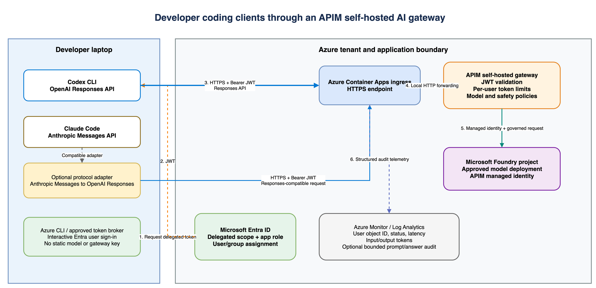

# Azure-hosted APIM self-hosted gateway demo

This deployment creates an isolated Microsoft Foundry AI Gateway demonstration in Azure. A classic API Management Developer instance remains the control plane while its self-hosted gateway data plane runs as one Azure Container Apps replica behind a public HTTPS endpoint.

## Deploy

1. Create the local configuration file:

   ```bash
   cp demo.env.example demo.env
   ```

2. Validate without changing Azure:

   ```bash
   ./validate.sh preflight
   ```

3. Deploy Foundry, GPT-4.1-mini, APIM, the gateway registration, Log Analytics, the Container Apps environment, and the gateway container:

   ```bash
   ./deploy.sh all
   ```

The generated gateway bootstrap token is held in process memory only and passed as a secure Bicep parameter. It expires after seven days; a running gateway continues to operate after token expiry, but redeployment requires a newly generated token.

## End-user demo UI

After the Foundry association and API assignment are complete, deploy the browser UI:

```bash
./deploy.sh ui
```

This command creates a private Basic Azure Container Registry, builds the Node UI image, and adds it as a sidecar to `ca-shgw-demo`. The Container Apps hostname then serves the UI at `/`, while the generated API path continues to proxy to the gateway container.

Open the UI and select **Run demo**:

```text
https://<container-app>.<environment-domain>.<region>.azurecontainerapps.io/
```

The browser calls only the same-origin `/api/run` endpoint. The Node container sends the request to `http://localhost:8080`, and the APIM project key remains in the Container Apps secret store; it is never returned to the browser.

Validate the end-user flow:

```bash
./validate.sh ui
```

## Entra role-policy demo

The authenticated extension creates one Entra application, two security groups, and one disposable user in each group:

| App role | Group | Hate threshold | LLM token limit |
| --- | --- | --- | --- |
| `AI.Limited` | `AI Gateway Demo Limited` | 1 | 1 TPM per user |
| `AI.Unlimited` | `AI Gateway Demo Unlimited` | 7 | None |

Provision the identities, rebuild the UI, enable mandatory Container Apps Easy Auth, and deploy the role-aware APIM product policy:

```bash
./setup-entra-demo.sh
```

The generated demo passwords are stored only in the local macOS Keychain. Retrieve a password directly in your terminal without placing it in source control or chat:

```bash
security find-generic-password -w \
   -s 'aigw-self-hosted-demo' \
   -a 'aigw-limited@<tenant-domain>'
```

Replace the account with `aigw-unlimited@<tenant-domain>` for the second user. The shared demo accounts don't require password change at first sign-in. The browser is redirected to Microsoft Entra before the app is shown, and the UI displays the signed-in account and effective policy tier.

The setup can exclude disposable demo identities from the tenant's MFA Conditional Access policies when required for an isolated lab. Do not add named human users to this exception. Remove all temporary members after testing to restore Conditional Access MFA enforcement. Microsoft-managed mandatory MFA can still apply independently to Azure management tools.

Container Apps Easy Auth requires a Blob SAS URL for its token store. Because shared-key access is disabled, the setup uses Entra to generate a six-day user-delegation SAS. The dedicated storage account keeps `allowSharedKeyAccess=false`; rerun `setup-entra-demo.sh` before the SAS expires.

The Node sidecar keeps the APIM subscription key private and forwards the Easy Auth ID token to the localhost self-hosted gateway. APIM validates the token audience, tenant, and `roles` claim. `AI.Limited` takes precedence if an account is assigned both roles.

## Foundry external application tracing

The infrastructure creates workspace-based Application Insights `appi-aigw-shgw-<suffix>`, connects it to the Foundry project as an `AppInsights` project connection, and injects the connection string into the UI through a Container Apps secret. The Node BFF exports one correlated trace per `/api/run` call. Its GenAI span includes external agent ID `ai-gateway-external-agent`, the conversation ID, Entra object ID and account name, effective role tier, prompt, response or policy block reason, model, token usage when returned, HTTP status, and timing.

Register the external agent once in Microsoft Foundry:

1. Open `proj-aigw-shgw-demo` and select **Build → Agents → New agent → Register external agent**.
2. Set **Agent name** and **OTel agent ID** to `ai-gateway-external-agent`.
3. Use the description `Authenticated Container Apps demo using a self-hosted APIM AI Gateway with role-aware token limits and Content Safety.`
4. Select **Register**. The OTel ID must match `OTEL_AGENT_ID` in the Container App.

This demo deliberately captures complete prompt and response content. Treat Application Insights as sensitive data storage: restrict log access, keep the 30-day retention, and never enter production secrets or personal data. Production deployments should disable content capture or redact it before export.

After deploying the new UI revision, sign in and run one prompt. Copy the `conversationId` from the `/api/run` response in browser developer tools, then verify ingestion with this time-scoped KQL:

```kusto
AppDependencies
| where TimeGenerated > ago(30m)
| where Properties["gen_ai.conversation.id"] == "<conversation-id>"
| project TimeGenerated, Name, Success, DurationMs=DurationMs,
   UserObjectId=UserAuthenticatedId, UserAccount=UserId,
   UserName=Properties["app.user.name"],
   Tier=Properties["app.policy.tier"], Outcome=Properties["app.policy.outcome"],
   Input=Properties["gen_ai.input.messages"], Output=Properties["gen_ai.output.messages"],
   OperationId
| order by TimeGenerated asc
```

Open Microsoft Foundry, select the demo project, open `ai-gateway-external-agent`, then open the matching trace. Verify the end-user attributes and full input/output content. Before storing portal evidence in a public repository, crop or redact account names, tenant domains, object IDs, subscription names and IDs, and deployment-specific resource names.

## Content Safety demo

The customer-hosted path runs the Microsoft Content Safety and Prompt Shields images inside the same Container Apps environment as the self-hosted gateway. The Azure Content Safety account is used only for licensing and metering.

The management-group policy normally forces `disableLocalAuth=true`. This lab applies `SecurityControl=Ignore` only to the dedicated container billing account `csc-aigw-shgw-<suffix>`, enabling the API key required by the connected container.

Do not delete `csc-aigw-shgw-<suffix>` while `ca-content-safety` is running. The container must periodically reach that account for licensing and metering; deleting it causes Content Safety calls to time out and the demo to return HTTP `500`.

Deploy the local container without changing APIM routing:

```bash
bash ./deploy.sh safety-container
```

The images exceed or can exceed the Container Apps Consumption image limit of 8 GB. The deployment therefore adds a D4 profile named `cs-d4` with capacity for two nodes and assigns only `ca-content-safety` and `ca-prompt-shields` to it. The gateway and UI remain on Consumption. Each safety container runs with 4 vCPU, 16 GiB, `CUDA_ENABLED=false`, internal-only ingress, and one replica. CPU mode is suitable for this demonstration; Microsoft recommends NVIDIA CUDA for optimal performance.

Deploy and validate Microsoft Prompt Shields without changing APIM routing:

```bash
bash ./deploy.sh prompt-shields-container
bash ./validate.sh prompt-shields-container
```

The `promptshields:latest` preview image detects direct jailbreak attempts in user prompts and indirect prompt injection in supplied documents. The current Responses API policy sends the extracted request input as `userPrompt`; document scanning can be added when the API begins forwarding separately identified grounding documents.

Validate the container before changing APIM:

```bash
bash ./validate.sh safety-container
```

After both container validations pass, deploy the local-only product policy with the internal `ca-prompt-shields` and `ca-content-safety` FQDNs. The policy extracts the Responses API `input`, calls the preview container's `/contentsafety/jailbreak:analyze` endpoint first, then calls `/contentsafety/text:analyze` before the Foundry API policy runs. A detected prompt attack returns HTTP `403` with code `PromptAttackDetected`; harmful content returns HTTP `403` with code `ContentSafetyViolation`.

Set each category threshold in `demo.env` before deploying the policy. Lower values are stricter, and a category is blocked when its returned severity is greater than or equal to the configured threshold.

```bash
CONTENT_SAFETY_HATE_THRESHOLD=1
CONTENT_SAFETY_VIOLENCE_THRESHOLD=1
CONTENT_SAFETY_SEXUAL_THRESHOLD=1
CONTENT_SAFETY_SELF_HARM_THRESHOLD=1
```

```bash
bash ./deploy.sh safety-local
bash ./validate.sh safety
```

The rendered APIM policy contains the selected numbers directly in the `var threshold` expression; edit `demo.env`, not the generated policy XML. Valid configured thresholds are 1 through 7. The isolated request is required because this Foundry API uses the `api-key` header for its APIM subscription; forwarding that unrelated key to Content Safety overrides bearer authentication and returns `401`.

| Category | Example content blocked at threshold 4 |
| --- | --- |
| Violence | Threats, stated intent to kill, graphic violence, severe injury, or physical assault |
| Hate | Abusive or dehumanizing attacks against protected identity groups |
| Sexual | Explicit sexual content |
| SelfHarm | Instructions or encouragement for suicide or self-injury |

Run the end-to-end proof:

```bash
./validate.sh safety
```

The check sends one safe prompt and expects HTTP `200`, sends a clearly graphic violent prompt and expects HTTP `403` with `ContentSafetyViolation`, then sends a jailbreak prompt and expects HTTP `403` with `PromptAttackDetected`. The same blocked prompts can be tested through the public UI. Capture the applied Prompt Shields result as `docs/images/ai-gateway-self-hosted-azure/09-prompt-shields-blocked.png`.

Key changes require a fresh Container Apps revision. Set `ROTATE_CONTENT_SAFETY_KEY=true` only when rotation is required; normal reruns reuse the current key. Azure's container metering backend can take several minutes to recognize a newly regenerated key.

Foundry policy changes can replace the project product policy; rerun the selected safety deployment after such a change.

If Foundry reports `We couldn't save the policy` while setting a token limit, check the failed APIM product-policy write in the Azure activity log. A validation error such as `Expected a "{" but found a "&"` means the custom policy was deployed with double-encoded policy expressions. Redeploy the corrected XML policy, then retry the token limit:

```bash
bash ./deploy.sh safety-local
```

## Foundry association checkpoint

After the base deployment finishes:

1. Open the new APIM service and verify **Deployment + infrastructure → Service updates (preview)** shows update group **Early**.
2. In Microsoft Foundry, open `proj-aigw-shgw-demo`, then **Manage → AI Gateway → Add AI Gateway**.
3. Select the new Foundry resource, choose **Use existing**, select `apim-aigw-shgw-<suffix>`, and add the demo project.
4. Verify the associated gateway and enabled project. Sanitize any screenshot before adding it to a public repository.
5. List the generated APIs:

   ```bash
   az apim api list \
   --service-name apim-aigw-shgw-<suffix> \
     --resource-group rg-aigw-shgw-demo \
     --query '[].{id:name,displayName:displayName,path:path}' \
     --output table
   ```

6. Add the generated API ID and path to `demo.env`, then assign it to the self-hosted gateway:

   ```bash
   ./deploy.sh assign
   ```

7. Find the project subscription and add its identifier to `demo.env`:

   ```bash
   az apim subscription list \
   --service-name apim-aigw-shgw-<suffix> \
     --resource-group rg-aigw-shgw-demo \
     --query '[].{id:name,displayName:displayName,scope:scope,state:state}' \
     --output table
   ```

Do not store the returned subscription key in `demo.env`; the validation script retrieves it only for the duration of the request.

## Validate the demo

Validate deployed state and the gateway health endpoint:

```bash
./validate.sh deployed
```

After association and API assignment, run an end-to-end model request:

```bash
./validate.sh functional
```

## Developer laptop coding clients

The coding client architecture shows the authentication, request, inference, and telemetry paths from a developer laptop through the self-hosted gateway. It uses generic names and contains no tenant, user, subscription, or customer identifiers.



[Open the editable Draw.io architecture](../../docs/coding-clients-self-hosted-ai-gateway.drawio).

The implemented path uses Codex CLI, the OpenAI Responses API, and an approved Codex-capable model deployment. Claude Code uses the Anthropic Messages API and cannot call this Responses route directly. Supporting Claude Code requires a separately deployed, approved protocol adapter that converts Anthropic Messages requests and responses to the backend contract. APIM provides gateway policy enforcement but does not automatically perform that protocol translation.

### Request and identity flow

The setup creates a dedicated single-tenant Entra API registration with delegated scope `AiGateway.Invoke` and app role `Gateway.Invoke`. Azure CLI is preauthorized for the delegated scope. Codex uses its built-in command authentication to execute `az account get-access-token` directly, so no token helper script or static API key is installed on the workstation.

```text
Codex CLI on developer laptop
   -> Azure CLI cached user sign-in
   -> Entra access token for the gateway API
   -> HTTPS Container Apps ingress
   -> self-hosted APIM gateway
   -> APIM JWT, role, and per-user token enforcement
   -> APIM managed identity
   -> approved model deployment in Microsoft Foundry
   -> token and optional bounded content audit in Log Analytics
```

For Claude Code, insert the approved protocol adapter between the laptop client and the Responses-compatible gateway route, or expose a separately governed Anthropic-compatible APIM API and backend. Do not distribute Foundry keys or APIM subscription keys to developer workstations in either design.

### Prerequisites

- Codex CLI and Azure CLI installed on macOS or Windows.
- The user signs in to the customer tenant with Azure CLI.
- An administrator assigns the user or an approved group to the `Gateway.Invoke` app role.
- `gpt-5.1-codex` is deployed in the Foundry project.

### Configure this demo

Set the customer Foundry project and deployment in `demo.env` when they differ from this validated demo:

```bash
FOUNDRY_PROJECT_NAME=proj-aigw-shgw-demo
CODEX_MODEL_DEPLOYMENT=gpt-5.1-codex
CODEX_ACCESS_GROUP='AI Gateway Codex Users'
```

Run the idempotent setup:

```bash
bash ./setup-codex-cli.sh
```

The script creates `~/.codex/foundry-gateway.config.toml` without modifying the default Codex configuration. It also deploys a subscription-key-free APIM API at `/codex/openai/v1/responses`, assigns it to `shgw-demo`, and grants the `Gateway.Invoke` app role to `CODEX_ACCESS_GROUP`. Group-based enterprise application assignment applies only to direct user members, not users inherited through nested groups. Set `CODEX_ACCESS_GROUP=` to skip group assignment. That exact route bypasses the browser-oriented Container Apps Easy Auth configuration; the proxy requires the bearer header and APIM performs authoritative tenant, audience, scope, role, and token-limit enforcement.

If Azure CLI needs an interactive tenant session, sign in once and rerun the setup:

```bash
az login --tenant "<tenant-id>" --scope "api://<gateway-app-id>/AiGateway.Invoke"
```

After a new user or group assignment, sign out of Azure CLI and perform this scoped login again so the local token cache does not reuse the pre-assignment authorization failure.

Start Codex with the isolated profile:

```bash
codex --profile foundry-gateway
```

For a noninteractive verification:

```bash
codex exec --profile foundry-gateway \
   --sandbox read-only \
   --ephemeral \
   "Reply with exactly CODEX_SELF_HOSTED_GATEWAY_OK"
```

Run the repeatable gateway validation, including negative authentication checks:

```bash
./validate.sh codex
```

Expected results are HTTP `200` for the assigned user, HTTP `401` without a token, and HTTP `401` for a token issued to another audience. The API policy ignores the client-supplied model value and pins the request to `CODEX_MODEL_DEPLOYMENT`.

Codex currently probes `GET /models` when it starts. Only the exact Responses path bypasses the browser-oriented Easy Auth layer, so this optional discovery call returns `403` and Codex uses its local fallback metadata. The configured `gpt-5.1-codex` Responses request still succeeds.

On Windows and macOS, the Codex profile is identical because it invokes the cross-platform `az` command directly. No customer-specific executable is required. Distribute the profile using the customer's normal endpoint-management tooling and install Azure CLI through its approved software channel. The administrator can run `setup-codex-cli.sh` from Azure Cloud Shell; it is deployment automation and is not installed on customer workstations.

This flow is a valid proof of Entra-authenticated self-hosted gateway enforcement for the Responses API. A Claude Desktop customer proof still requires a Claude model deployment and Claude Desktop third-party configuration with native OIDC.

### Validated Codex result

Validated on 2026-09-15 with Codex CLI `0.153.4`:

| Check | Result |
| --- | --- |
| Entra application | `Codex CLI Self-Hosted AI Gateway` |
| Delegated scope | `AiGateway.Invoke` |
| Required app role | `Gateway.Invoke` |
| APIM subscription key | Not required |
| Foundry deployment | `gpt-5.1-codex` |
| Codex CLI response | `CODEX_SELF_HOSTED_GATEWAY_OK` |
| Missing bearer token | HTTP `401` |
| Wrong token audience | HTTP `401` |
| Client-supplied model override | Ignored; APIM forced `gpt-5.1-codex` |

### End-user attribution

The Azure-hosted proxy writes one structured `CodexEndUserAudit` record after each Codex gateway response. It records the immutable Entra tenant and object IDs, optional account name, Azure CLI client application ID, response status, APIM request ID, and Responses API input, output, and total token usage. It never logs the bearer token.

Question and answer logging is disabled by default because it can retain confidential customer or source-code content. Enable it only in an approved environment by setting `CODEX_LOG_CONTENT=true`; each field is capped by `CODEX_CONTENT_MAX_CHARS`. The audit extracts the last end-user message rather than persisting the full Codex request context.

Query the Container Apps Log Analytics workspace, not the APIM resource-scoped Logs blade:

```kusto
ContainerAppConsoleLogs_CL
| where TimeGenerated > ago(2h)
| where ContainerAppName_s == "ca-shgw-demo"
| where Log_s contains '"category":"CodexEndUserAudit"'
| extend Audit = parse_json(extract(@"(\{.*\})", 1, Log_s))
| project
   TimeGenerated,
   UserObjectId = tostring(Audit.userObjectId),
   UserAccount = tostring(Audit.userAccount),
   TenantId = tostring(Audit.tenantId),
   ClientAppId = tostring(Audit.clientAppId),
   Status = toint(Audit.gatewayStatus),
   InputTokens = tolong(Audit.inputTokens),
   OutputTokens = tolong(Audit.outputTokens),
   TotalTokens = tolong(Audit.totalTokens),
   GatewayRequestId = tostring(Audit.gatewayRequestId)
| order by TimeGenerated desc
```

Summarize consumed tokens by end user:

```kusto
ContainerAppConsoleLogs_CL
| where TimeGenerated > ago(24h)
| where Log_s contains '"category":"CodexEndUserAudit"'
| extend Audit = parse_json(extract(@"(\{.*\})", 1, Log_s))
| where toint(Audit.gatewayStatus) between (200 .. 299)
| summarize
   Requests = count(),
   InputTokens = sum(tolong(Audit.inputTokens)),
   OutputTokens = sum(tolong(Audit.outputTokens)),
   TotalTokens = sum(tolong(Audit.totalTokens))
   by UserAccount = tostring(Audit.userAccount), UserObjectId = tostring(Audit.userObjectId)
| order by TotalTokens desc
```

Review the captured end-user question and model answer when content auditing is enabled:

```kusto
ContainerAppConsoleLogs_CL
| where TimeGenerated > ago(2h)
| where Log_s contains '"category":"CodexEndUserAudit"'
| extend Audit = parse_json(extract(@"(\{.*\})", 1, Log_s))
| where tobool(Audit.contentLogged)
| project
   TimeGenerated,
   UserAccount = tostring(Audit.userAccount),
   Question = tostring(Audit.userQuestion),
   Answer = tostring(Audit.assistantAnswer),
   InputTokens = tolong(Audit.inputTokens),
   OutputTokens = tolong(Audit.outputTokens),
   GatewayRequestId = tostring(Audit.gatewayRequestId)
| order by TimeGenerated desc
```

Treat a user identity as authenticated only when APIM returned a successful status. Failed requests can contain unvalidated JWT payload claims and are retained only for troubleshooting.

To prove local token enforcement:

1. In Foundry, open the associated gateway and select **Token management → Limits**.
2. Set the GPT-4.1-mini project limit to `1` token per minute.
3. Verify the applied setting in the portal.
4. Repeat the functional request. Expect HTTP `429` with `OpenAITokenLimitExceeded` before a backend call.
5. In APIM, open **Self-hosted gateways → shgw-demo → Metrics**. Chart **Requests**, filter to the gateway location, and split by **Last Error Reason**.
6. Remove the test limit and confirm a final functional request returns HTTP `200`. If the preview UI cannot remove the limit or leaves an empty token-limit variable, run `bash ./deploy.sh safety-local` to restore the Content Safety policy without any `tokenlimit-*` variable, then refresh Foundry and retest.

Container stdout is available in the Container App logs. Self-hosted request diagnostics are not uploaded to `ApiManagementGatewayLogs`; use APIM native metrics for the enforcement proof.

## Validated deployment

Validated in an isolated Azure subscription:

- Resource group: `rg-aigw-shgw-demo`
- Foundry account/project: `aif-aigw-shgw-<suffix>` / demo project
- APIM/gateway: `apim-aigw-shgw-<suffix>` / `shgw-demo`
- Generated API and path: deployment-specific
- Container Apps endpoint: deployment-specific HTTPS FQDN
- Runtime image: `mcr.microsoft.com/azure-api-management/gateway:2.12.1`
- UI image: private `<registry>.azurecr.io/aigw-demo-ui:<timestamp>`

The initial `2.9.2` image could not compile Foundry's generated API policy because it did not expose `context.Request.Foundry.Deployment`. Version `2.12.1` compiled the policy and completed an end-to-end GPT-4.1-mini request.

Validation results:

| Check | Result |
| --- | --- |
| Status endpoint | HTTP `200` |
| Foundry API assignment to `shgw-demo` | Verified |
| Baseline model request | HTTP `200`, `SELF_HOSTED_AZURE_OK` |
| First request after setting 1 TPM | HTTP `200` |
| Second request | HTTP `429`, `OpenAITokenLimitExceeded` |
| Rejected request backend fields | Absent; policy stopped it in inbound processing |
| Azure Monitor Requests split | `OpenAITokenLimitExceeded = 1` |
| Final request after cleanup | HTTP `200` |
| End-user UI model request | HTTP `200`, `UI_DEMO_OK` |
| Content Safety safe prompt | HTTP `200`, model called |
| Content Safety violent prompt | HTTP `403`, `ContentSafetyViolation`, model not called |
| End-user UI violent prompt | HTTP `403`, `Prompt blocked by Azure AI Content Safety.` |
| Local container readiness | HTTP `200`, valid metering key |
| Local Hebrew classification | Violence severity `5` |
| Live APIM safety endpoint | Internal `ca-content-safety` FQDN |

Removing the test limit reproduced the preview empty-variable issue. The project product policy was restored to a base-only policy and verified to contain no `tokenlimit-*` variable before the final request.

Evidence:

- Sanitized APIM update-channel evidence with identity and subscription details removed.
- Sanitized Foundry association evidence with deployment-specific names removed.
- Sanitized token-limit and metrics evidence with account details removed.

## Cleanup

```bash
./cleanup.sh
```

The script lists the resources and requires the exact resource-group name before starting deletion.